# Model Definitions, Fields, and Component Types {#field-types}

Learn about fields and the component types that the Universal Editor can edit in the properties panel with examples. Understand how you can instrument your own app by creating a model definition and linking to the component.

## Overview {#overview}

When adapting your own apps for use with the Universal Editor, you must instrument the components and define what fields and component types they can manipulate in the properties panel of the editor. You do this by creating a model and linking to that from the component.

This document provides an overview of a model definition and of fields and the component types available to you along with example configurations.

>[!TIP]
>
>If you are not familiar with how to instrument your app for the Universal Editor, please see the document [Universal Editor Overview for AEM Developers](/help/implementing/universal-editor/developer-overview.md).

## Model Definition Structure {#model-structure}

In order to configure a component via the properties panel in the Universal Editor, a model definition has to exist and be linked to the component.

The model definition is a JSON structure, starting with an array of models.

```json
[
  {
    "id": "model-id",        // must be unique
    "fields": []             // array of fields which shall be rendered in the properties panel
  }
]
```

See the **[Fields](#fields)** section of this document for more information about how to define your `fields` array.

To use the model definition with a component, the `data-aue-model` attribute can be used.

```html
<div data-aue-resource="urn:datasource:/content/path" data-aue-type="component"  data-aue-model="model-id">Click me</div>
```

## Loading a Model Definition {#loading-model}

Once a model is created, it can be referenced as an external file.

```html
<script type="application/vnd.adobe.aue.model+json" src="<url-of-model-definition>"></script>
```

Alternatively you can also define the model inline.

```html
<script type="application/vnd.adobe.aue.model+json">
  { ... model definition ... }
</script>
```

## Fields {#fields}

A field object has the following type definition.

|Configuration|Value Type|Description|Required|
|---|---|---|---|
|`component`|`ComponentType`|Renderer of the component|Yes|
|`name`|`string`|Property where the data shall be persisted|Yes|
|`label`|`FieldLabel`|Label of the field|Yes|
|`description`|`FieldDescription`|Description of the field|No|
|`placeholder`|`string`|Placeholder for the field|No|
|`value`|`FieldValue`|Default value|No|
|`valueType`|`ValueType`|Standard validation, can be `string`, `string[]`, `number`, `date`, `boolean`|No|
|`required`|`boolean`|Is the field required|No|
|`readOnly`|`boolean`|Is the field read only|No|
|`hidden`|`boolean`|Is the field hidden by default|No|
|`condition`|`RulesLogic`|Rule to show or hide the field based on a [condition](/help/implementing/universal-editor/customizing.md#conditionally-hide)|No|
|`multi`|`boolean`|Is the field a multi field|No|
|`validation`|`ValidationType`|Validation rule or rules for the field|No|
|`raw`|`unknown`|Raw data which can be used by the component|No|

### Component Types {#component-types}

The following are the component types that are possible to use for rendering fields.

|Description|Component Type|
|---|---|
|[AEM Tag](#aem-tag)|`aem-tag`|
|[AEM Content](#aem-content)|`aem-content`|
|[Boolean](#boolean)|`boolean`|
|[Checkbox Group](#checkbox-group)|`checkbox-group`|
|[Container](#container)|`container`|
|[Content Fragment](#content-fragment)|`aem-content-fragment`|
|[Date Time](#date-time)|`date-time`|
|[Experience Fragment](#experience-fragment)|`aem-experience-fragment`|
|[Multiselect](#multiselect)|`multiselect`|
|[Number](#number)|`number`|
|[Radio Group](#radio-group)|`radio-group`|
|[Reference](#reference)|`reference`|
|[Rich Text](#rich-text)|`richtext`|
|[Select](#select)|`select`|
|[Tab](#tab)|`tab`|
|[Text](#text)|`text`|

#### AEM Tag {#aem-tag}

An AEM tag component type enables an AEM tag picker, which can be used to attach tags to the component.

>[!BEGINTABS]

>[!TAB Sample]

```json
{
  "id": "aem-tag-picker",
  "fields": [
    {
      "component": "aem-tag",
      "label": "AEM Tag Picker",
      "name": "cq:tags",
      "valueType": "string"
    }
  ]
}
```

>[!TAB Screenshot]

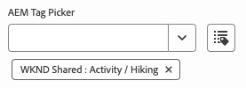

>[!ENDTABS]

#### AEM Content {#aem-content}

An AEM content component type enables an AEM content picker, which can be used to select any AEM resource. Unlike the [reference component](#reference), which can only select assets, the AEM content component can reference any AEM content. It offers an additional validation type.

|Validation Type|Value Type|Description|Required|
|---|---|---|---|
|`rootPath`|`string`|Path that the content picker will open for the user to select AEM content, limiting selection to that directory and subdirectories|No|

>[!BEGINTABS]

>[!TAB Sample]

```json
{
  "id": "aem-content-picker",
  "fields": [
    {
      "component": "aem-content",
      "name": "reference",
      "value": "",
      "label": "AEM Content Picker",
      "valueType": "string",
      "validation": {
            "rootPath": "/content/refresh"
        }
    }
  ]
}
```

>[!TAB Screenshot]

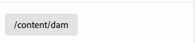

>[!ENDTABS]

#### Boolean {#boolean}

A boolean component type stores a simple true/false value rendered as a toggle. It offers an additional validation type.

|Validation Type|Value Type|Description|Required|
|---|---|---|---|
|`customErrorMsg`|`string`|Message that will display if the value entered isn't a boolean value|No|

>[!BEGINTABS]

>[!TAB Sample 1]

```json
{
  "id": "boolean",
  "fields": [
    {
      "component": "boolean",
      "label": "Boolean",
      "name": "boolean",
      "valueType": "boolean"
    }
  ]
}
```

>[!TAB Sample 2]

```json
{
  "id": "another-boolean",
  "fields": [
    {
      "component": "boolean",
      "label": "Boolean",
      "name": "boolean",
      "valueType": "boolean",
      "validation": {
        "customErrorMsg": "Think, McFly. Think!"
      }
    }
  ]
}
```

>[!TAB Screenshot]


>[!ENDTABS]

#### Checkbox Group {#checkbox-group}

Similar to a boolean, a checkbox group component type allows for the selection of multiple true/false items, rendered as multiple checkboxes.

>[!BEGINTABS]

>[!TAB Sample]

```json
{
  "id": "checkbox-group",
  "fields": [
    {
      "component": "checkbox-group",
      "label": "Checkbox Group",
      "name": "checkbox",
      "valueType": "string[]",
      "options": [
        { "name": "Option 1", "value": "option1" },
        { "name": "Option 2", "value": "option2" }
      ]
    }
  ]
}
```

>[!TAB Screenshot]

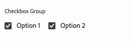

>[!ENDTABS]

#### Container {#container}

A container component type allows the grouping of components. It offers an additional configuration.

|Configuration|Value Type|Description|Required|
|---|---|---|---|
|`collapsible`|`boolean`|Is the container collapsible|No|

>[!BEGINTABS]

>[!TAB Sample]

```json
 {
  "id": "container",
  "fields": [
    {
      "component": "container",
      "label": "Container",
      "name": "container",
      "valueType": "string",
      "collapsible": true,
      "fields": [
        {
          "component": "text-input",
          "label": "Simple Text 1",
          "name": "text",
          "valueType": "string"
        },
        {
          "component": "text-input",
          "label": "Simple Text 2",
          "name": "text2",
          "valueType": "string"
        }
      ]
    }
  ]
}
```

>[!TAB Screenshot]

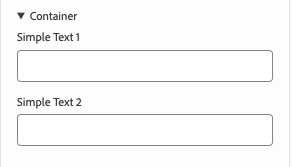

>[!ENDTABS]

#### Content Fragment {#content-fragment}

The Content Fragment picker can be used to select a [Content Fragment](/help/sites-cloud/authoring/fragments/content-fragments.md) and its variations (if required). It offers an additional configuration and validation.

|Configuration|Value Type|Description|Required|
|---|---|---|---|
|`variationName`|`string`|Variable name to store the selected variation. If undefined, no variation picker is displayed|No|

|Validation Type|Value Type|Description|Required|
|---|---|---|---|
|`rootPath`|`string`|Path that the content picker will open for the user to select the Content Fragment, limiting selection to that directory and subdirectories|No|

>[!NOTE]
>
>The Universal Editor [validates Content Fragment fields based on their models](/help/assets/content-fragments/content-fragments-models.md#validation) allowing you to enforce data integrity rules such as regex patterns and uniqueness constraints.
>
>This ensures that your content meets specific business requirements before it's published.

>[!BEGINTABS]

>[!TAB Sample 1]

```json
[
  {
    "id": "aem-content-fragment",
    "fields": [
      {
        "component": "aem-content-fragment",
        "name": "picker",
        "label": "Content Fragment Picker",
        "valueType": "string",
        "variationName": "contentFragmentVariation",
        "validation": {
            "rootPath": "/content/refresh"
        }
      }
    ]
  }
]
```

>[!TAB Screenshot]


>[!ENDTABS]

#### Date Time {#date-time}

A date time component type allows the specification of a date, time, or combination thereof. It offers additional configurations.

|Configuration|Value Type|Description|Required|
|---|---|---|---|
|`displayFormat`|`string`|Format with which to display the date string|Yes|
|`valueFormat`|`string`|Format in which to store the date string|Yes|

It also offers an additional validation type.

|Validation Type|Value Type|Description|Required|
|---|---|---|---|
|`customErrorMsg`|`string`|Message that will display if `valueFormat` isn't met|No|

>[!BEGINTABS]

>[!TAB Sample 1]

```json
{
  "id": "date-time",
  "fields": [
    {
      "component": "date-time",
      "label": "Date & Time",
      "name": "date",
      "valueType": "date"
    }
  ]
}
```

>[!TAB Sample 2]

```json
{
  "id": "another-date-time",
  "fields": [
    {
      "component": "date-time",
       "valueType": "date-time",
      "name": "field1",
      "label": "Date Time",
      "description": "This is a date time field that stores both date and time.",
      "required": true,
      "placeholder": "YYYY-MM-DD HH:mm:ss",
      "displayFormat": null,
      "valueFormat": null,
      "validation": {
        "customErrorMsg": "Marty! You have to come back with me!"
      }
    },
    {
      "component": "date-time",
      "valueType": "date",
      "name": "field2",
      "label": "Another Date Time",
      "description": "This is another date time field that only stores the date.",
      "required": true,
      "placeholder": "YYYY-MM-DD",
      "displayFormat": null,
      "valueFormat": null,
      "validation": {
        "customErrorMsg": "Back to the future!"
      }
    },
    {
      "component": "date-time",
      "valueType": "time",
      "name": "field3",
      "label": "Yet Another Date Time",
      "description": "This is another date time field that only stores the time.",
      "required": true,
      "placeholder": "HH:mm:ss",
      "displayFormat": null,
      "valueFormat": null,
      "validation": {
        "customErrorMsg": "Great Scott!"
      }
    }
  ]
}
```

>[!TAB Screenshot]

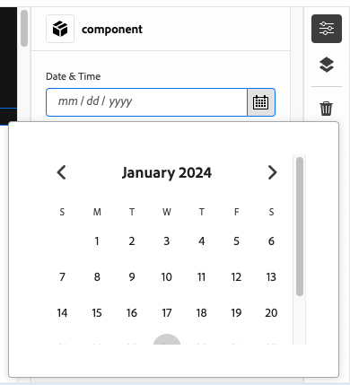

>[!ENDTABS]

#### Experience Fragment {#experience-fragment}

The Experience Fragment picker can be used to select an [Experience Fragment](/help/sites-cloud/authoring/fragments/experience-fragments.md) and its variations (if required). It offers an additional configuration and validation.

|Configuration|Value Type|Description|Required|
|---|---|---|---|
|`variationName`|`string`|Variable name to store the selected variation. If undefined, no variation picker is displayed|No|

|Validation Type|Value Type|Description|Required|
|---|---|---|---|
|`rootPath`|`string`|Path that the content picker will open for the user to select the Experience Fragment, limiting selection to that directory and subdirectories|No|

>[!BEGINTABS]

>[!TAB Sample 1]

```json
[
  {
    "id": "experience-fragment",
    "fields": [
      {
        "component": "aem-experience-fragment",
        "valueType": "string",
        "name": "experience-fragment",
        "label": "experience-fragment",
        "variationName": "experienceFragmentVariation",
        "validation": {
            "rootPath": "/content/refresh"
        }
      }
    ]
  }
]
```

>[!TAB Screenshot]

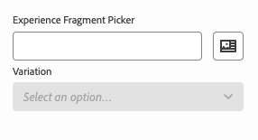

>[!ENDTABS]


#### Multiselect {#multiselect}

A multiselect component type presents multiple items for selection in a drop-down including the ability to group the selectable elements.

>[!BEGINTABS]

>[!TAB Sample 1]

```json
{
  "id": "multiselect",
  "fields": [
    {
      "component": "multiselect",
      "name": "multiselect",
      "label": "Multi Select",
      "valueType": "string",
      "options": [
        { "name": "Option 1", "value": "option1" },
        { "name": "Option 2", "value": "option2" }
      ]
    }
  ]
}
```

>[!TAB Sample 2]

```json
{
  "id": "multiselect-grouped",
  "fields": [
    {
      "component": "multiselect",
      "name": "property",
      "label": "Multiselect field",
      "valueType": "string",
      "required": true,
      "maxSize": 2,
      "options": [
        {
          "name": "Theme",
          "children": [
            { "name": "Light", "value": "light" },
            { "name": "Dark",  "value": "dark" }
          ]
        },
        {
          "name": "Type",
          "children": [
            { "name": "Alpha", "value": "alpha" },
            { "name": "Beta", "value": "beta" },
            { "name": "Gamma", "value": "gamma" }
          ]
        }
      ]
    }
  ]
}
```

>[!TAB Screenshots]

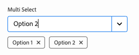
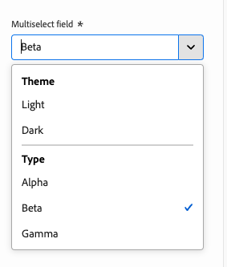

>[!ENDTABS]

#### Number {#number}

A number component type allows for the input of a number. It offers additional validation types.

|Validation Type|Value Type|Description|Required|
|---|---|---|---|
|`numberMin`|`number`|Minimum number allowed|No|
|`numberMax`|`number`|Maximum number allowed|No|
|`customErrorMsg`|`string`|Message that will display if `numberMin` or `numberMax` isn't met|No|

>[!BEGINTABS]

>[!TAB Sample 1]

```json
{
  "id": "number",
  "fields": [
    {
      "component": "number",
      "name": "number",
      "label": "Number",
      "valueType": "number",
      "value": 0
    }
  ]
}
```

>[!TAB Sample 2]

```json
{
  "id": "another-number",
  "fields": [
   {
      "component": "number",
      "valueType": "number",
      "name": "field1",
      "label": "Number Field",
      "description": "This is a number field.",
      "required": true,
      "placeholder": null,
      "validation": {
        "numberMin": 0,
        "numberMax": 88,
        "customErrorMsg": "You also need 1.21 gigawatts."
      }
    }
  ]
}
```

>[!TAB Screenshot]

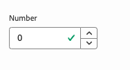

>[!ENDTABS]

#### Radio Group {#radio-group}

A radio group component type allows for a mutually-exclusive selection from multiple options rendered as a group similar to a checkbox group.

>[!BEGINTABS]

>[!TAB Sample]

```json
{
  "id": "radio-group",
  "fields": [
    {
      "component": "radio-group",
      "label": "Radio Group",
      "name": "radio",
      "valueType": "string",
      "options": [
        { "name": "Option 1", "value": "option1" },
        { "name": "Option 2", "value": "option2" }
      ]
    }
  ]
}
```

>[!TAB Screenshot]

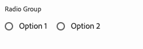

>[!ENDTABS]

#### Reference {#reference}

An reference component type enables an AEM asset picker, which can be used to select any AEM asset to reference. Unlike the [AEM content component](#aem-content), which can select any AEM resource, the reference component can only reference assets. It offers an additional validation type.

A reference component type allows for a reference to another data object from the current object.

>[!BEGINTABS]

>[!TAB Sample]

```json
{
  "id": "reference",
  "fields": [
    {
      "component": "reference",
      "label": "Reference",
      "name": "reference",
      "valueType": "string"
    }
  ]
}
```

>[!TAB Screenshot]

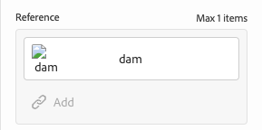

>[!ENDTABS]

#### Rich Text {#rich-text}

Rich text allows for multi-line, rich text input. It offers additional validation types.

|Validation Type|Value Type|Description|Required|
|---|---|---|---|
|`maxSize`|`number`|Maximum number characters allowed|No|
|`customErrorMsg`|`string`|Message that will display if `maxSize` is exceeded|No|

>[!BEGINTABS]

>[!TAB Sample 1]

```json
{
  "id": "richtext",
  "fields": [
    {
      "component": "richtext",
      "name": "rte",
      "label": "Rich Text",
      "valueType": "string"
    }
  ]
}
```

>[!TAB Sample 2]

```json
{
  "id": "another-richtext",
  "fields": [
    {
      "component": "richtext",
      "name": "rte",
      "label": "Rich Text",
      "valueType": "string",
      "validation": {
        "maxSize": 1000,
        "customErrorMsg": "That's about as funny as a screen door on a battleship."
      }
    }
  ]
}
```

>[!TAB Screenshot]

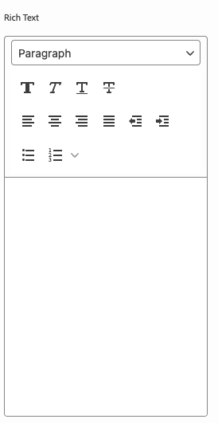

>[!ENDTABS]

#### Select {#select}

A select component type allows for selection of a single option from a list of predefined options in a drop-down menu.

>[!BEGINTABS]

>[!TAB Sample]

```json
{
  "id": "select",
  "fields": [
    {
      "component": "select",
      "label": "Select",
      "name": "select",
      "valueType": "string",
      "options": [
        { "name": "Option 1", "value": "option1" },
        { "name": "Option 2", "value": "option2" }
      ]
    }
  ]
}
```

>[!TAB Screenshot]

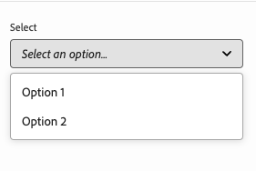

>[!ENDTABS]

#### Tab {#tab}

A tab component type allows you to group other input fields together on multiple tabs to improve layout organization for the authors.

A `tab` definition can be thought of as a separator in the array of `fields`. Everything that comes after a `tab` will be placed on that tab until a new `tab` is encountered, whereafter the following items will be placed on the new tab.

If you wish to have items that appear above all tabs, they must be defined before any tabs.

>[!BEGINTABS]

>[!TAB Sample]

```json
{
  "id": "tab",
  "fields": [
    {
      "component": "tab",
      "label": "Tab 1",
      "name": "tab1"
    },
    {
      "component": "text-input",
      "label": "Text 1",
      "name": "text1",
      "valueType": "string"
    },
    {
      "component": "tab",
      "label": "Tab 2",
      "name": "tab2"
    },
    {
      "component": "text-input",
      "label": "Text 2",
      "name": "text2",
      "valueType": "string"
    }
  ]
}
```

>[!TAB Screenshot]

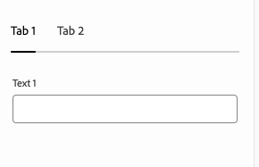

>[!ENDTABS]

#### Text {#text}

Text allows for a single line of text input.  It includes additional validation types.

|Validation Type|Value Type|Description|Required|
|---|---|---|---|
|`minLength`|`number`|Minimum number of characters allowed|No|
|`maxLength`|`number`|Maximum number of characters allowed|No|
|`regExp`|`string`|Regular expression which the input text must match|No|
|`customErrorMsg`|`string`|Message that will display if `minLength`, `maxLength`, and/or `regExp` is/are violated|No|

>[!BEGINTABS]

>[!TAB Sample 1]

```json
{
  "id": "simpletext",
  "fields": [
    {
      "component": "text",
      "name": "text",
      "label": "Simple Text",
      "valueType": "string"
    }
  ]
}
```

>[!TAB Sample 2]

```json
{
  "id": "another simpletext",
  "fields": [
    {
      "component": "text",
      "name": "text",
      "label": "Simple Text",
      "valueType": "string",
      "description": "This is a text input with validation.",
      "required": true,
      "validation": {
        "minLength": 1955,
        "maxLength": 1985,
        "regExp": "^foo:.*",
        "customErrorMsg": "Why don't you make like a tree and get outta here?"
      }
    }
  ]
}
```

>[!TAB Screenshot]

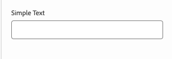

>[!ENDTABS]
