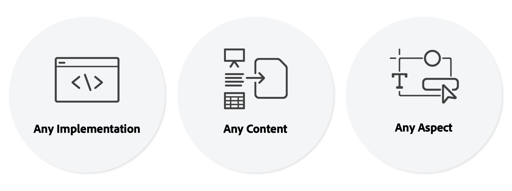

# Universal Editor Introduction {#introduction}

The Universal Editor is a versatile visual editor that is part of Adobe Experience Manager Sites. It enables authors to do what-you-see-is-what-you-get (WYSIWYG) editing of any headless or headful experience. Understand how it can help content authors deliver exceptional experiences and how it offers unparalleled freedom for developers.

## Background {#background}

The Universal Editor provides an efficient and intuitive in-context authoring experience that requires minimal training. With it, authors can manage their content directly in the context the web experience, exactly how it will appear to the visitors. Being a true editor as a service and overall more flexible, it intends to eventually supersede the Page Editor.

Authors benefit from the Universal Editor’s flexibility as it is supports same consistent visual editing for all forms of AEM content: in-place editing and layout composition is possible likewise for both content fragments and page components. The two forms of content can even be edited when showing up side by side in a web experience, without authors having to switch context. This is a tremendous improvement compared to previous editors in AEM only supported one type of content.

Developers benefit from Universal Editor’s versatility as it also supports true decoupling of the implementation. It allows developers to utilize virtually any framework or architecture of their choice, without imposing any SDK or technology constraints. This flexibility even makes it easy to instrument existing web apps for the universal editor without having to re-architecture them.

## Truly Universal {#universal}

The Universal Editor can be instrumented for any implementation, for any content, and for any aspect of the content.

### Any Implementation {#any-implementation}

Because experiences can be built in many different ways, any implementation can use the Universal Editor so authors can perform in-context editing.

Users often think that a headless implementation limits the authors to editing all content in a form-based UI, but this isn't the case with the Universal Editor

The requirements for an implementation to use the Universal Editor is straight-forward and supports the following:

* **Any Architecture** - Server-side rendering, edge-side rendering, client-side rendering, and so on.
* **Any Framework** - Vanilla AEM, or any third-party framework like React, Next.js, Angular, and so on.
* **Any Hosting** - Can be hosted locally to AEM, or on a remote domain

### Any Content {#any-content}

A content author should have the same powerful editing experience formerly offered by the AEM page editor. But the Universal Editor allows content authors to edit **any** content visually and in-context and supports:

* **AEM Page Structures** - Nested `cq:Components` of `cq:Pages`, including Experience Fragments
* **AEM Content Fragments** - Edit content from Content Fragments as they appear in-context of the experience.
* **Documents** - Proof of concepts have shown that also Word, Excel, Google Docs or Markdown documents can also be edited the same way (this is WIP).

### Any Aspect {#any-aspect}

For a content author, content is not just about the information contained, but how it is rendered and received. Content comes with additional meta-data and instrumentation rules, which the Universal Editor can understand and edit including:

* **Applying Layout &amp; Style** - By using a style system, the marketing practitioner and content author can apply different styles to their content and create different layouts for the content such as columns, carousels, tabs, accordions, and so on.

## Value {#value}

By decoupling the content editing experience from any particular content delivery system, the editor becomes truly universal and flexible allowing the content author to delivery exceptional experiences, increase content velocity, and provides a state-of-the-art developer experience.

* **Deliver Exceptional Experiences** - To enable practitioners to create a compelling experience for visitors, the Universal Editor allows practitioners to create and edit the content in the context of the preview. This allows them to create content that fits the design of the experience and that constitutes a meaningful journey for visitors.
* **Increase Content Velocity** - To streamline the management workflow of practitioners, the Universal Editor allows editing content within the preview to guide practitioners by showing only the options that are relevant to that context and makes the workflow independent from the content sources.
* **State-of-the-art Developer Experience** - To support real-world heterogeneous application landscape, the Universal Editor is completely fully decoupled and technology-agnostic, allowing developers to use their preferred technology stack to implement the experience.

## Universal Editor and the Content Fragment Editor {#universal-editor-content-fragment-editor}

At first glance, it might seem like the Universal Editor and the Content Fragment Editor provide similar editing capabilities. However, these editors offer very different capabilities and they accomplish different jobs of the marketing practitioner.

### Content Fragment Editor {#content-fragment-editor} 

A marketing practitioner wants to create content without having to care about its layout, so that it can be reused in numerous contexts of the experience.

* The underlying job to accomplish is to scale the content strategy.

### Universal Editor {#universal-editor}

A marketing practitioner wants to create content that is tailored to the layout of a given context to deliver an exceptional experience.

* The underlying job to accomplish is to convincingly connect with the readers.

## Limitations {#limitations}

As you explore the Universal Editor and move forward implementing it in your own projects, please keep the following limitations in mind.

* No more than 25 AEM resources (Content Fragments, pages, Experience Fragments, Assets, etc.) should be references as instrumentation on a single page.
* AEM as a Cloud Service and [AEM 6.5](https://experienceleague.adobe.com/en/docs/experience-manager-65/content/implementing/developing/headless/universal-editor/introduction) are the only supported AEM backends.
* AEM as a Cloud Service release `2023.8.13099` or higher is required.
* Content authors must have their own individual Experience Cloud accounts.
* As part of AEM, the Universal Editor [supports the same desktop browsers as AEM.](/help/overview/supported-platforms.md)
  * Mobile versions of these browsers are not supported.

{{ue-ip-allow-lists}}

## Next Steps {#next-steps}

Please see the document [Universal Editor Use Cases and Learning Paths](/help/implementing/universal-editor/use-cases.md) to learn more about common use cases for the Universal Editor and to discover the right documentation resources to support you in your project.
