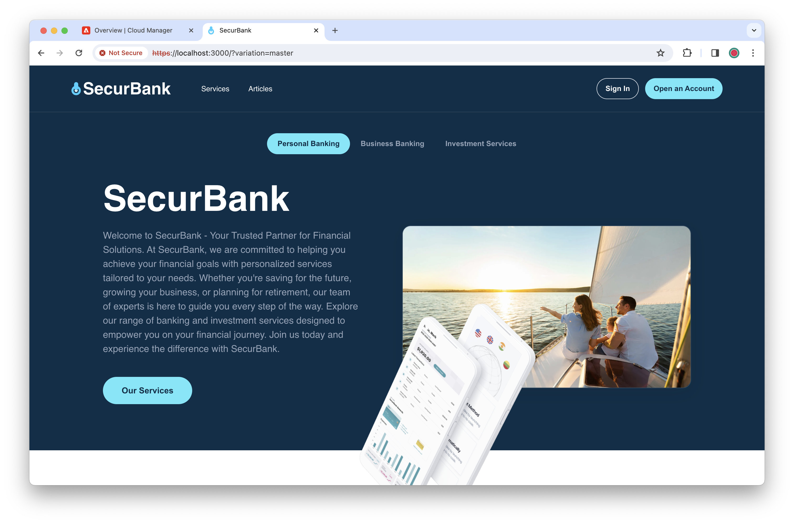

# SecurBank Sample App for the Universal Editor {#securbank}

Learn about the Universal Editor with hands-on experience by using the SecurBank App, designed to showcase the power, flexibility, and usability of the Universal Editor to accelerate content creation.

## Prerequisites {#prerequisites}

* You must be assigned to the **AEM Administrator** [product profile](/help/journey-onboarding/assign-profiles-aem.md) to install the SecurBank app.
* You must have [Node.js](https://nodejs.org) version 20 or higher installed for local development.

## Installing SecurBank {#installation}

The installation of the SecurBank app is straight forward, but because it touches many areas of AEM as a Cloud Service a number of steps are involved. The following is an overview of the main steps.

1. [Create a sandbox program in Cloud Manager](#create-sandbox-program).
1. [Clone the program's git repository and update with the SecurBank AEM project content](#clone-and-update).
1. [Run the pipeline to deploy the SecurBank AEM project](#run-pipeline).
1. [Retrieve Cloud Manager credentials for local web app development](#retrieve-credentials).
1. [Download and configure the SecurBank web app](#download-web-app).
1. [Run the SecurBank web app](#run-web-app).

The following sections detail the individual tasks required.

### Create a sandbox program in Cloud Manager. {#create-sandbox-program}

You will need a new Cloud Manager program where you can install SecurBank.

1. Log into Cloud Manager at [my.cloudmanager.adobe.com](https://my.cloudmanager.adobe.com/) and select the appropriate organization

1. Create a new sandbox program for the SecurBank app.

   * Use the default options when selecting **Solutions &amp; Add-Ons**.
   * For details on how to create a sandbox program, please see the document [Creating Sandbox Programs](/help/implementing/cloud-manager/getting-access-to-aem-in-cloud/creating-sandbox-programs.md).

### Clone the program's git repository and update with the SecurBank AEM project content. {#clone-and-update}

1. Once the program is created, open it and on the **Repositories** tab, tap or click the **Access Repo Info** button to open the **Repository Info** dialog and view the credentials necessary to access the git repository for the sandbox environment.

   * For details on how to access your repository information, please see the document [Accessing Repositories](/help/implementing/cloud-manager/managing-code/accessing-repos.md).

1. Using the credentials in the **Repository Info** dialog, clone the repository on your local machine.

1. Locate the folder of the local clone, open it and delete all content except for the hidden/dot files.

1. Retrieve the latest SecurBank AEM project code from GitHub at [`https://github.com/Adobe-Marketing-Cloud/summit-2024-l425-securbank`](https://github.com/Adobe-Marketing-Cloud/summit-2024-l425-securbank) by clicking **Code** and then **Download ZIP** in the dropdown.

1. Decompress the contents of the zip file on your local file system and move it to the now empty folder of the local clone of the sandbox program.

1. Using the terminal, switch to the folder of the cloned project and commit all the content and push it to git.

   1. `git add --all`
   1. `git commit -m "Adding SecurBank app code"`
   1. `git push`

### Run the pipeline to deploy the SecurBank AEM project. {#run-pipeline}

With the AEM project for SecurBank committed to the sandbox repository, it can be deployed with a pipeline.

1. Return to the **Overview** tab of your sandbox program in Cloud Manager and run the full-stack non-production pipeline.

   * Uncheck all options for the pipeline run.
   * For more information about running pipelines, please see the document [Managing Pipelines](/help/implementing/cloud-manager/configuring-pipelines/managing-pipelines.md#running-pipelines).

### Retrieve Cloud Manager credentials for local web app development. {#retrieve-credentials}

Before you can run the SecurBank app, you will need Cloud Manager credentials to connect the app to Cloud Manager.

1. As the pipeline is running, return to the **Overview** tab in Cloud Manager, and tap or click the ellipsis button next to the environment name and select **Developer Console**.

1. In the Developer Console select the **Integrations** tab then the **Local Token** tab and tap or click **Get Local Development Token**.

1. A JSON file is produced with the access token. Copy only the token itself (the remaining JSON is not necessary) to a secure location for use in a future step before closing the Developer Console and returning to Cloud Manager.

1. Back in Cloud Manager, on the **Overview** tab, right-click the URL of the environment to copy it and save it in a secure location for use in a future step.

### Download and configure the SecurBank web app. {#download-web-app}

Now you can download and configure the SecurBank web app.

1. Retrieve the latest SecurBank app code from GitHub at [`https://github.com/Adobe-Marketing-Cloud/summit-2024-l425/tree/ue-z-final-with-events`](https://github.com/Adobe-Marketing-Cloud/summit-2024-l425/tree/ue-z-final-with-events) by clicking **Code** and then **Download ZIP** in the dropdown.

1. Decompress the contents of the zip file on your local file system.

1. Start your preferred code editor and open the hidden environment file in the SecurBank app project at `summit-2024-l425-ue-z-final-with-events/react-app/.env`.

1. Make the following changes to the `.env` file and save the changes.

   * For `REACT_APP_HOST_URI` paste the value of the previously copied URL of your environment.
   * For `REACT_APP_DEV_TOKEN` paste the value of the previously copied local development token.

### Run the SecurBank web app. {#run-web-app}

With everything set up both in Cloud Manager and locally, you can run the SecurBank web app.

1. At the command line of your local machine, navigate to the `react-app` folder of the SecurBank app project you downloaded and decompressed.

1. In your `react-app` folder install the SecurBank app with the `node -i` command.

1. Once installed, start the SecurBank app with the `npm start` command.

1. If the installation and start were successful, you will see:

  * The following output in the terminal.

    ```text
    Compiled successfully!

    You can now view securbank in the browser.

      Local:            https://localhost:3000
      On Your Network:  https://192.168.1.15:3000

    Note that the development build is not optimized.
    To create a production build, use npm run build.

    webpack compiled successfully
    ```

    * And a browser window open to the URL `https://localhost:3000`.

      * Note that this is for development purposes and as such, no valid certificate is provided. As such you may need to inform your browser to allow it to access the page.

Congratulations! You should now see the SecurBank app successfully running in your browser.

If the content does not yet appear, make sure that the **Deploy to Dev** pipeline that you ran completed successfully.


