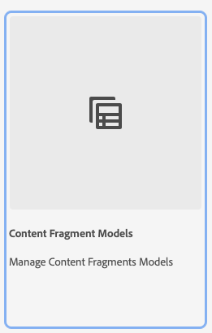

# Learn about Creating Content Fragment Models in AEM {#architect-headless-content-fragment-models}

## The Story so Far {#story-so-far}

At the beginning of the [AEM Headless Content Author Journey](overview.md) the [Content Modeling Basics for Headless with AEM](basics.md) covered the basic concepts and terminology relevant to authoring for headless.

This article builds on these so you understand how to create your own Content Fragment Modelsfor your AEM headless project.

## Objective {#objective}

* **Audience**: Beginner
* **Objective**: the concepts and mechanics of modeling content for your Headless CMS using Content Fragments Models.

<!-- which persona does this? -->

<!--
## Enabling Content Fragment Models {#enabling-content-fragment-models}

At the very start you need to enable Content Fragment Models for your site, this is done in the Configuration Browser; under Tools -> General -> Configuration Browser. You can either select to configure the global entry, or create a new configuration. For example:

>[!NOTE]
>
>See Additional Resources - Content Fragments in the Configuration Browser
-->

## Creating Content Fragment Models {#creating-content-fragment-models}

Then the Content Fragments Models can be created and the structure defined. This can be done under Tools -> Assets -> Content Fragment Models. 

After selecting this you navigate to the location for your model and select **Create**. Here you can enter various key details.

The option **Enable model** is activated by default. This means that your model will be available for use (in creating Content Fragments) as soon as you have saved it. You can deactivate this if you want - there are opportunities later to enable (or disable) an existing model.

Confirm with **Create** and you can then **Open** your model to start defining the structure.

## Defining Content Fragment Models {#defining-content-fragment-models}

 

 
    
For example:

>[!NOTE]
>
>See Additional Resources - Content Fragment Models.

## Publishing {#publishing}

<!-- needs more details -->

## What's Next {#whats-next}

Now that you have learned the basics, the next step is to start creating your own Content Fragment Models.

## Additional Resources {#additional-resources}

* [Authoring Concepts](/help/sites-cloud/authoring/getting-started/concepts.md)

* [Basic Handling](/help/sites-cloud/authoring/getting-started/basic-handling.md) - this page is primarily based on the **Sites** console, but many/most features are also relevant for navigating to, and taking action on, **Content Fragment Models** under the **Assets** console.

* [Working with Content Fragments](/help/assets/content-fragments/content-fragments.md)
 
  * [Content Fragment Models](/help/assets/content-fragments/content-fragments-models.md)

* Getting Started Guides
  
  * [Creating Content Fragment Models Headless Quick Start Guide](help/implementing/developing/headless/getting-started/create-content-model.md)
