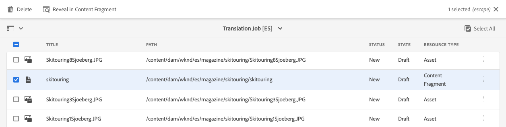
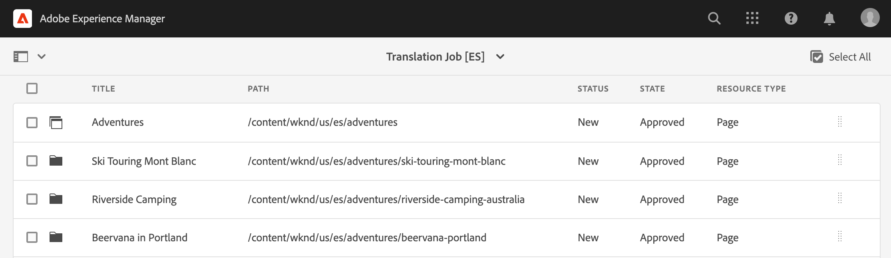

# Translate Content {#translate-content}

Use the translation connector and rules to translate your headless content.

## The Story So Far {#story-so-far}

In the previous document of the AEM headless localization journey, [Configure Translation Rules](translation-rules.md) you learned how how to use AEM's translation rules to identify your translation content. You should now:

* Understand what the translation rules do.
* Be able to define your own translation rules.

Now that your connector and translations rules are set up, this article takes you through the next step of translating your headless content.

## Objective {#objective}

This document helps you understand how to use AEM's translation projects along with the connector and your translations rules to translate content. After reading this document you should:

* Understand what a translation project is.
* Be able to create new translation projects.
* Use translation projects to translate your headless content.

## Creating a Translation Project {#creating-translation-project}

Translation projects enable you to manage the translation of headless AEM content. A translation project contains the content to be translated into other languages.

When content is added to a translation project, a translation job is created for it. Jobs provide commands and status information that you use to manage the human translation and machine translation workflows that execute on the resources.

To create a translation project:

1. Navigate to **Navigation** -&gt; **Assets** -&gt; **Files**. Remember that headless content in AEM is stored as assets known as Content Fragments.
1. Select the language root of your project. In this case we have selected `/content/dam/wknd/en`.
1. Tap or click the rail selector and show the **References** panel.
1. Tap or click on **Language Copies**.
1. Check the **Language Copies** checkbox.
1. Expand the section **Update Language Copies** at the bottom of the references panel.
1. In the **Project** dropdown, select **Create Translation Project(s)**.
1. Provide an appropriate title for your translation project.
1. Tap or click **Start**.

You receive a message that the project was created.

>[!NOTE]
>
>It is assumed that the necessary language structure for the translations languages have already been created as part of the [definition of your content structure.](getting-started.md#content-structure) This should be done in collaboration with the content architect.

## Using a Translation Project {#using-translation-project}

When creating the translation project, AEM evaluated the headless content under the path you selected as well as based on the rules that you previously defined. Based on those rules, it extracted the content that requires translation into a new translation project.

To view the translation project:

1. Navigate to **Navigation** -&amp; **Projects**.
1. Tap or click the project that was created in the previous section.

The project is divided into multiple cards.

* **Summary** - This card shows the basic header information of the project including the owner, language, and translation provider.
* **Translation Job** - This card shows an overview of the actual translation job including the status, number of assets, etc.
* **Team** - This card shows the users who are collaborating on this translation project. This journey will not cover this topic.
* **Tasks** - Additional tasks associated with translating the content such as to do items or workflow items. This journey will not cover this topic.

To see the detail of the headless content included in this project:

1. Tap or click on the ellipsis button at the bottom of the **Translation Job** card.
1. The **Translation Job** window lists all items in the job.

1. Tap or click a line to see the detail of that line, keeping in mind that one line may represent multiple content items to translate.
1. Tap or click the selection checkbox for a line item to see further options such as the option to delete it from the job or view it in the Content Fragments or Assets consoles.

Typically the content for the translation job starts in the **Draft** state as indicated by the **State** column in the **Translation Job** window.

To start the translation job, return to the translation project overview and tap or click the chevron button at the top of the **Translation Job** card and select **Start**.

AEM now communicates with your translation configuration and connector to send the content to the translation service. You can view the progress of the translation by returning to the **Translation Job** window and viewing the **State** column of the entries.

Machine translations automatically return with a state of **Approved**. Human translation allows for more interaction, but is beyond the scope of this journey.
