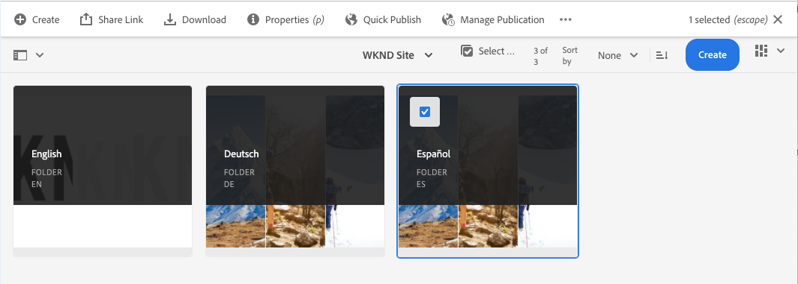
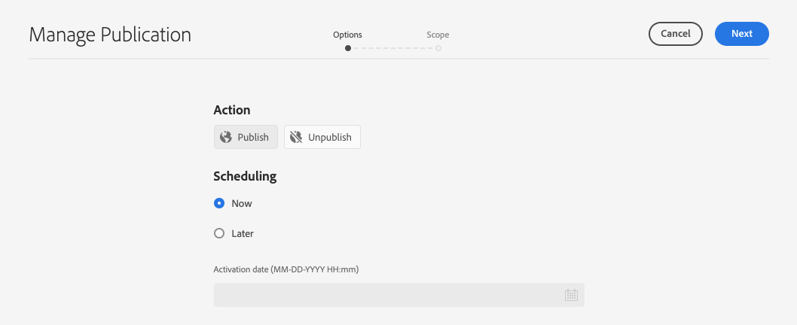
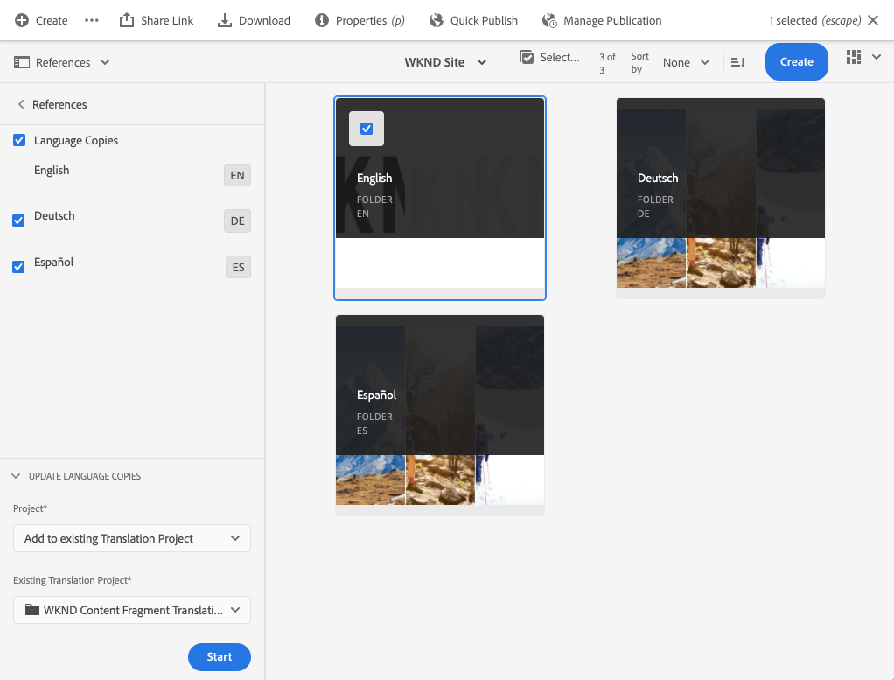
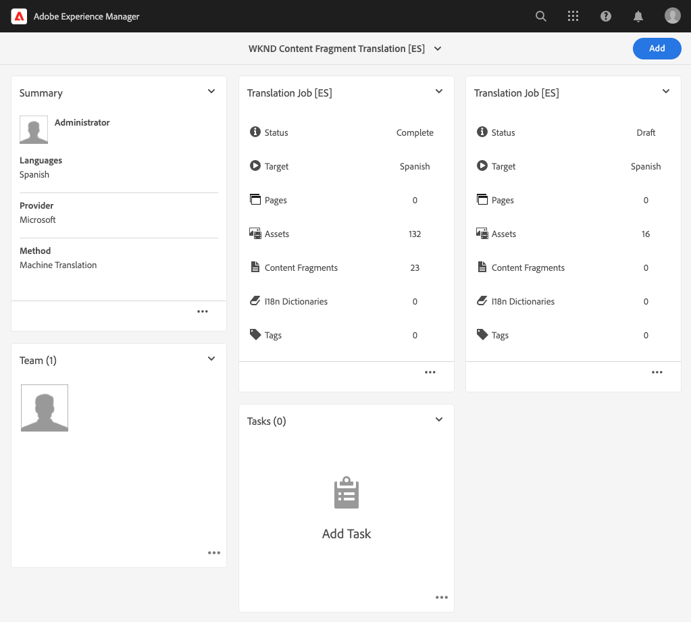
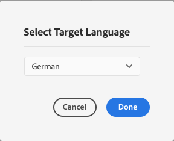

# Publish Translated Headless Content {#publish-content}

Learn how to publish your translated content and update the translations as the content updates.

## The Story So Far {#story-so-far}

In the previous document of the AEM headless translation journey, [Translate Content,](configure-connector.md) you learned how to use AEM Translation Projects to translate your headless content. You should now:

* Understand what a translation project is.
* Be able to create new translation projects.
* Use translation projects to translate your headless content.

Now that your initial translation is complete, this article takes you through the next step of publishing that content and what to do to update your translations as the underlying content in the language root  changes.

## Objective {#objective}

This document helps you understand how to publish headless content in AEM and how to create a continual workflow to keep your translations up-to-date. After reading this document, you should:

* Understand the author-publish model of AEM.
* Know how to publish your translated content.
* Be able to implement a continual update model for your translated content.

## AEM's Author-Publish Model {#author-publish}

Before you publish your content, it is a good idea to understand AEM's author-publish model. In simplified terms, AEM divides users of the system into two groups.

1. Those who create and manage the content and the system
1. Those who consume the content from the system

AEM is therefore physically separated into two instances.

1. The **author** instance is the system where content authors and administrators work to create and manage content.
1. The **publish** instance is the system that delivers the content to the consumers.

Once content is created on the author instance, it must be transferred to the publish instance for it to be available for consumption. The process of transferring from author to publish is called **publication**.

## Publishing Your Translated Content {#publishing}

Once you are happy with the state of your translated content, it must be published so headless services can consume it. This task is usually not the responsibility of the translation specialist, but is documented here to illustrate the complete workflow.

>[!NOTE]
>
>Generally when the translation is complete, the translations specialist informs the content owners that the translations are ready for publication. The content owners then publish them.
>
>The following steps are provided for completeness.

The simplest way to publish the translations is to navigate to the project assets folder.

```text
/content/dam/<your-project>/
```

Under this path you have sub-folders for each translation language and can choose which to publish.

1. Go to **Navigation** &gt; **Assets** &gt; **Files** and open the project folder.
1. Here you see the language root folder and all other language folders. Select the localized language or languages that you want to publish.

1. Select **Manage Publication**.
1. In the **Manage Publication** window, make sure that **Publish** is automatically selected under **Action** and that **Now** is selected under **Scheduling**. Select **Next**.

1. In the next **Manage Publication** window, confirm that the proper path(s) is/are selected. Select **Publish**.

1. AEM confirms the publish action with a pop-up message at the bottom of the screen.


Your translated headless content is now published! It can now be accessed and consumed by your headless services.

>[!TIP]
>
>You can select multiple items (that is, multiple language folders) when publishing so you can publish multiple translations at one time.

There are additional options when publishing your content, such as scheduling a publication time, which are beyond the scope of this journey. See the [Additional Resources](#additional-resources) section at the end of the document for more information.

## Updating Your Translated Content {#updating-translations}

Translation is rarely a one-off exercise. Typically your content authors continue to add to and modify your content in the language root after initial translation is complete. This means that you need to also update your translated content.

Specific project requirements define how often you need to update your translations and what decision process is followed before performing an update. Once you have decided to update your translations, the process in AEM is very simple. As the initial translation was based on a translation project, so too are any updates.

However as before, the process differs slightly if you chose to automatically create your translation project or manually create your translation project.

### Updating an Automatically Created Translation Project {#updating-automatic-project}

1. Navigate to **Navigation** &gt; **Assets** &gt; **Files**. Remember that headless content in AEM is stored as assets known as Content Fragments.
1. Select the language root of your project. In this case we have selected `/content/dam/wknd/en`.
1. Select the rail selector and show the **References** panel.
1. Select **Language Copies**.
1. Check the **Language Copies** checkbox.
1. Expand the section **Update Language Copies** at the bottom of the references panel.
1. In the **Project** drop-down list, select **Add to an existing Translation Project**.
1. In the **Existing Translation Project** drop-down list, select the project created for the initial translation.
1. Select **Start**.



The content is added to the existing translation project. To view the translation project:

1. Navigate to **Navigation** &gt; **Projects**.
1. Select the project that you just updated.
1. Select the language or one of the languages that you updated.

You see that a new job card was added to the project. In this example, another Spanish translation was added.



You may notice that the statistics listed on the new card (number of assets and content fragments) is different. This is because AEM recognizes what has changed since the last translation and only includes the content that must be translated. This includes retranslation of updated content and the first-time translation of new content.

From this point, you [start and manage your translation job just as you did the original.](translate-content.md#using-translation-project)

### Updating a Manually Created Translation Project {#updating-manual-project}

To update a translation you can add a new job to your existing project that is responsible for translating the updated content.

1. Navigate to **Navigation** &gt; **Projects**.
1. Select the project that you need to update.
1. Select the **Add** button at the top of the window.
1. In the **Add Tile** window, select **Translation Job** and then **Submit**.

   

1. On the card of the new translation job, select the chevron button at the top of the card, and select **Update Target** to define the target language of the new job.

   

1. In the **Select Target Language** dialog, use the drop-down to select the language and select **Done**.

   

1. Once your new translation job's target language is set, select the ellipsis button at the bottom of the job card to view the details of the job.
1. The job is empty when first created. Add content to the job by tapping or clicking the **Add** button and using the path browser [as you did before when originally creating the translation project.](translate-content.md##manually-creating)

>[!TIP]
>
>The path browser's powerful filters can again be useful to find just the content that has been updated.
>
>You can learn more about the path browser in the [additional resources section.](#additional-resources)

From this point, you [start and manage your translation job just as you did the original.](translate-content.md#using-translation-project)

## End of the Journey? {#end-of-journey}

Congratulations! You have completed the headless translation journey! You should now:

* Have an overview of what headless content delivery is.
* Have a basic Understanding AEM's headless features.
* Understand AEM's translation features and how they related to headless content.
* Be able to start translating your own headless content.

You are now ready to translate your own headless content in AEM. However AEM is a powerful tool and there are many additional options available. Check out some of the additional resources available in the [Additional Resources section](#additional-resources) to learn more about the features you saw in this journey.

## Additional Resources {#additional-resources}

* [Managing Translation Projects](/help/sites-cloud/administering/translation/managing-projects.md) - Learn the details of translation projects and additional features such as human translation workflows and multi-language projects.
* [Authoring concepts](/help/sites-cloud/authoring/author-publish.md) - Learn about the author and publish model of AEM in more detail. This document is focused on authoring pages rather than Content Fragments, but the theory still applies.
* [Publishing Pages](/help/sites-cloud/authoring/sites-console/publishing-pages.md) - Learn about the additional features available when publishing content. This document is focused on authoring pages rather than Content Fragments, but the theory still applies.
* [Authoring Environment and Tools](/help/sites-cloud/authoring/path-selection.md#path-selection) - AEM provides various mechanisms for organizing and editing your content including a robust path browser.
