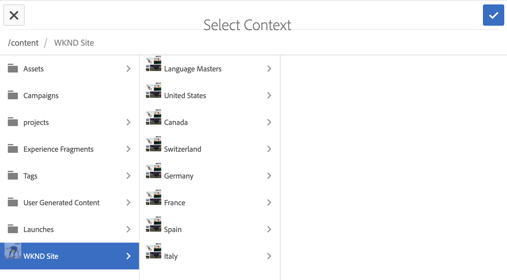
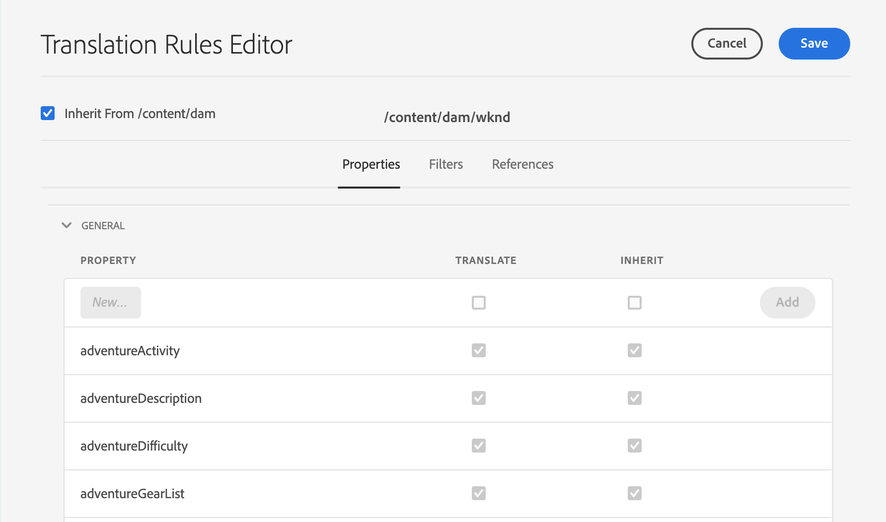
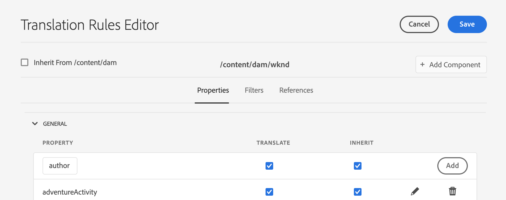

# Configure Translation Rules {#configure-translation-rules}

Learn how to define translation rules to identify content for translation.

## The Story So Far {#story-so-far}

In the previous document of the AEM headless translation journey, [Configure translation integration](configure-connector.md) you learned how to install and configure your translation integration and should now:

* Understand the important parameters of the Translation Integration Framework in AEM.
* Be able to set up your own connection to your translation service.

Now that your integration is set up, this article takes you through the next step of identifying what content you need to translate.

>[!CAUTION]
>
>This step of the documentation journey is only necessary if you are not using the **Translatable** flag on Content Fragments.
>
>* The **Translatable** flag automatically creates translation rules for you and requires no intervention.
>* The **Translatable** flag is only used if the Translation Integration Framework configuration is set to **[Enable Content Model Fields for Translation](/help/sites-cloud/administering/translation/integration-framework.md)**.
>* Enabling this option in the TIF configuration will supersede any manually-created translation rules.| 

## Objective {#objective}

This document helps you understand how to use AEM's translation rules to identify your translation content. After reading this document, you should:

* Understand what the translation rules do.
* Be able to define your own translation rules.

## Translation Rules {#translation-rules}

Content Fragments, which represent your headless content, can contain much information organized by structured fields. Depending on your project needs, it is likely that not all the fields within a Content Fragment must to be translated.

Translation rules identify the content that is included in, or excluded from, translation projects. When content is translated, AEM extracts or harvests the content based on these rules. In this way only content that must be translated is sent to the translation service.

Translation rules include the following information:

* The path of the content to which the rule applies
  * The rule also applies to the descendants of the content
* The names of the properties that contain the content to translate
  * The property can be specific to a specific resource type or to all resource types

Because Content Fragment Models, which define the structure of your Content Fragments, are unique to your own project, it is vital to set up translation rules so AEM knows what elements of your content models to translate.

>[!TIP]
>
>Generally, the content architect provides the translation specialist with the **Property Name**s of all the fields needed for translation. These names are needed to configure translation rules. As the translation specialist, you [can find these **Property Name**s yourself](getting-started.md#content-modlels) as previously described in this journey.

## Creating Translation Rules {#creating-rules}

Multiple rules can be created to support complex translation requirements. For example, one project you may be working on requires all fields of the model to be translated, but on another only description fields must be translated while titles are left untranslated.

Translation rules are designed to handle such scenarios. However in this example we illustrate how to create rules by focusing on a simple, single configuration.

There is a **Translation Configuration** console available for configuring translation rules. To access it:

1. Navigate to **Tools** &gt; **General**.
1. Select **Translation Configuration**.

In the **Translation Configuration** UI, there are several options available for your translation rules. Here we highlight the most necessary and typical steps required for a basic headless localization configuration.

1. Select **Add Context** to add a path. This is the path of the content that is be affected by the rule.

1. Use the path browser to select the required path and select **Confirm** to save. Remember, Content Fragments, which hold headless content, are generally located under `/content/dam/<your-project>`.

1. Select the context you created and then select **Edit**. This opens the **Translation Rules Editor** to configure the properties.

1. By default all configurations are inherited from the parent path, in this case `/content/dam`. Uncheck the option **Inherit from `/content/dam`** so you can add additional fields to the configuration.
1. When unchecked, under the **General** section of the list, add the property names of the Content Fragment Model(s) that you [previously identified as fields for translation](getting-started.md#content-models).
   1. In the **New Property** field, enter the property name. Notice that the options **Translate** and **Inherit** are checked automatically.
   1. Select **Add**.
   1. Repeat these steps for all the fields that you must translate.
   1. Select **Save**.

You have now configured your translation rules.

## Advanced Usage {#advanced-usage}

There are several additional properties that can be configured as part of your translation rules. In addition, you can specify your rules by hand as XML, which allows for more specificity and flexibility.

Such features are generally not needed to get started localizing your headless content, but you can read about them further in the [Additional Resources](#additional-resources) section if you are interested.

## What's Next {#what-is-next}

Now that you have completed this part of the headless translation journey you should:

* Understand what the translation rules do.
* Be able to define your own translation rules.

Build on this knowledge and continue your AEM headless translation journey by next reviewing the document [Translate content](translate-content.md) where you learn how your integration and rules work together to translate headless content.

## Additional Resources {#additional-resources}

While it is recommended that you move on to the next part of the headless translation journey by reviewing the document [Translate content](translate-content.md), the following are some additional, optional resources that do a deeper dive on some concepts mentioned in this document, but they are not required to continue on the headless journey.

* [Identifying Content to Translate](/help/sites-cloud/administering/translation/rules.md) - Learn how translation rules identify content that needs translating.
