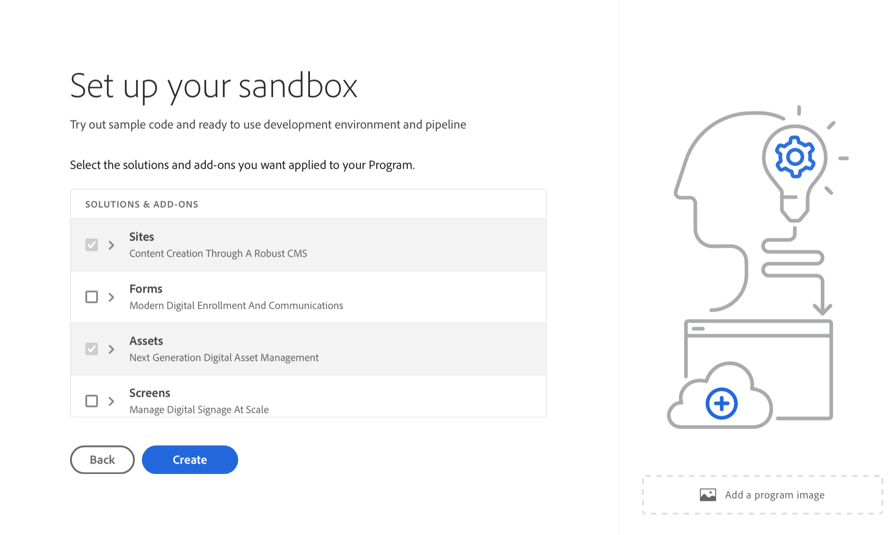

# Create a program {#create-program}

In this part of the [onboarding journey](overview.md), you learn how to use Cloud Manager to create your first program.

## Objective {#objective}

After reviewing the previous document in this onboarding journey, [Access Cloud Manager](cloud-manager.md), you have ensured you have appropriate access to Cloud Manager. Now, you can create your first program.

After reading this document, you can:

* Understand and explain what a program is.
* Know the difference between production and sandbox programs.
* Create your own program.

## What is a program? {#programs}

Programs are the highest level of organization in Cloud Manager. Depending on your license with Adobe, programs allow you to organize your solution and grant access to particular team members to those programs.

Cloud Manager programs represent sets of Cloud Manager environments. These programs support logical sets of business initiatives, typically corresponding to a licensed Service Level Agreement (SLA). For example, one program may represent the Adobe Experience Manager (AEM) resources to support a global public web site for an organization, while another program represents an internal, central DAM.

Consider the example of the theoretical WKND Travel and Adventure Enterprises, a tenant specializing in travel-related media. They might have two programs. One AEM Sites program for its WKND Magazine division and one AEM Assets program for the WKND Media division. Different team members would then have access to the different programs because of their own division of labor requirements.

There are two different types of programs:

* A **production program** is created to enable live traffic for your site. This program is your "real" environment.
* A **sandbox program** is typically created to serve the purposes of training, running demos, enablement, POCs, or documentation.

Since they serve different purposes, the different environments have different options. However, the process of creating them is similar. For this onboarding journey, you create a sandbox environment.

>[!TIP]
>
>If you must create a production program, see the [Additional Resources](#additional-resources) section for a link to documentation describing programs in detail.

## Creating a sandbox program {#create-sandbox}

1. Log into Cloud Manager at [my.cloudmanager.adobe.com](https://my.cloudmanager.adobe.com/) and select the appropriate organization.
 
1. From Cloud Manager's landing page, click **Add Program** in the top-right corner of the screen.

    

1. From the create program wizard, select **Setup a sandbox**, then provide a program name and select **Continue**.

   

1. In the **Setup your sandbox** dialog box, you can choose which solutions you want to enable in your sandbox program. The **Sites** and **Assets** solutions are always included in sandbox programs and are automatically selected. These solutions are sufficient for your onboarding example. Click **Create**.

   
   
You see a new sandbox program card on the landing page with a status indicator as the setup process progresses.

Once the program is complete, members of your organization assigned to the **Developer** product profile can log in to Cloud Manager and manage Cloud Manager Git repositories.

## What's next {#whats-next}

With your first program created, you can now create environments for it. Continue your onboarding journey by next reviewing the document [Create Environments](create-environments.md).

See also [Onboard your Edge Delivery Services site](/help/implementing/cloud-manager/edge-delivery/create-edge-delivery-site.md).

## Additional resources {#additional-resources}

The following are additional, optional resources if you would like to go beyond the content of the onboarding journey.

* [Programs and Program Types](/help/implementing/cloud-manager/getting-access-to-aem-in-cloud/program-types.md) - Learn about the hierarchy of Cloud Manager and how the different types of programs fit into its structure and how they differ.
* [Creating Sandbox Programs](/help/implementing/cloud-manager/getting-access-to-aem-in-cloud/creating-sandbox-programs.md) - Learn how to use Cloud Manager to create your own sandbox program for training, demo, POC, or other non-production purposes.
* [Creating Production Programs](/help/implementing/cloud-manager/getting-access-to-aem-in-cloud/creating-production-programs.md) - Learn how to use Cloud Manager to create your own production program to host live traffic.
* [Using Adobe Cloud Manager - Programs](https://experienceleague.adobe.com/en/docs/experience-manager-learn/cloud-service/cloud-manager/programs) - Cloud Manager programs represent sets of AEM environments supporting logical sets of business initiatives, typically corresponding to a purchased Service Level Agreement (SLA).
* [AEM as a Cloud Service Team and Product Profiles](/help/onboarding/aem-cs-team-product-profiles.md) - Learn how AEM as a Cloud Service team and product profiles can grant and limit access to your licensed Adobe solutions.
