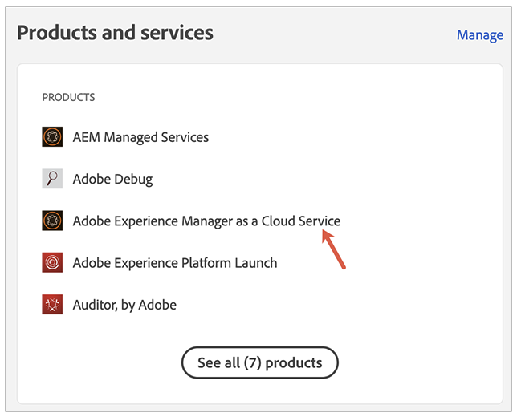
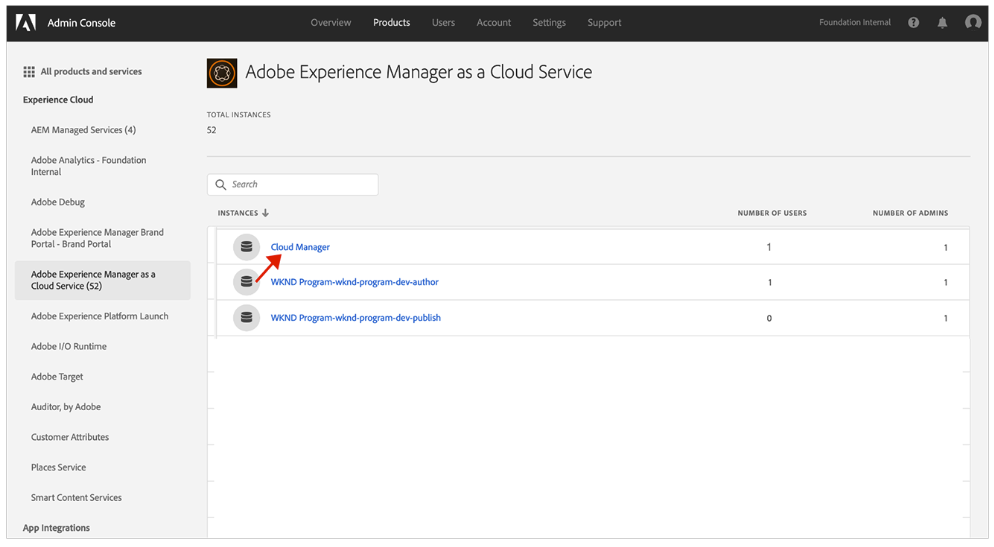
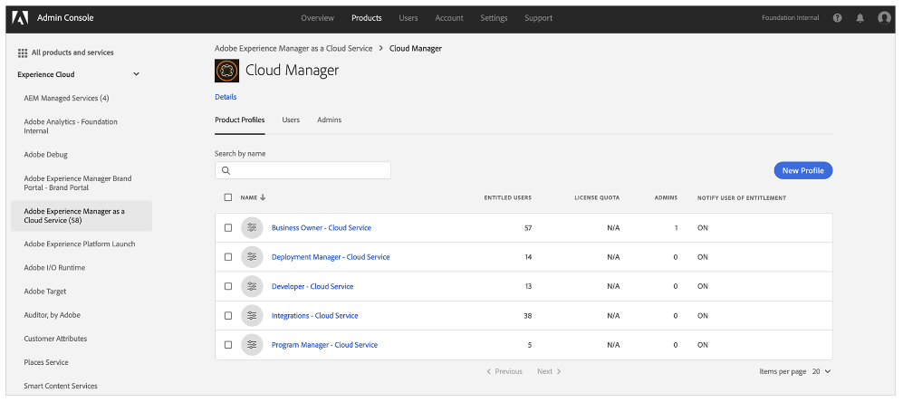
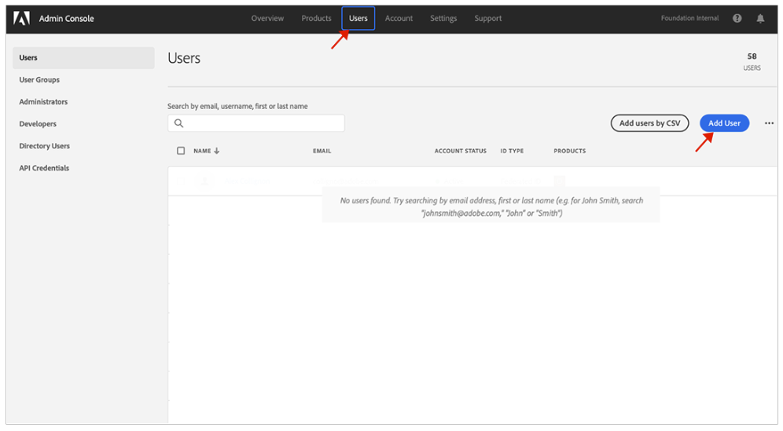

# User Groups for Notifications {#user-groups}

Learn how to create a user group in the Admin Console to manage receipt of important email notifications.

## Overview {#overview}

From time to time Adobe needs to contact regarding their AEM as a Cloud Service environments. In addition to in-product notification, Adobe also occasionally uses email for such notifications. There are two types of such notification:

* **Incident Notification- Cloud Service** - These notifications are sent during an incident or when Adobe has identified a potential availability issue with your AEM as a Cloud Service environment.
* **Proactive Notification- Cloud Service** - These notifications are sent when an Adobe support team member wants to provide guidance on a potential optimization or recommendation that can benefit your AEM as a Cloud Service environment.

For the correct users to receive these notifications, you need to configure user groups.

## Prerequisites {#prerequisites}

Because user groups are created and maintained in the Admin Console, before creating user groups for notifications, you must:

* Have permissions to add and edit group memberships.
* Have a valid Adobe Admin Console profile.

## Create New Cloud Manager Product Profiles {#create-groups}

To properly set up receipt of notifications you will need to create two user groups. These steps must only be done once.

1. Log in to Admin Console at [`https://adminconsole.adobe.com`.](https://adminconsole.adobe.com)

1. From the **Overview** page, select **Adobe Experience Manager as a Cloud Service** from the **Products and services** card.

   

1. Navigate to the **Cloud Manager** instance from the list of all instances.

     

1. You will see the list of all configured Cloud Manager product profiles. For example:

    

1. Click **New Profile** and introduce the following details:

   * Product profile name: Incident Notification - Cloud Service
   * Display name: Incident Notification - Cloud Service
   * Description: Cloud Manager profile for the users that will receive notifications during an incident or when Adobe has identified a potential availability problem with your AEM as a Cloud Service environment.

6. Click **Save** and repeat step 5 with the following details:

   * Product profile name: Proactive Notification - Cloud Service
   * Display name: Proactive Notification - Cloud Service
   * Description: Cloud Manager profile for the users that will receive notifications when an Adobe support team member wants to provide guidance on a potential optimization or recommendation to do with your AEM as a Cloud Service environment configuration.

>[!NOTE]
>
>It is important that the Cloud Manager profile name to be exactly the same as above. Please copy and paste the Product profile name from the description provided. Any deviations or typos will result in notifications not being sent as desired. In case of error or if profiles have not been defined, Adobe will default to notifying existing users assigned to Cloud Manager Developer (is it or , or, and) Deployment Manager profiles.

## Assign the  Users to the new notification product profiles {#add-users}

Now that the groups have been created, you must assign the appropriate users. You can do this when creating new users or by updating existing users.

### Add New Users to Groups {#new-user}

1. Identify the user(s) who should receive either Incident or Proactive Notifications.

1. Log in to Admin Console at [`https://adminconsole.adobe.com`](https://adminconsole.adobe.com) if you are not still logged in.

1. From the **Overview** page, select **Adobe Experience Manager as a Cloud Service** from the **Products and services** card.

   

1. Select the **Users** tab from the top navigation, then select **Add User**.

 

5. In the **Add users to your team** dialog, enter the email ID of the user you want to add.

   * If the federated ID for your team members has not yet been set up, select Adobe ID for the ID Type.
   * If user already exists, see step 9.

6. Click the plus button under the **Select products** heading to begin product selection and select **Adobe Experience Manager as a Cloud Service** and assign either **Incident Notification - Cloud Service** or **Proactive Notification - Cloud Service**, or both to the user.

1. Click **Save** and a welcome email is sent to the user you added. The invited user will now receive the notifications.

1. Repeat these steps for the users on your team that you would like to receive the notifications.

1. In case the user already exist, search the name of the user and:

   * Click the name of the user.
   * In the **Products** section, click **Edit**.
   * Click the pencil button the **Select products** heading to begin product selection and select **Adobe Experience Manager as a Cloud Service** and assign either **Incident Notification - Cloud Service** or **Proactive Notification - Cloud Service**, or both to the user.
   * Click **Save** and a welcome email is sent to the user you added. The invited user will now receive the notifications. 
