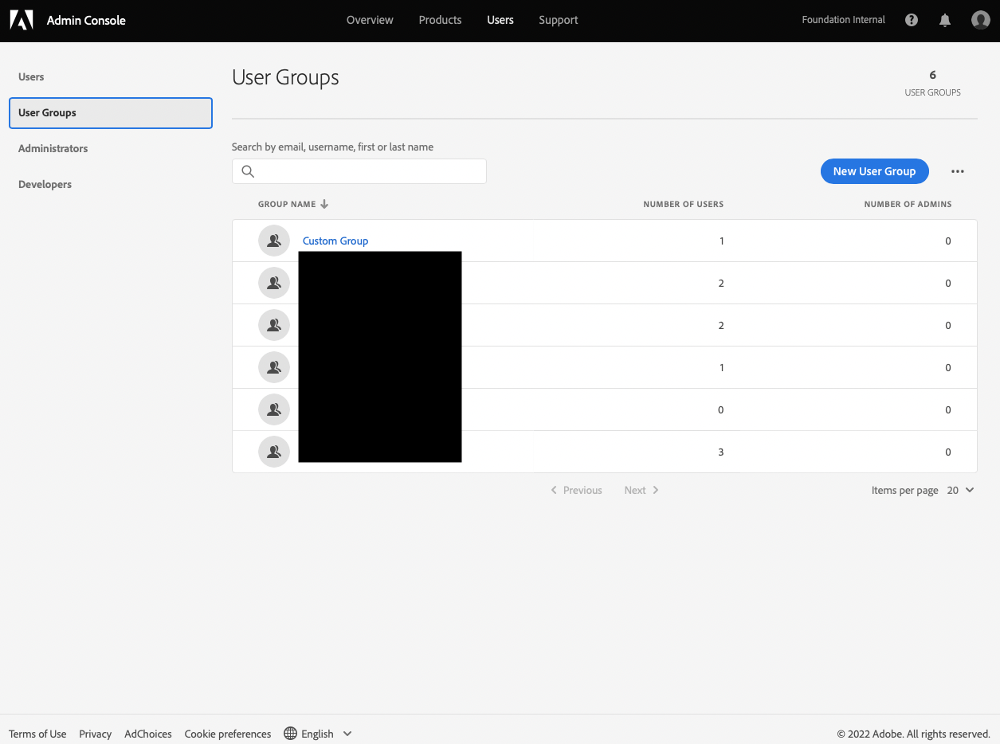
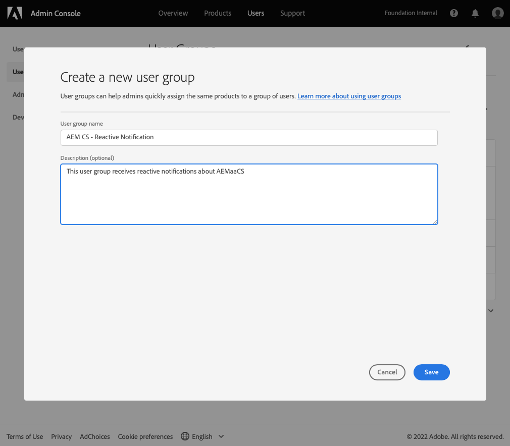
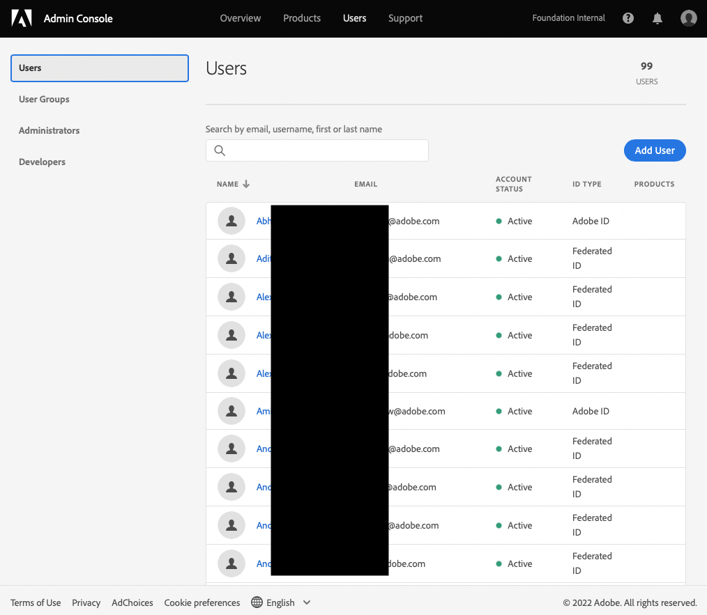

# User Groups for Notifications {#user-groups}

Learn how to create a user group in the Admin Console to manage receipt of important email notifications.

## Overview {#overview}

From time to time Adobe needs to contact regarding their AEM as a Cloud Service environments. In addition to in-product notification, Adobe also occasionally uses email for such notifications. There are two types of such notification:

* **Reactive Notification** - These notifications are sent during an incident or when Adobe has identified a potential availability issue with your AEM as a Cloud Service environment.
* **Proactive Notification** - These notifications are sent when an Adobe support team member wants to provide guidance on a potential optimization or recommendation that can benefit your AEM as a Cloud Service environment.

For the correct users to receive these notifications, you need to configure user groups.

## Prerequisites {#prerequisites}

Because user groups are created and maintained in the Admin Console, before creating user groups for notifications, you must:

* Have permissions to add and edit group memberships.
* Have a valid Adobe Admin Console profile.

## Create User Groups for Notification {#create-groups}

To properly set up receipt of notifications you will need to create two user groups. These steps must only be done once.

1. Log in to Admin Console at [`https://adminconsole.adobe.com`.](https://adminconsole.adobe.com)

1. Click on the **Users** tab and then the **User Groups** option in the left navigation panel.

   

1. Click the **New User Group** button and provide a **User group name** exactly as specified and an optional **Description**.

   * The group names must match the following. Do not adjust or amend the group names in any way.
     * `AEM CS - Reactive Notification`
     * `AEM CS - Proactive Notification`

   

1. Click **Save**.

1. Repeat the steps for the second group.

In cases where the groups are not defined, Adobe will notify existing users with Cloud Manager **Developer** or **Deployment** profiles.

## Add Users to Groups {#add-users}

Now that the groups have been created, you must assign the appropriate users. You can do this when creating new users or by updating existing users.

### Add New Users to Groups {#new-user}

1. Log in to Admin Console at [`https://adminconsole.adobe.com`](https://adminconsole.adobe.com) if you are not still logged in.

1. Click on the **Users** tab and then the **Users** option in the left navigation panel.

   

1. Click the **Add user** button and provide the user's email address. Optionally you can also provide a first and last name.

1. Click on the plus below the user name fields, and then click the **User groups** tab in the pop-up to select the groups for the user.

   

1. Click **Save** to save the new user.

Repeat these steps for each user for whom you need to assign the notification groups.

### Add Existing Users to Groups {#existing-user}

1. Log in to Admin Console at [`https://adminconsole.adobe.com`](https://adminconsole.adobe.com) if you are not still logged in.

1. Click on the **Users** tab and then the **Users** option in the left navigation panel.

   

1. Highlight the user you wish to add to a notification group and 