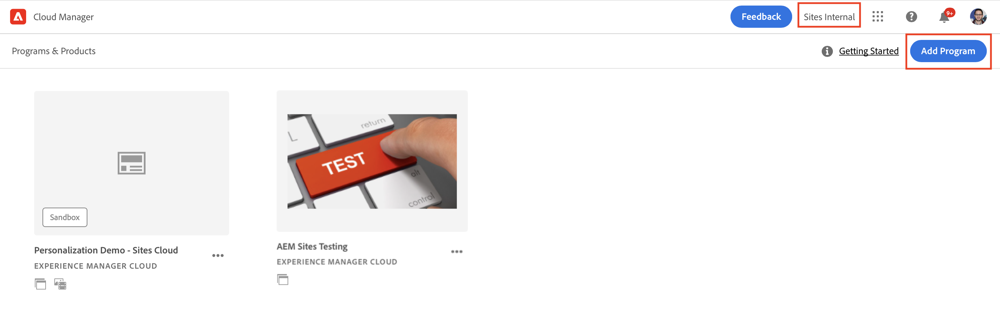
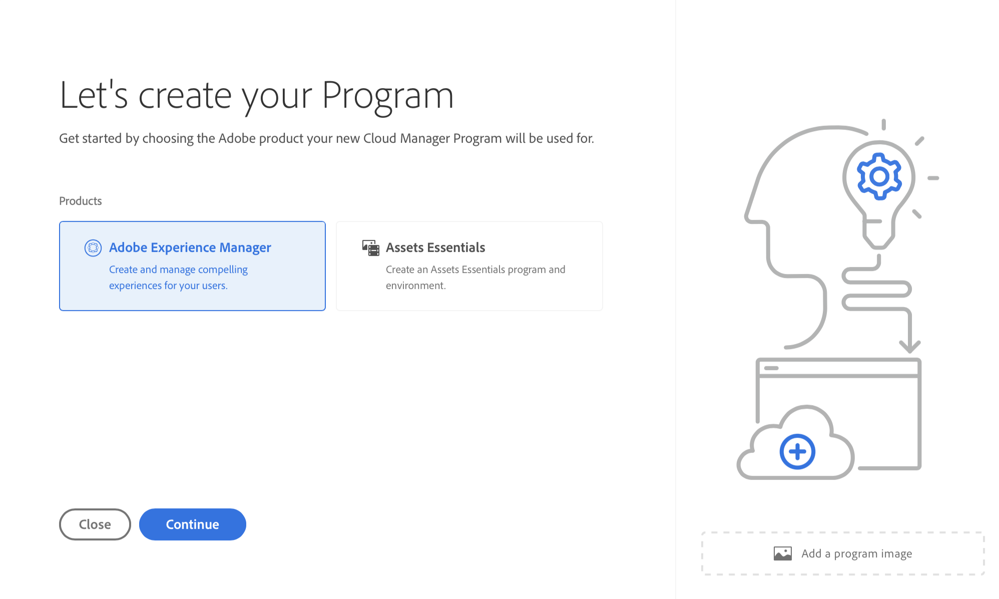
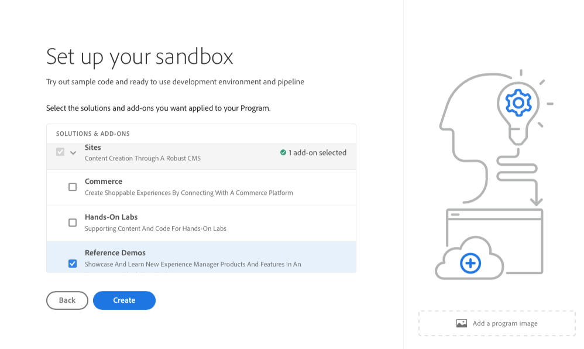
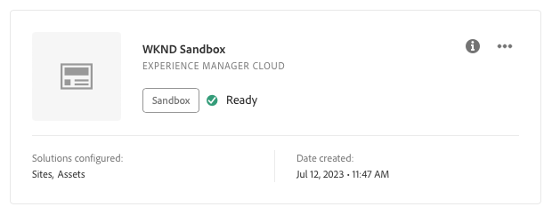
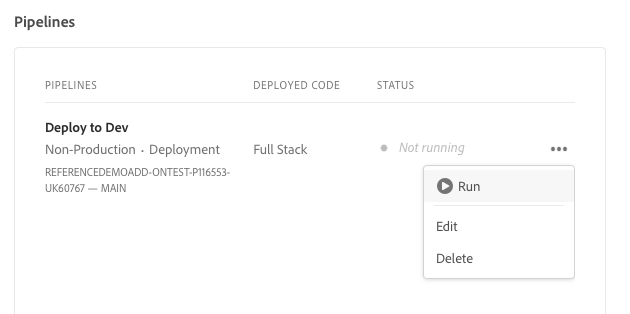
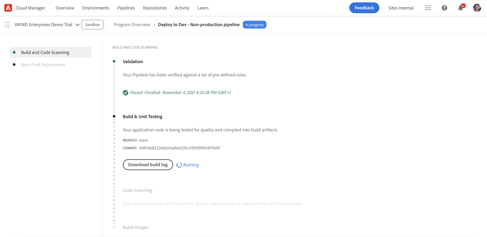

# Create Program {#creating-a-program}

Learn how to set up a new program and pipeline to deploy the add-on.

## The Story So Far {#story-so-far}

In the previous document of the Adobe Experience Manager (AEM) Reference Demos Add-on journey, [Understand Reference Demo Add-on Installation](installation.md), you learned how the installation process of the Reference Demos Add-on works, illustrating how the different pieces work together. You should now:

* Have a basic understanding of Cloud Manager.
* Understand how pipelines deliver content and configuration to AEM.
* See how templates can create sites prepopulated with demo content with just a few clicks.

This article builds on those fundamentals and takes the first configuration step to create a program for testing purposes and uses a pipeline to deploy the add-on content.

## Objective {#objective}

This document helps you understand how to set up a new program and pipeline to deploy the add-on. After reading, you should be able to do the following:

* Understand and explain how to use Cloud Manager to create a program.
* Activate the Reference Demos Add-on for the new program.
* Run a pipeline so you can deploy the add-on content.

## Create a Program {#create-program}

After logging in to Cloud Manager, you can create a sandbox program for your testing and demo purposes.

>[!NOTE]
>
>Your user must be a member of the **Business Owner** role in Cloud Manager in your organization to create programs.

1. Log into Adobe Cloud Manager at [my.cloudmanager.adobe.com](https://my.cloudmanager.adobe.com/).

1. Once logged in ensure that you are in the correct organization by checking it in the top-right corner of the screen. If you are only a member of one org, this step is not necessary.

   

1. Select **Add Program** at the top-right of the window.

1. In the **Let's create your Program** dialog:

   1. Provide a **Program name** to describe your program.
   1. Select **Set up a sandbox** for your **Program Objective**
   1. Select **Continue**.

   

1. In the **Setup your sandbox** dialog in the **Solutions &amp; Add-ons** table, expand the **Sites** entry in the list by tapping or clicking it and then check **Reference Demos**.

   * If you also want to create demos for AEM Screens, check the **Screens** option in the list. Select **Update**.

   

1. Select **Create** and Cloud Manager begins setting up your sandbox program. You are taken to the program overview screen and a brief banner notification indicates that the process has started. A card has been added to the overview page for your new program. The setup process takes a few minutes to complete.

1. Once the setup is complete, the card for the environment on the overview page shows its status as **Ready**. Select the card so you can open the environment.

   

1. Your environment is ready and the add-on is now enabled as an option, but the contents of the demo must be deployed to AEM to be available. To do this, select the ellipsis button next to the Deploy to Dev pipeline in the **Pipelines** card and select **Run**.

   

1. The pipeline starts and you are taken to a page detailing the progress of the deployment. You can navigate away from this screen as the program is created and return later if necessary.

   

The pipeline can take several minutes to complete. Once complete, the add-on and its demo content are available for use in the AEM authoring environment.

## What's Next {#what-is-next}

Now that you have completed this part of the AEM Reference Demo Add-on journey you should:

* Understand how to use Cloud Manager to create a program.
* Know how to activate the Reference Demos Add-on for the program.
* Be able to run a pipeline so you can deploy the add-on content.

Build on this knowledge and continue your AEM Reference Demo Add-on journey by next reviewing [Create a Demo Site](create-site.md). In there, you learn to create a demo site in AEM based on a library of pre-configured templates that were deployed by the pipeline.

## Additional Resources {#additional-resources}

* [Cloud Manager documentation](https://experienceleague.adobe.com/docs/experience-manager-cloud-service/content/onboarding/onboarding-concepts/cloud-manager-introduction.html) - If you would like more details on Cloud Manager's features, you may want to directly consult the in-depth technical docs.
