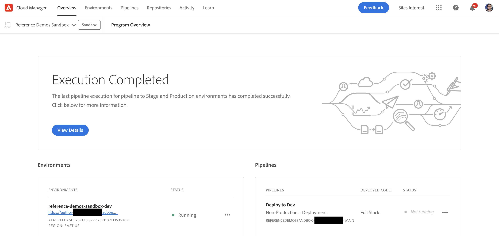

# Create Program {#creating-a-program}

Learn how to set up a new program and pipeline to deploy the add-on.

## The Story So Far {#story-so-far}

In the previous document of the AEM Reference Demos Add-On journey, [Understand Reference Demo Add-On Installation,](installation.md) you learned how the installation process of the Reference Demos Add-On works, illustrating how the different pieces work together. You should now:

* Have a basic understanding of Cloud Manager.
* Understand how pipelines deliver content and configuration to AEM.
* See how templates can create new sites prepopulated with demo content with just a few clicks.

This article builds on those fundamentals and takes the first configuration step to create a program for testing purposes and uses a pipeline to deploy the add-on content.

## Objective {#objective}

This document helps you understand how to set up a new program and pipeline to deploy the add-on. After reading you should:

* Understand how to use Cloud Manager to create a new program.
* Know how to activate the Reference Demos Add-On for the new program.
* Be able to run a pipeline to deploy the add-on content.

## Create a Program {#create-program}

After logging in to Cloud Manager, you can create a new sandbox program for your testing and demo purposes.

>[!NOTE]
>
>Your user must be a member of the **Business Owner** role in Cloud Manager in your organization in order to create programs.

1. Log into Adobe Cloud Manager at [my.cloudmanager.adobe.com](https://my.cloudmanager.adobe.com/).

1. Once logged in ensure that you are in the correct organization by checking it in the top-right corner of the screen. If you are only member of one org, this step is not necessary.

   

1. Tap or click **Add Program** at the top-right of the window.

1. In the **Let's create your Program** dialog, make sure that **Adobe Experience Manager** is selected under **Products** and then tap or click **Continue**.

   

1. In the next dialog:

   * Provide a **Program name** to describe your program.
   * Tap or click **Set up a sandbox** for your **Program Objective**
   
   Then tap or click **Create**.

   

1. You are taken to the program overview screen where you can observe the process of your program's creation. Cloud Manager provides estimates of time remaining. You can navigate away from this screen as the program is created and return later if necessary.

   

1. Upon completion, Cloud Manager presents an overview including the environments and pipelines created automatically.

   

1. Edit the program details by clicking the program name at the top-left of the page and in the dropdown select **Edit Program**.

   

1. In the **Edit Program** dialog, switch to the **Solutions &amp; Add-ons** tab.

   

1. On the **Solutions &amp; Add-ons** tab, expand the **Sites** entry in the list and then check **Reference Demos**. If you also wish to create demos for AEM Screens, check the **Screens** option in the list as well. Tap or click **Update**.

   

1. The add-on is now enabled as an option, but its contents must be deployed to AEM to be available. Back on the program overview page, tap or click **Start** to start the pipeline to deploy the add-on content to AEM.

   

1. The pipeline starts and you are taken to a page detailing the progress of the deployment. You can navigate away from this screen as the program is created and return later if necessary.

   

Once the pipeline is complete, the add-on and its demo content is available for use in the AEM authoring environment.

## What's Next {#what-is-next}

Now that you have completed this part of the AEM Reference Demo Add-On journey you should:

* Understand how to use Cloud Manager to create a new program.
* Know how to activate the Reference Demos Add-On for the new program.
* Be able to run a pipeline to deploy the add-on content.

Build on this knowledge and continue your AEM Reference Demo Add-On journey by next reviewing the document [Create a Demo Site,](create-site.md) where you will learn to create a demo site in AEM based on a library of pre-configured templates that were deployed by the pipeline.

## Additional Resources {#additional-resources}

* [Cloud Manager documentation](https://experienceleague.adobe.com/docs/experience-manager-cloud-service/onboarding/onboarding-concepts/cloud-manager-introduction.html) - If you would like more details on Cloud Manager's features, you may want to directly consult the in-depth technical docs.
