# Create Demo Site {#creating-a-site}

Create a demo site in AEM based on a library of pre-configured templates.

## The Story So Far {#story-so-far}

In the previous document of the AEM Reference Demos Add-On journey, [Create Program](create-program.md), you took the first configuration step to create a program for testing purposes and used a pipeline to deploy the add-on content. You should now:

* Understand how to use Cloud Manager to create a program.
* Know how to activate the Reference Demos Add-On for the new program.
* Be able to run a pipeline to deploy the add-on content.

This article describes the next step of the process by creating a site or AEM Screens project in AEM based on the templates of the Reference Demo Add-On.

## Objective {#objective}

This document helps you understand how to create a site based on the templates of the Reference Demo Add-On. After reading you should:

* Understand how to access the AEM authoring environment.
* Know how to create a site based on a template.
* Understand the basics of navigating the site structure and editing a page.

## Create a Demo Site or Screens Project {#create-site}

Once the pipeline has deployed the Reference Demo Add-On, you can access the AEM authoring environment to create demo sites based on the add-on content.

1. From the program overview page in Cloud Manager, select the link to the AEM authoring environment.

   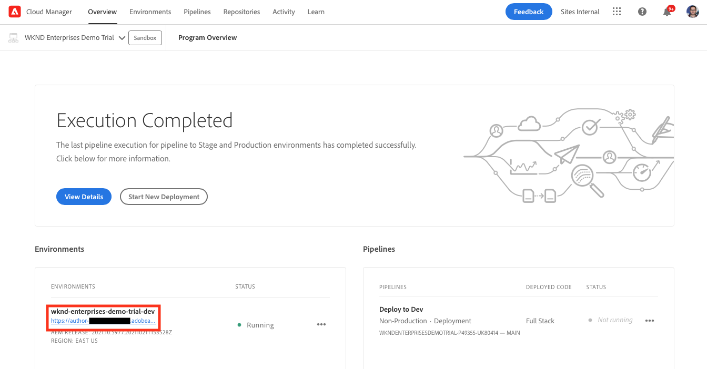

1. From the main menu of AEM, select **Sites**.

   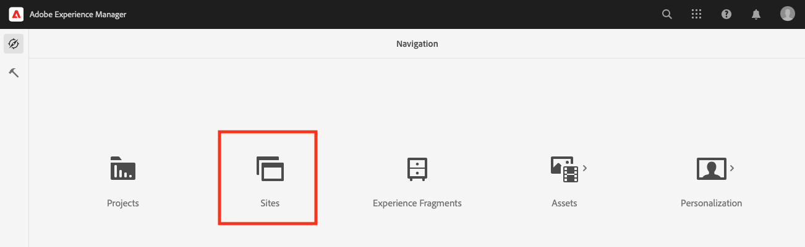

1. From the sites console, select **Create** at the top-right of the screen and select **Site from template** in the drop-down.

   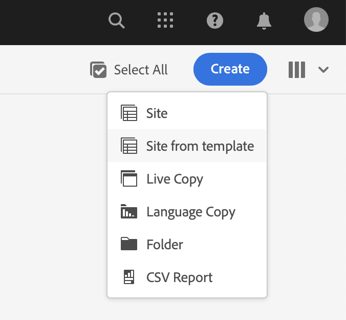

1. The site creation wizard starts. In the left column you can see the demo templates that the pipeline deployed to your authoring instance. Select one to select it and show details in the right column. If you want to test or demo AEM Screens, be sure to choose the **We.Cafe Site Template**. Select **Next**.

   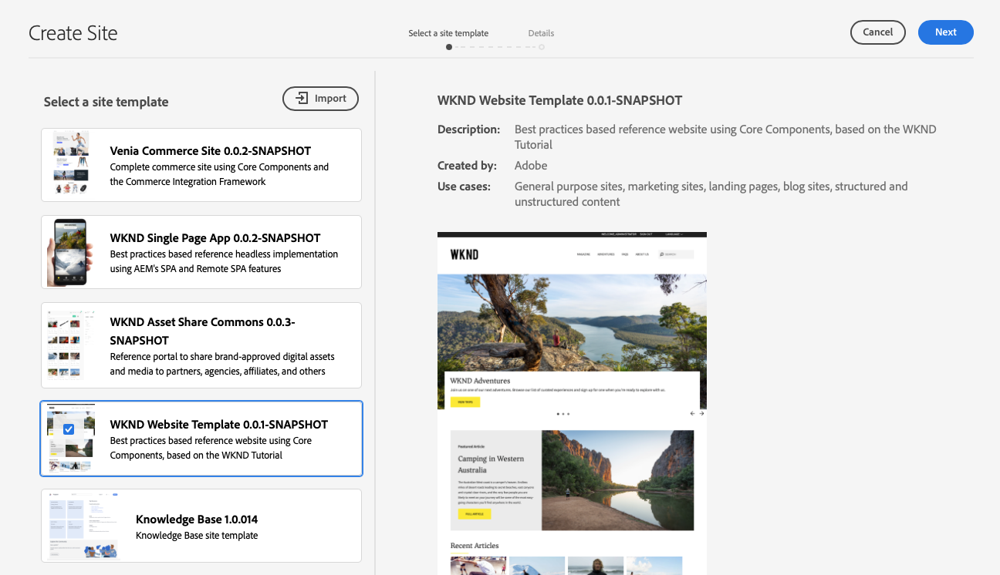

1. In the next screen, provide a title for your site or Screens project. A site name can be provided or generated from the title, if omitted. Select **Create**.

   * The site title appears in the browsers title bar.
   * The site name becomes part of the URL.
   * The site name must comply with AEM's page naming conventions, details of which are available in the [Additional Resources](#additional-resources) section.

   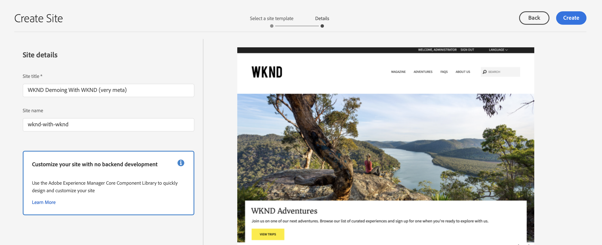

1. The site creation is confirmed with a dialog. Select **Done**.

   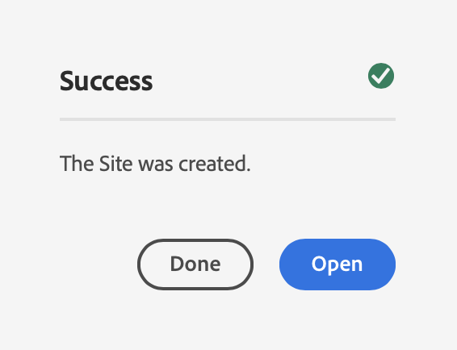

You have now created your own demo site!

## Use Demo Site {#use-site}

Now that your demo site is created, you can navigate and use it as you would any other site in AEM.

1. The site now appears in the sites console.

   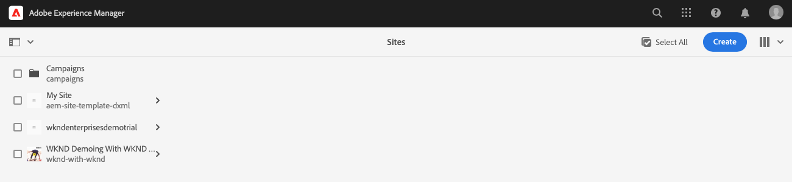

1. In the top-right corner of the screen, make sure that the console view is set to **Column View**.

   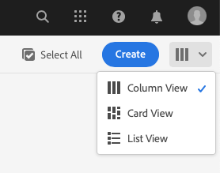

1. Select the site to explore its structure and contents. The column view continuously expands as you navigate the content tree of the demo site.

   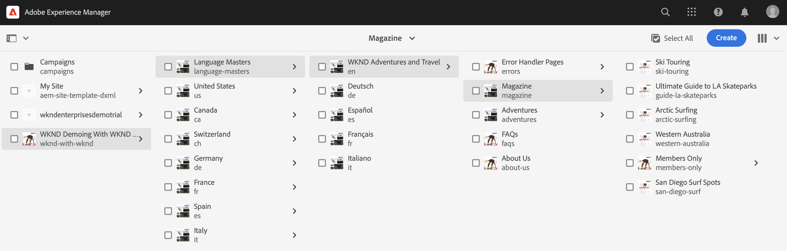

1. Select a page to select it and then select **Edit** in the toolbar.

   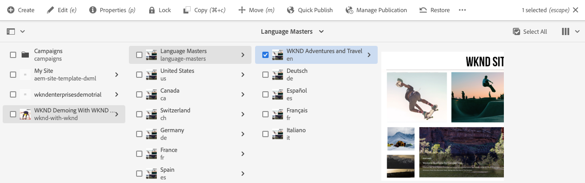

1. You can edit the page as any other AEM content page such as adding or editing components or assets and test the functionality of AEM.

   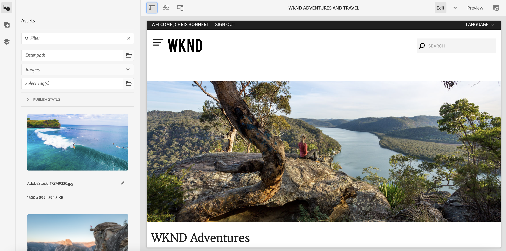

Congratulations! You now can explore your demo site's content further and discover all that AEM has to offer through the best practices content of the Reference Demo Add-On.

Create additional sites based on other templates to explore more AEM functionality.

## What's Next {#what-is-next}

Now that you have completed this part of the AEM Reference Demo Add-On journey you should:

* Understand how to access the AEM authoring environment.
* Know how to create a site based on a template.
* Understand the basics of navigating the site structure and editing a page.

You can now test the features of AEM using add-on content. You have two options to continue your journey:

* If you want to fully demo and test AEM Screens content, make sure that you have deployed a site based on the **We.Cafe Site Template** as described previously and continue to [Enable AEM Screens for Your Demo Site](screens.md).
* If you only with to demo Sites content, continue to [Manage Your Demo Sites](manage.md), where you learn about the tools available to help you manage your demo sites and how to remove them.

## Additional Resources {#additional-resources}

* [Cloud Manager documentation](https://experienceleague.adobe.com/docs/experience-manager-cloud-service/onboarding/onboarding-concepts/cloud-manager-introduction.html) - If you would like more details on Cloud Manager's features, you may want to directly consult the in-depth technical docs.
* [Create Site](/help/sites-cloud/administering/site-creation/create-site.md) - Learn how to use AEM to create a site using site templates to define the style and structure of your site.
* [AEM's page naming conventions](/help/sites-cloud/authoring/sites-console/organizing-pages.md#page-name-restrictions-and-best-practices). - See this page to understand the conventions for organizing AEM pages.
* [AEM Basic Handling](/help/sites-cloud/authoring/basic-handling.md) - Explore this document if you are new to AEM to understand basic concepts such as navigation and console organization.
