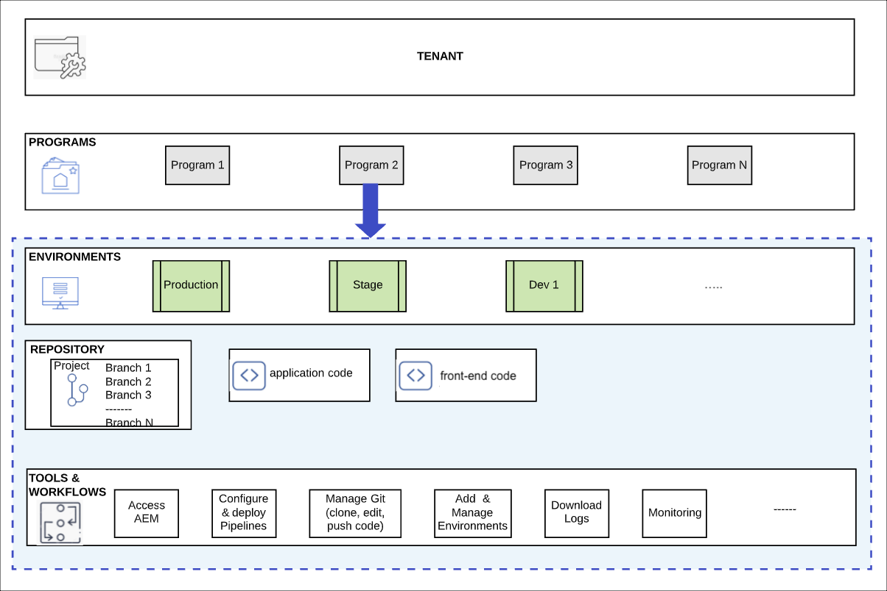

# Understand Reference Demo Add-On Installation {#understand-installation}

Learn about Cloud Manager and how it is used to install the add-on.

>[!TIP]
>
>If you already are experienced with Cloud Manager or want to jump directly to configuration and usage of the add-on, please skip to [Create a Program and a Pipeline](create-program.md)
>
>If you want to learn how Cloud Manager and AEM work together to create your demo environments as well as how to set up and use your own, please continue reading the current document.

## Objective {#objective}

This document helps you understand how the installation process of the Reference Demos Add-On works, illustrating how the different pieces work together. After reading you should:

* Have a basic understanding of Cloud Manager.
* Understand how pipelines deliver content and configuration to AEM.
* See how templates can create new sites prepopulated with demo content with just a few clicks.

This document focuses on understanding these fundamental pieces of the AEM Reference Demo Add-On before moving on to the next step of the journey where you begin installation.

Although it is recommended to proceed through this journey step-by-step, f you already are experienced with Cloud Manager or want to jump directly to configuration and usage of the add-on, please skip to [Create a Program and a Pipeline](create-program.md)

## Responsible Role {#responsible-role}

This journey applies to a system administrator who is a member of the **Business Owner** role in Cloud Manager.

## Requirements and Prerequisites {#requirements-prerequisites}

There are minimal requirements to learn about and begin using the Reference Demos Add-On.

### Knowledge {#knowledge}

* Basic knowledge of Cloud Manager

### Tools {#tools}

* Be a member of **Business Owner** role in Cloud Manager

## Installation Flow {#installation-flow}

The installation of the AEM Reference Demos Add-On is conceptually quite simple.

1. A new AEM program is created in Cloud Manager for testing purposes.
1. The demo content and configurations is deployed to the program using a pipeline in Cloud Manager. The demo content contains
   * Site templates used to create various AEM sites using features of AEM, repopulated with best practices examples.
   * Configuration tools to manage your demo content.
1. Using the quick site creation tool, you can create demo sites based on the templates.
1. Using the configuration tools, you can manage those demo sites and template including deleting them when no longer needed.

The remainder of this document gives a bit more detail and context around Cloud Manager and AEM templates.

## Cloud Manager {#cloud-manager}

Cloud Manager is an essential component of AEM as a Cloud Service and serves as the single entry point for the platform.

Cloud Manager is used to administer the cloud resources supporting your AEM projects including the environments and tools needed.

For the purposes of this journey, a complete understanding of Cloud Manager is not necessary. At a high level, Cloud Manager consists of several levels of structure.

* **TENANT** - Every customer is provisioned with a tenant. **WKND Travel and Adventure Enterprises** might be a tenant.
* **PROGRAMS** - Each tenant has one or more programs with various solutions activated. The **WKND Travel and Adventure Enterprises** tenant might have a **WKND Nightlife** and a **WKND Afternoon Projects** program with AEM Sites activated. A program can also be created just for testing purposes and the Reference Demo Add-On can be activated for it.
* **ENVIRONMENTS** - Each program has multiple environments such as production for live content, and staging and dev for development purposes. **WKND Nightlife** and **WKND Afternoon Projects** programs would both have dev, stage, and production environments. For testing programs, only a dev environment is created.
* **REPOSITORY** - The environments have git repositories where application and front-end code is maintained.
* **TOOLS &amp; WORKFLOWS** - Pipelines manage the deployment of code from the repositories as well as add-on content to the environments.

To use the add-on:

1. You log into your tenant.
1. Create a new program.
1. Activate the add-on for the program.
1. Deploy the add-on using the pipeline.

To then use the add-on's content, you need to create a site using templates.

## AEM Site Templates {#site-templates}

AEM Site Templates are packages that contain predefined content and structure for a site. Site templates can be customized to mee the needs of specific projects so when AEM administrators create new sites, they can choose from templates that apply to their business cases.

The AEM Reference Demos Add-On delivers multiple templates for various testing needs. Once you have created your program and deployed the pipeline to install the add-on, you can log into AEM and create sites based on many demo templates

## What's Next {#what-is-next}

Now that you have completed this part of the AEM Reference Demos Add-On journey you should:

* Have a basic understanding of Cloud Manager.
* Understand how pipelines deliver content and configuration to AEM.
* See how templates can create new sites prepopulated with demo content with just a few clicks.

Build on this knowledge and continue your AEM Quick Site Creation journey by next reviewing the document [Create a Program and a Pipeline,](create-program.md) where you will learn how to set up a new program and pipeline to deploy the add-on.

## Additional Resources {#additional-resources}

While it is recommended that you move on to the next part of the Quick Site Creation journey by reviewing the document [Create a Program and a Pipeline,](create-program.md) the following are some additional, optional resources that do a deeper dive on some concepts mentioned in this document, but they are not required to continue on the journey.

* [Cloud Manager documentation](https://experienceleague.adobe.com/docs/experience-manager-cloud-service/onboarding/onboarding-concepts/cloud-manager-introduction.html) - If you would like more details on Cloud Manager's features, you may want to directly consult the in-depth technical docs.
* [Site Templates](/help/sites-cloud/administering/site-creation/site-templates.md) - If you would like to know more about the structure of site templates and how they are used to create sites, refer to this document.
