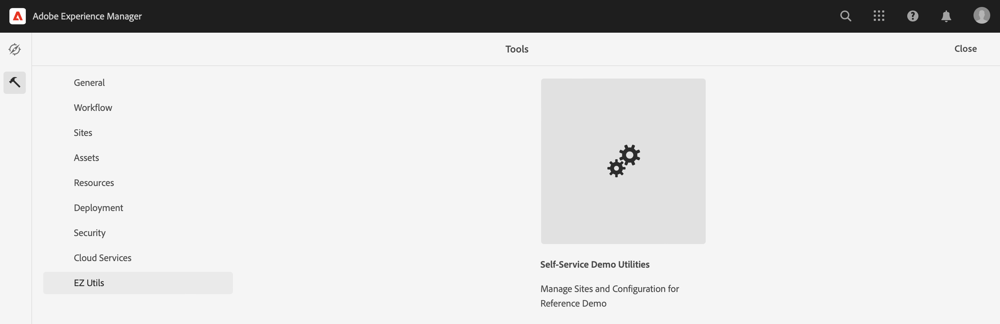
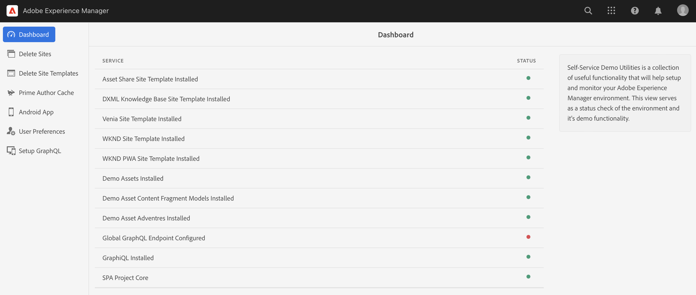
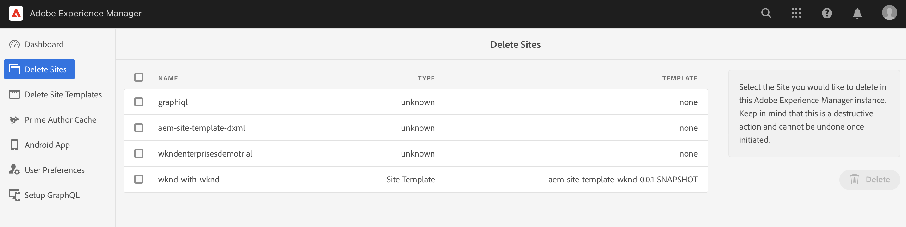
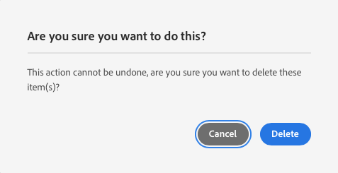
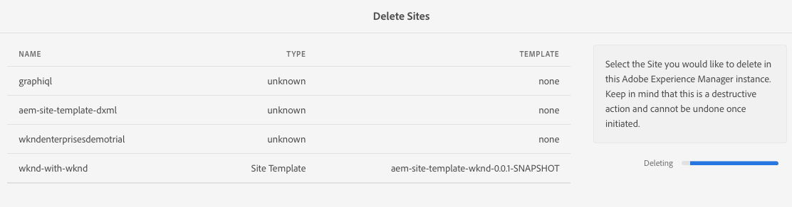

# Manage Your Demo Sites {#manage-demo-sites}

Learn about the tools available to help you manage your demo sites and how to remove them.

## The Story So Far {#story-so-far}

In the previous document of the AEM Reference Demos Add-On journey, [Create Site](create-site.md), you created a new demo site based on the templates of the Reference Demo Add-On. You should now:

* Understand how to access the AEM authoring environment.
* Know how to create a site based on a template.
* Understand the basics of navigating the site structure and editing a page.

If you also [enabled AEM Screens for your demo site](screens.md), you should also:

* Know the basics of AEM Screens.
* Understand the We.Cafe demo content.
* Know how to configure AEM Screens for We.Cafe.

Now that you have your own demo site to explore, this article describes the tools available to help you manage your demo sites and how to remove them.

## Objective {#objective}

This document helps you understand how you can manage the demo sites you created. After reading you should:

* Understand how to access the Self-Service Demo Utilities.
* Know what utilities are available to you.
* How to delete an existing demo site or template.

## Accessing the Self-Service Demo Utilities {#accessing-utilities}

Now that you have your own demo sites, you probably would like to know how you can manage them. The pipeline not only deployed the site templates to give your demo sites content, it also deployed a set of utilities to manage those sites.

1. From the AEM global navigation bar, select **Tools** &gt; **Reference Demos** &gt; **Reference Demo Utilities**.

   

1. Reference Demo Utilities is a collection of useful functionality that will help setup and monitor your Adobe Experience Manager environment. The initial view is the **Dashboard**, which serves as a status check of the environment and its demo functionality.

   

Self-Service Demo Utilities provides several tools.

* **Delete Sites** - Select the Site you would like to delete in this Adobe Experience Manager instance. Keep in mind that this is a destructive action and cannot be undone once initiated.
* **Delete Site Templates** - Select the Site Template you would like to delete in this Adobe Experience Manager instance. Before you delete a Site Template, make sure all sites referencing the template are also deleted. Keep in mind that this is a destructive action and cannot be undone once initiated.
* **Prime Author Cache** - This will fetch several resources within the Adobe Experience Manager instance, speeding up their fetch times. It may take several seconds.
* **Android App** - Tools for installing and launching the demonstration Android App. Create a site based on the **WKND Single Page App** to populate this page. Use from an Android device, emulator, or Bluestacks.
* **User Preferences** - Turn off Tutorial Popup Dialogs.
* **Setup GraphQL** - Quickly set up the global GraphQL endpoint.

## Deleting Demo Sites and Templates {#deleting}

After you have tested a set of AEM functionality, you may no longer need your demo site or even the template on which it is based. It is easy to delete both demo sites and site templates.

1. Access the **Reference Demo Utilities** and select **Delete Sites**.

   

1. The sites that are available are presented in a list. Check the site or sites you want to delete and then select **Delete**.

   >[!CAUTION]
   >
   >Site and template deletion is a destructive action and cannot be undone once initiated.

1. Confirm the site deletion in the dialog.

   

1. AEM deletes the site or sites selected and shows its progress where the **Delete** button was previously.

   

The site is now deleted.

You can delete templates in the same manner under the heading **Delete Site Templates** in the **Reference Demo Utilities**.

>[!CAUTION]
>
>Before you delete a Site Template, make sure all sites referencing the template are also deleted.

## End of the Journey? {#end-of-journey}

Congratulations! You have completed the AEM Reference Demos Add-On journey! You should now:

* Have a basic understanding of Cloud Manager and understand how pipelines deliver content and configuration to AEM.
* Understand how to use Cloud Manager to create a program.
* Know how to activate the Reference Demos Add-On for the new program and be able to run a pipeline to deploy the add-on content.
* Understand how to access the AEM authoring environment to create a site based on a template.
* Understand how to access the Self-Service Demo Utilities.
* Know how to delete an existing demo site or template.

You are now ready to explore the capabilities of AEM using your own demo sites. However AEM is a powerful tool and there are many additional options available. Check out some of the additional resources available in the [Additional Resources section](#additional-resources) to learn more about the features you saw in this journey.

## Additional Resources {#additional-resources}

* [Cloud Manager documentation](https://experienceleague.adobe.com/docs/experience-manager-cloud-service/onboarding/onboarding-concepts/cloud-manager-introduction.html) - If you would like more details on Cloud Manager's features, you may want to directly consult the in-depth technical docs.
* [Create Site](/help/sites-cloud/administering/site-creation/create-site.md) - Learn how to use AEM to create a site using site templates to define the style and structure of your site.
* [AEM's page naming conventions](/help/sites-cloud/authoring/sites-console/organizing-pages.md#page-name-restrictions-and-best-practices). - See this page to understand the conventions for organizing AEM pages.
* [AEM Basic Handling](/help/sites-cloud/authoring/basic-handling.md) - Explore this document if you are new to AEM to understand basic concepts such as navigation and console organization.
* [AEM as a Cloud Service technical documentation](https://experienceleague.adobe.com/docs/experience-manager-cloud-service.html) - If you already have a firm understanding of AEM, you may want to directly consult the in-depth technical docs.
* [Site Templates](/help/sites-cloud/administering/site-creation/site-templates.md) - If you would like to know more about the structure of site templates and how they are used to create sites, refer to this document.
