# Enable AEM Screens for Your Demo Site {#enable-screens}

Learn the steps enabling the full AEM Screens as a Cloud Service experience on your demo site.

>[!NOTE]
>
>AEM Screens Demo requires Screens Add-on to be added to Cloud Manager Program. Learn how with [Adding Screens as an Add-on to a New Program in Cloud Manager](/help/screens-cloud/onboarding-screens-cloud/add-on-new-program-screens-cloud.md) how to add it.

## The Story So Far {#story-so-far}

In the previous document of the AEM Reference Demos Add-on journey, [Create Demo Site](create-site.md), you created a demo site based on the templates of the Reference Demo Add-on. You should now:

* Understand how to access the AEM authoring environment.
* Know how to create a site based on a template.
* Understand the basics of navigating the site structure and editing a page.

Now that you have your own demo site to explore, and understand the tools to help you manage your demo sites, enable the full AEM Screens as a Cloud Service experience for your demo sites.

## Objective {#objective}

The AEM Reference Demos Add-on contains AEM Screens content for We.Cafe, a coffee shop business vertical. This document helps you understand how to execute the We.Cafe demo setup in the context of AEM Screens. After reading, you should:

* Know the basics of AEM Screens.
* Understand the We.Cafe demo content.
* Know how to configure AEM Screens for We.Cafe.
  * Know how to create a Screens project for We.Cafe.
  * Be able to configure a simulated weather service using Google Sheets and APIs.
  * Simulate dynamically changing Screens content based on your "weather service."
  * Install and use the screens player.

## Understand Screens {#understand-screens}

AEM Screens as a Cloud Service is a digital signage solution that allows marketers to create and manage dynamic digital experiences at scale. With AEM Screens as a Cloud Service, you can create engaging and dynamic digital signage experiences intended to be consumed in public spaces.

>[!TIP]
>
>For the full details of AEM Screens as a Cloud Service, see the [Additional Resources](#additional-resources) section at the end of this document.

By installing the AEM Reference Demos Add-on, you automatically have We.Cafe content for AEM Screens available to you in your demo authoring environment. The steps described in the [Deploy a Demo Screens Project](#deploy-project) help you enable the full AEM Screens experience by publishing that content and deploying to media players, and so on.

## Understand the Demo Content {#demo-content}

The We.Cafe coffee shop is composed of three shops in three locations in the US. All three shops have three similar experiences:

* A menu board above the counter with two or three vertical panels
* An entrance display facing the street with one horizontal or vertical panel inviting customers into the shop
* A quick self-order kiosk booth to bypass the queue with one vertical tablet

>[!NOTE]
>
>Only the entrance display can be tested in the current version of the demo. Other displays will follow in a future version.
>
>The kiosk is not included in the current version of the demo. It will be included in a future version.

The New-York location is assumed to be in a smaller shop that does not have much space, and as such:

* The menu board only has two vertical panels instead of three for San Francisco and San Jose
* The entrance display is positioned vertically instead of horizontally

>[!NOTE]
>
>If you decide to connect to Screens Cloud Service in the [Connect Screens as a Cloud Service](#connect-screens) section, create the locations as folders under displays. See the [Additional Resources](#additional-resources) section at the end of this document for more information on displays.

### Cafe Layouts {#care-layouts}

The We.Cafe locations have the following layouts.

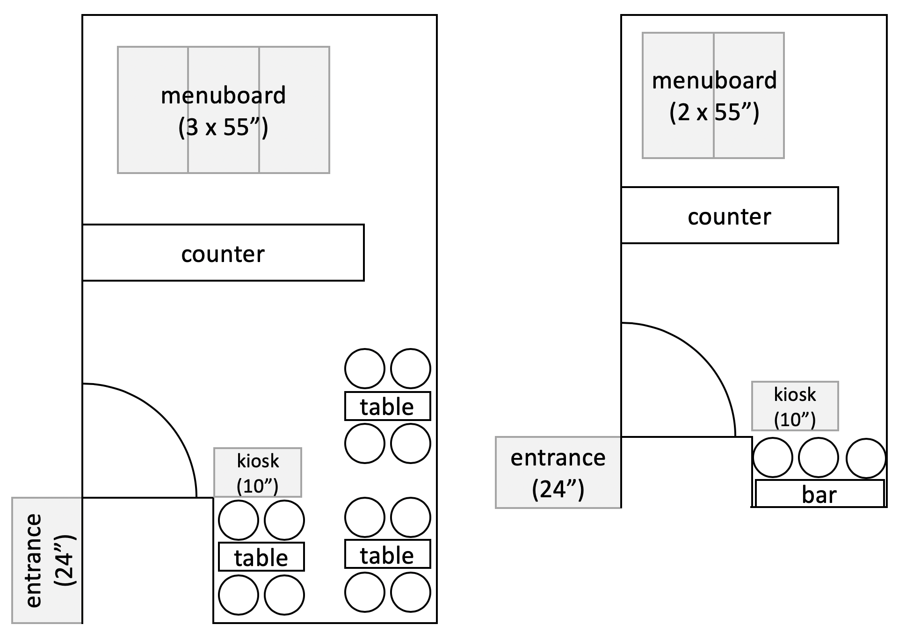

>[!NOTE]
>
>Measurements for the screens are in inches.

### Entrance {#entrance}

The entrance display is day-parted, and just changes the first image from morning to afternoon. On each pass of the sequence, it also advertises a different special coffee preparation, using a metered embedded sequence to play a different item each time.

The last image on the entrance channels is also targeted (that is, dynamically changed) based on outside temperature, which can be simulated as described in the [Create Simulated Data Source](#data-source) section.

## Deploy a Demo Screens Project {#deploy-project}

To use the demo content in the sandbox that you created in the [Create Program](create-program.md) step, a site must be created based on a template.

If you have not already created a We.Cafe demo site, simply follow the same steps as in the [Create Demo Site](create-site.md) section. When selecting the template, simply choose the **We.Cafe Website Template**.

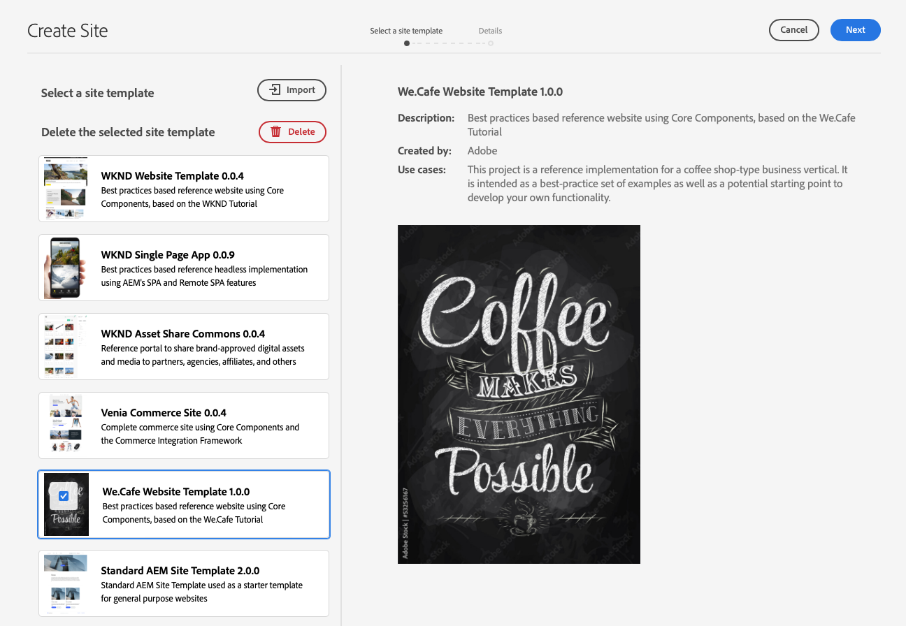

After the wizard completes, you find the content deployed under Sites and you can navigate and explore as you would any other content.

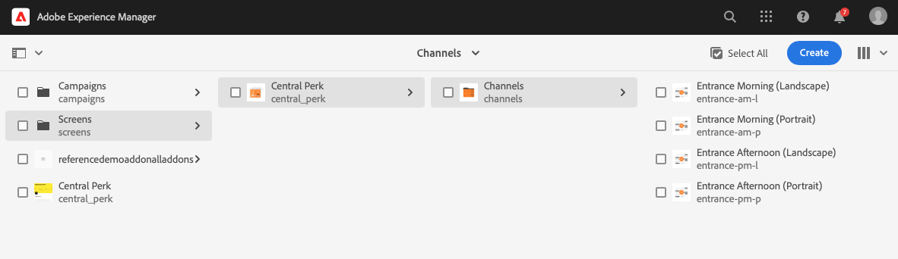

Now that you have We.Cafe demo content, you have a choice about how you want to test AEM Screens:

* If you only want to explore the content within the AEM Sites console, simply start exploring and discover more in the [Additional Resources](#additional-resources) section; no more action is required.
* If you want to experience the full dynamic features of AEM Screens, continue to the next section, [Dynamically Change Screens Content](#dynamically-change).

## Dynamically Change Screens Content {#dynamically-change}

Just like AEM Sites, AEM Screens can change content dynamically based on context. The We.Cafe demo has channels configured to show different content depending on the current temperature. To simulate this experience, you must create your own simple weather service.

### Create Simulated Data Source {#data-source}

Because it is difficult to change the weather during a demo or while testing, temperature changes must be simulated. A weather service is simulated by storing a temperature value in a Google Sheet spreadsheet which AEM's ContextHub calls to retrieve the temperature.

#### Create Google API Key {#create-api-key}

First, you must create a Google API key to facilitate the exchange of data.

1. Log on to a Google account.
1. Open up the Cloud Console using this link `https://console.cloud.google.com`.
1. Create a project by clicking the current project name in the top-left of the toolbar after the **Google Cloud Platform** label.

   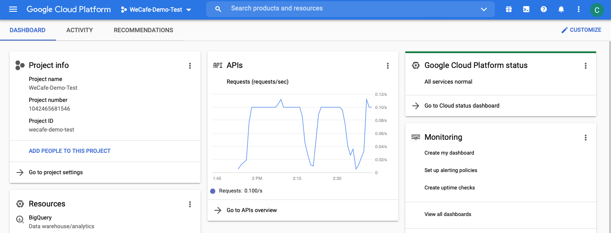

1. In the project selector dialog, click **NEW PROJECT**.

   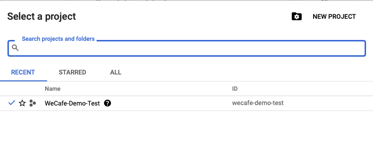

1. Give the project a name and click **CREATE**.

   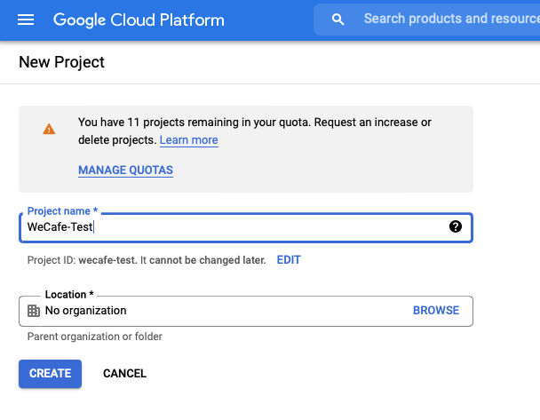

1. Make sure that your new project is selected and then using the hamburger menu in the dashboard of the Cloud Console, select **APIs &amp; Services**.

   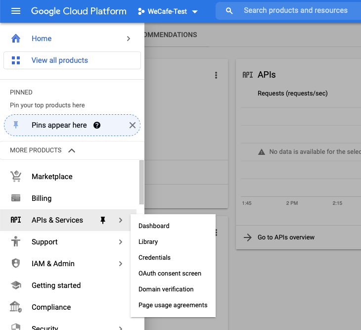

1. In the left panel of the APIs &amp; Services window, click **Credentials** at the top of the window, then click **CREATE CREDENTIALS** and **API Key**.

   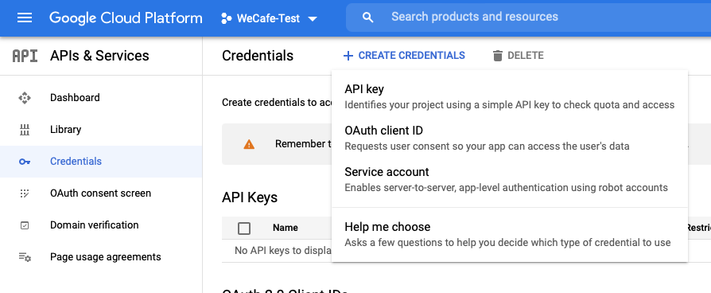

1. In the dialog box, copy your new API key and save for later use. Click **CLOSE** so you can exit the dialog box.

#### Enable Google Sheets API {#enable-sheets}

To allow the exchange of Google Sheets data using your API key, you must enable the Google Sheets API.

1. Return to the Google Cloud Console at `https://console.cloud.google.com` for your project and then use the hamburger menu to select **APIs &amp; Services &gt; Library**.

   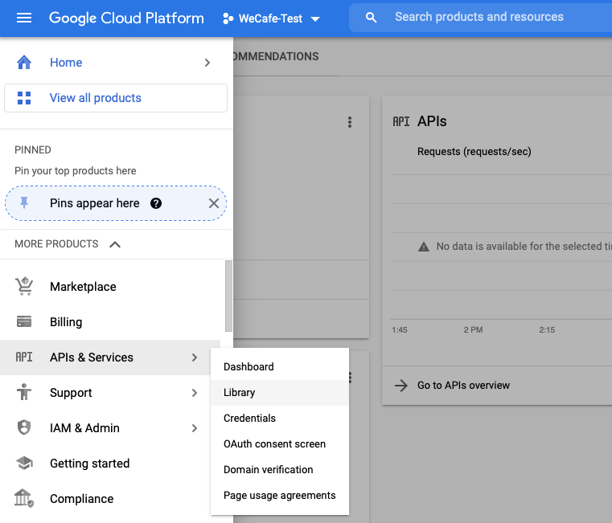

1. In the API Library screen, scroll to find your search for **Google Sheets API**, then click it.

   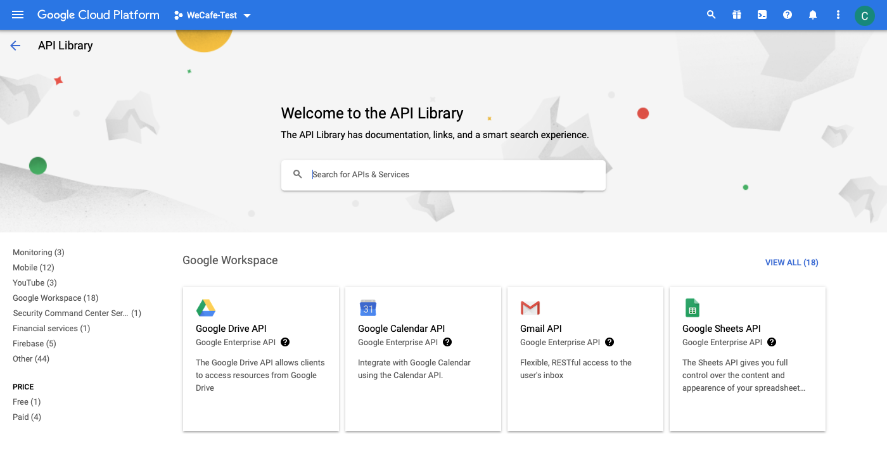

1. In the **Google Sheets API** window, click **ENABLE**.

   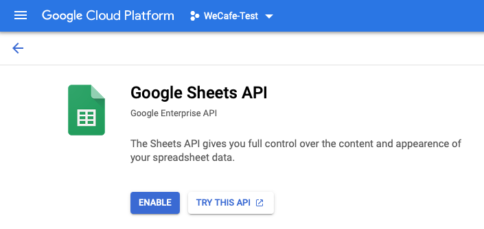

#### Create Google Sheets Spreadsheet {#create-spreadsheet}

Now you can create a Google Sheets spreadsheet to store your weather data.

1. Go to `https://docs.google.com` and create a Google Sheets spreadsheet.
1. Define the temperature by entering `32` in cell A2.
1. Share the document by clicking **Share** at the top-right of the window and under **Get link**, click **Change**.

   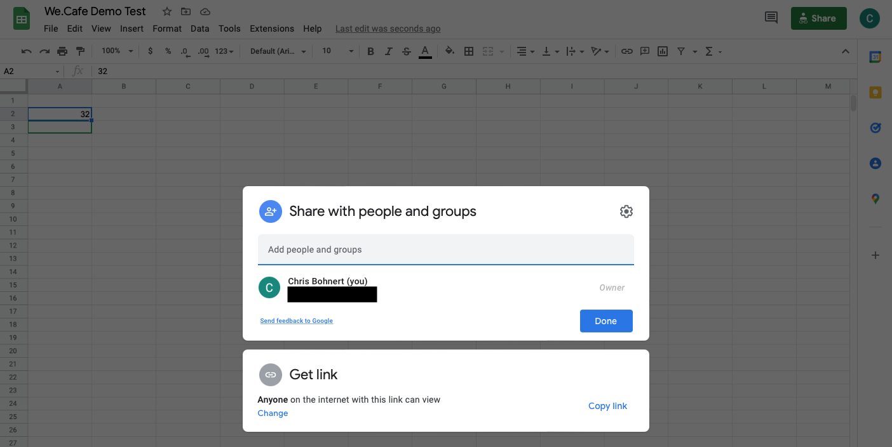

1. Copy the link for the next step.

   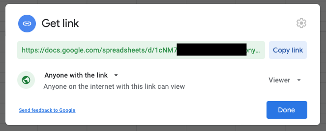

1. Locate the sheet ID.

   * The sheet ID is the random string of characters in the sheet link that you copied after `d/` and before `/edit`.
   * For example:
     * If your URL is `https://docs.google.com/spreadsheets/d/1cNM7j1B52HgMdsjf8frCQrXpnypIb8NkJ98YcxqaEP30/edit#gid=0` 
     * The sheet ID is `1cNM7j1B52HgMdsjf8frCQrXpnypIb8NkJ98YcxqaEP30`.

1. Copy the sheet ID for future use.

#### Test Your Weather Service {#test-weather-service}

Now that you have created your data source as a Google Sheets spreadsheet and enable access via API, test it to ensure that your "weather service" is accessible.

1. Open a web browser.

1. Enter the following request, replacing the sheet ID and API key values that you saved previously.

   ```
   https://sheets.googleapis.com/v4/spreadsheets/<yourSheetID>/values/Sheet1?key=<yourAPIKey>
   ```

1. If you receive JSON data similar to the following, you set it up properly.

   ```json
   {
     "range": "Sheet1!A1:Z1000",
     "majorDimension": "ROWS",
     "values": [
       [],
       [
         "32"
       ]
     ]
   }
   ```

AEM Screens can use this same service to access the simulated weather data that is configured in the next step.

### Configure ContextHub {#configure-contexthub}

AEM Screens can change content dynamically based on context. The We.Cafe demo has channels configured to show different content depending on the current temperature by using AEM's ContextHub.

>[!TIP]
>
>For the full details of ContextHub, see the [Additional Resources](#additional-resources) section at the end of this document.

When the screen content is displayed, ContextHub calls your weather service to find the current temperature to determine what content to display.

For demo purposes, the values in the sheet can be changed. ContextHub recognizes this fact and the content adjusts in the channel according to the updated temperature.

1. On the AEMaaCS author instance, go to **Global Navigation &gt; Tools &gt; Sites &gt; ContextHub**.
1. Select the configuration container that has the same name as what you gave the project when you created the Screens project from the **We.Cafe Website Template**.
1. Select **Configuration &gt; ContextHub Configuration &gt; Google Sheets** then click **Next** at the top right.
1. The configuration should already have pre-configured JSON data. There are two values that must be changed:
   1. Replace `[your Google Sheets id]` with the sheet ID that [you saved previously](#create-spreadsheet).
   1. Replace `[your Google API Key]` with the API key that [you saved previously](#create-api-key).
1. Click **Save**.

Now you can change the temperature value in your Google Sheet spreadsheet and ContextHub updates Screens dynamically as it "sees the weather change."

### Test Dynamic Data {#test-dynamic}

Now that AEM Screens and ContextHub are connected to your weather service, you can test it to see how screens can update content dynamically.

1. Access your sandbox author instance.
1. Navigate to the sites console via **Global Navigation &gt; Sites** and select the following page **Screens &gt; &lt;project-name&gt; &gt; Channels &gt; Entrance Morning (Portrait)**.

   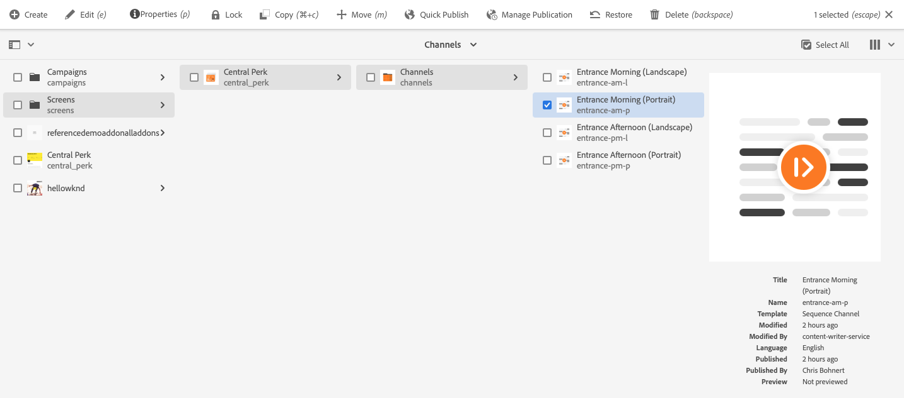

1. Click **Edit** in the toolbar or type the shortcut key `e` so you can edit the page.

1. In the editor, you can see the content. One image is highlighted in blue with a targeting icon in the corner.

   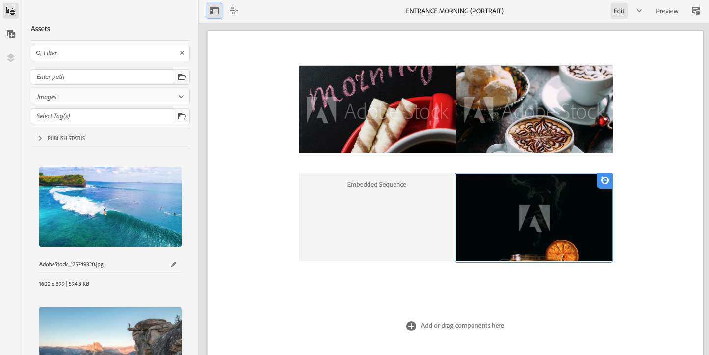

1. Change the temperature that you entered in your spreadsheet from 32 to 70 and watch the content change.

   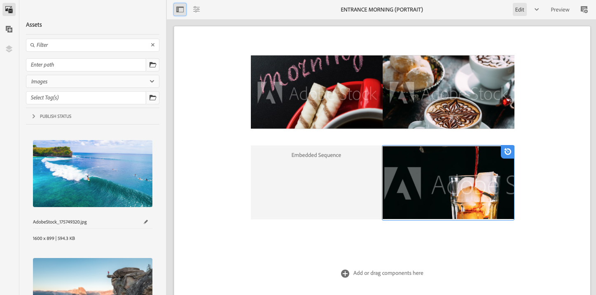

Based on the temperature changing from a freezing 32°F (0°C) to a comfortable 70°F (21°C), the featured image changed from a warming cup of tea to a cool iced coffee.

>[!IMPORTANT]
>
>Only use the described Google Sheets solution for demo purposes. Adobe does not support using Google Sheets for production environments.

## Connect Screens as a Cloud Service {#connect-screens}

If you would like to also set up a real digital signage experience, including a player that runs on a digital signage device or on your computer, follow the next steps.

Alternatively you can preview the demo simply in the Channel Editor on AEMaaCS.

>[!TIP]
>
>For the full details of the Channel Editor, see the [Additional Resources](#additional-resources) section at the end of this document.

### Configure AEM Screens as a Cloud Service {#configure-screens}

First, you must publish your Screens demo content to AEM Screens as a Cloud Service and configure the service.

1. Publish the content of your demo screens project.
1. Navigate to Screens as a Cloud Service at `https://experience.adobe.com/screens` and log in.
1. In the top-right of the screen, ensure that you are in the correct organization.

   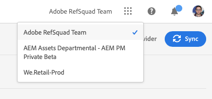

1. Near the upper-left corner, click the **Edit Settings** icon, shaped like a gear.
   
   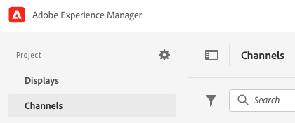

1. Provide the URLs of AEMaaCS author and publish instances where you created your demo site and click **Save**.

   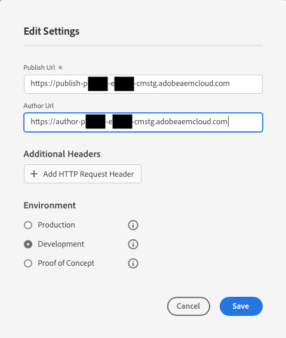

1. Once connected to your demo instances, Screens pulls in your channel content. Click **Channels** in the left panel so you can see your published channels. It may take a moment for the information to populate. You can click the blue **Sync** button at the top-right of the screen to update the information.

   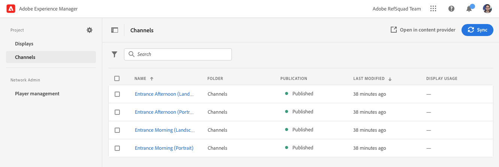

1. Click **Displays** in the left panel. You have not yet created any for your demo. You can simulate the locations of We.Cafe by creating folders for each. Click **Create** at the top-right of the screen and select **Folder**.

   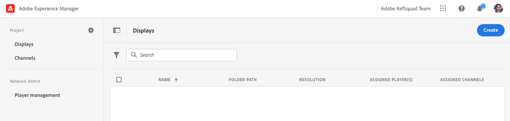

1. In the dialog box, provide a folder name such as **San Jose** and click **Create**.

1. Open the folder by clicking it and then click **Create** at the top-right and select **Display**.

1. Provide a display name and click **Create**.

   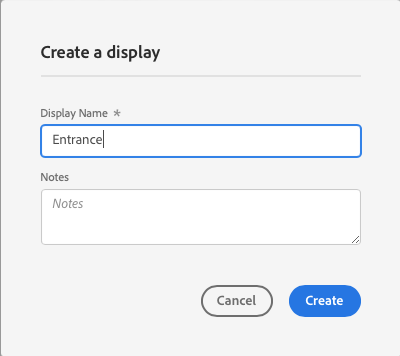

1. After the display is created, click the display's name to open the display details screen. The display must be assigned a channel that was synched from your demo site. Click **Assign channel** at the top-right of the screen.

   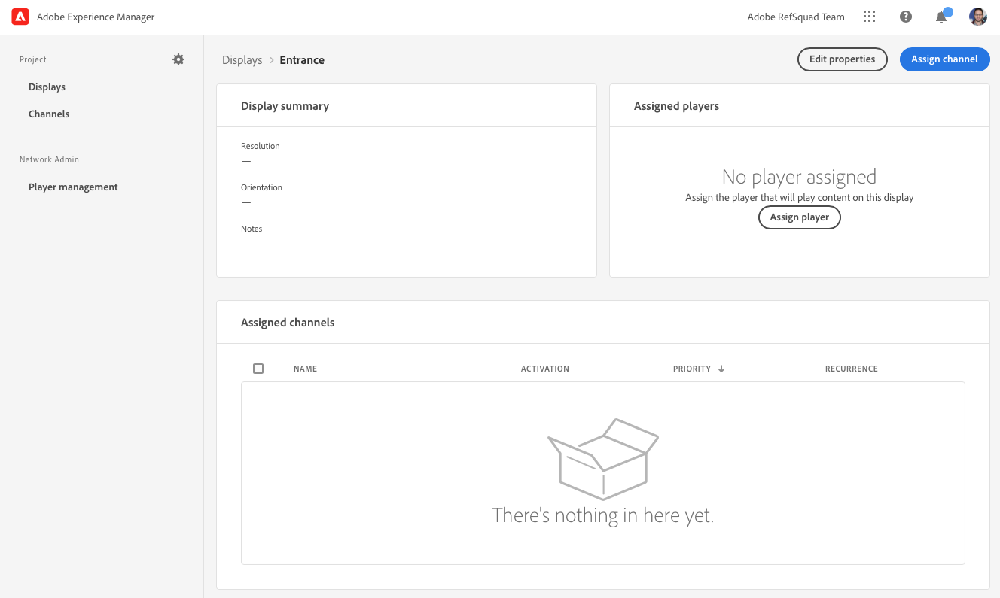

1. In the dialog, select the channel and click **Assign**.

   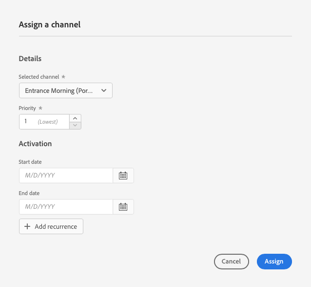

You can repeat these steps for your additional locations and displays. Following completion, you have linked your demo site with AEM Screens and have completed the necessary configuration.

You can preview the demo simply in the Channel Editor on AEMaaCS.

### Using Screens Player {#screens-player}

To view the content as on an actual screen, you can download the player and set it up locally. AEM Screens as a Cloud Service delivers the content to your player

#### Generate a Registration Code {#registration-code}

First, you must create a registration code to securely connect a player to AEM Screens as a Cloud Service.

1. Navigate to Screens as a Cloud Service at `https://experience.adobe.com/screens` and log in.
1. In the top-right of the screen, ensure that you are in the correct organization.

   

1. In the left panel, click **Player Management &gt; Registration Codes** and then click **Create code** at the top-right of the screen.

  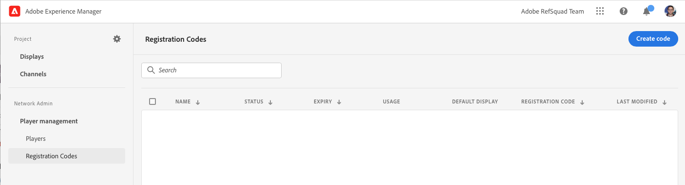

1. Enter a name for the code and click **Create**.

   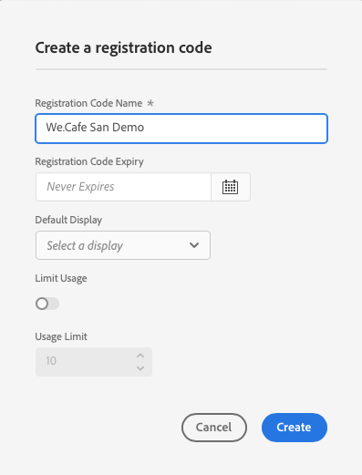

1. Once the code is created, it appears in the list. Click to copy the code.

   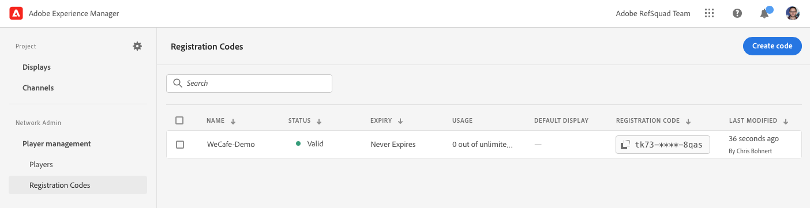

#### Install and Configure Player {#install-player}

1. Download the player for your platform from `https://download.macromedia.com/screens/` and install it.
1. Run the player, then switch to the **Configuration** tab.
1. Scroll to the bottom, then click and confirm both **Reset to Factory** and **Change to Cloud Mode** options.

   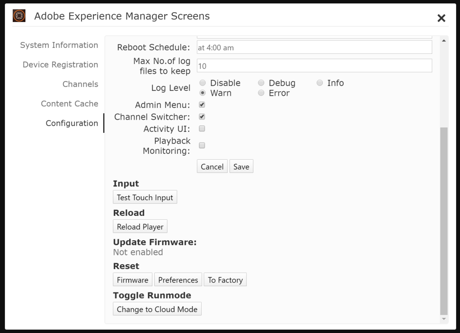

1. The player automatically changes to the **Player Registration** tab. Enter the code that you generated previously and click **Register**.

   

1. Switch to the **System Information** tab to confirm that the player has been registered.

   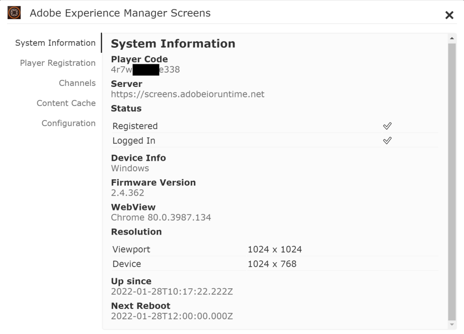

#### Assign Player to a Display {#assign-player}

1. Navigate to Screens as a Cloud Service at `https://experience.adobe.com/screens` and log in.
1. In the top-right of the screen, ensure that you are in the correct organization.

   

1. In the left panel, click **Player Management &gt; Players** and you see the player that you previously installed and registered.

   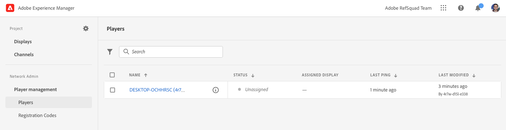

1. Click the player name so you can open its details. Click **Assign to display** in the top-right of the screen.

   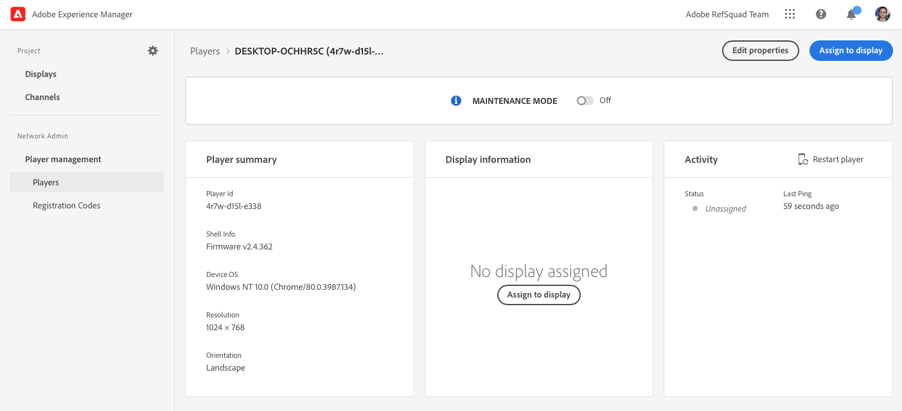

1. In the dialog box, select the display that you created previously and then click **Select**.

   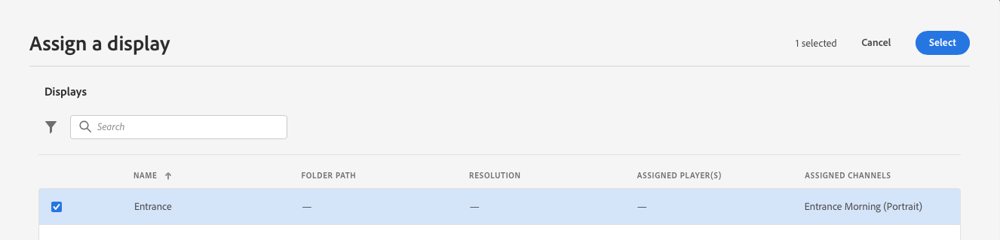

#### Playback! {#playback}

Once you have assigned a display to a player, AEM Screens as a Cloud Service delivers the content to your player where it is visible.


## What's Next {#what-is-next}

Now that you have completed this part of the AEM Reference Demo Add-on journey you should:

* Know the basics of AEM Screens.
* Understand the We.Cafe demo content.
* Know how to configure AEM Screens for We.Cafe.

You are now ready to explore the capabilities of AEM Screens using your own demo sites. Continue to the next section of the journey, [Manage Your Demo Sites](manage.md), where you learn about the tools available to help you manage your demo sites and how to remove them.

You can also check out some of the additional resources available in the [Additional Resources section](#additional-resources) to learn more about the features you saw in this journey.

## Additional Resources {#additional-resources}

* [ContextHub documentation](/help/sites-cloud/authoring/personalization/contexthub.md) - Learn how ContextHub can be used to personalize content based on user context beyond weather conditions.
* [Using API Keys - Google Documentation](https://developers.google.com/maps/documentation/javascript/get-api-key) - A handy reference for details about using Google's API keys.
* [Displays](/help/screens-cloud/creating-content/creating-displays-screens-cloud.md) - Learn more about what a display is in AEM Screens and what it can do.
* [Download Player](/help/screens-cloud/managing-players-registration/installing-screens-cloud-player.md) - Learn how to access the Screens Player and how to install.
* [Register Player](/help/screens-cloud/managing-players-registration/registering-players-screens-cloud.md) - Learn how to set up and register a player with your AEM Screens project.
* [Assigning Player to a Display](/help/screens-cloud/managing-players-registration/assigning-player-display.md) - Configure a player to display your content.
