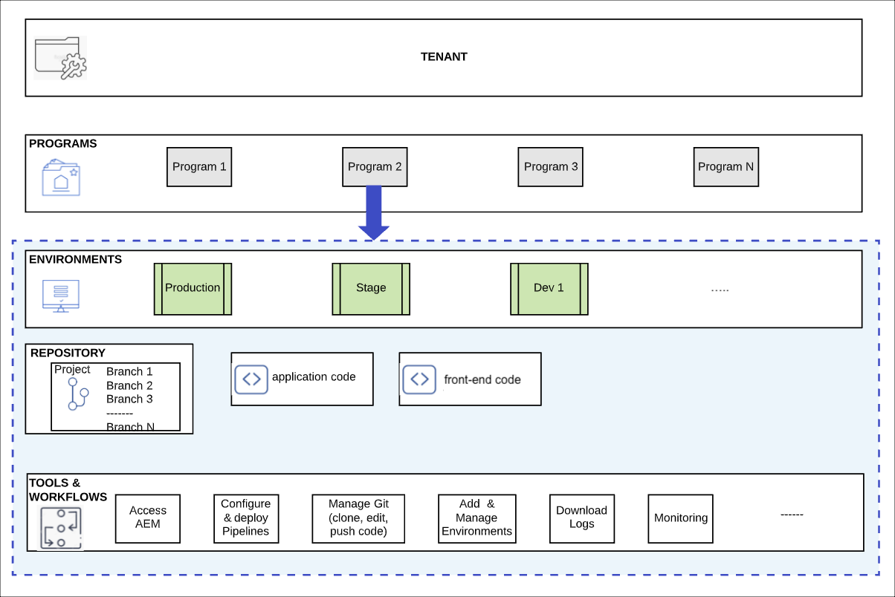
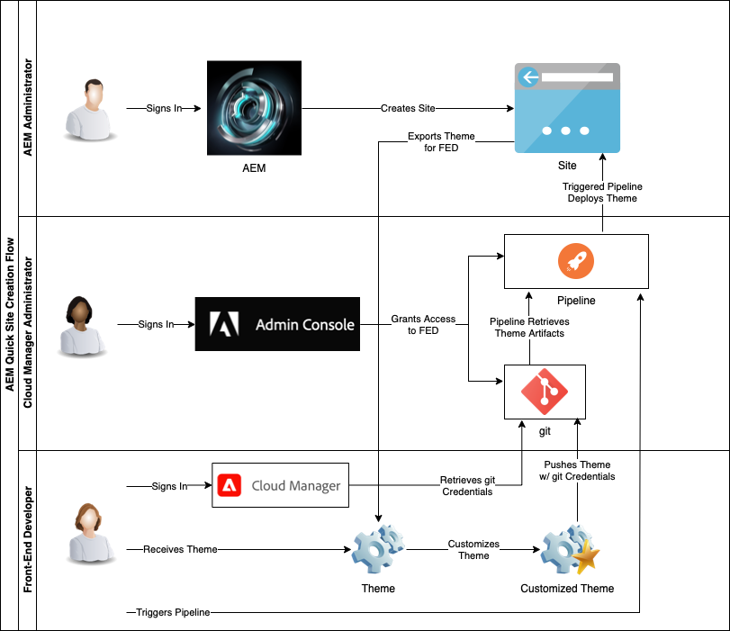

# Understand Cloud Manager and the Quick Site Creation Workflow {#understand-cloud-manager}

Learn about Cloud Manager and how it ties together the new Quick Site Creation process.

>[!TIP]
>
>If your role is exclusively front-end development, you can skip to the article [Retrieve git repository access information](retrieve-access.md) in this journey.
>
>If you are an AEM administrator, a Cloud Manager administrator, are responsible for both front-end development and administrator tasks, or would simply like to understand the end-to-end process in AEM for front-end development, continue reading the current document and proceed on this journey.

## Objective {#objective}

This document helps you understand how the AEM Quick Site Creation tool works and gives you an overview of the end-to-end flow. After reading you should:

* Understand how AEM Sites and the Cloud Manager work together to facilitate front-end development
* See how the front-end customization step is entirely decoupled from AEM and requires no AEM knowledge.

This document focuses on understanding these fundamental pieces of the Quick Site creation solution before moving on to the next step of the journey where you begin configuration.

Although it is recommended to proceed through this journey step-by-step, if you already understand AEM Sites and Cloud Manager work together and want to start directly with configuration, you can [skip to the next step of the journey.](create-site.md)

## Responsible Role {#responsible-role}

This part of the journey applies to both the AEM administrator and the Cloud Manager administrator.

## Requirements and Prerequisites {#requirements-prerequisites}

There are several requirements before you begin creating and customizing sites using the Quick Site Creation tool.

Because this journey is intended for both front-end developers, administrators, and combinations of all roles, the requirements for both all are listed here.

It is important to understand that for the front-end developer, no AEM access or knowledge is necessary.

### Knowledge {#knowledge}

|Knowledge|Role|
|---|---|
|Understanding of the standard tools and processes of front-end development|Front-End Developer|
|Basic knowledge of how to create and manage sites in AEM|AEM Administrator|
|Basic knowledge of Cloud Manager|Cloud Manager Administrator|

For the front-end developer, no AEM knowledge is necessary.

### Tools {#tools}

|Tool|Role|
|---|---|
|Preferred front-end development environment|Front-End Developer|
|npm|Front-End Developer|
|webpack|Front-End Developer|
|Access to Cloud Manager|Cloud Manager Administrator|
|Be a member of **Business Owner** role in Cloud Manager|Cloud Manager Administrator|
|Be a Sys Admin in Cloud Manager|Cloud Manager Administrator|
|Access to Admin Console|Cloud Manager Administrator|
|Be a member of the **Deployment Manager** role in Cloud Manager|Cloud Manager Administrator|
|Be a member of the **Deployment Manager** role in Cloud Manager|Front-End Developer|

For the front-end developer, no use of AEM is necessary.

>[!TIP]
>
>If you are not familiar with Cloud Manager roles and role management, see the Role Based Permissions document in the [Additional Resources](#additional-resources) section.

## Cloud Manager {#cloud-manager}

Cloud Manager is an essential component of AEM as a Cloud Service and serves as the single entry point for the platform.

To support customers with enterprise development setups, AEM as a Cloud Service fully integrates with Cloud Manager and its purpose-built CI/CD pipelines. The Quick Site Creation tool extends these features to support dedicated front-end development pipelines.

For the purposes of this journey, a complete understanding of Cloud Manager is not necessary. At a high level, Cloud Manager consists of several levels of structure.

* **TENANT** - Every customer is provisioned with a tenant.
* **PROGRAMS** - Each tenant has one or more programs, which often reflect the customer's licensed solutions.
* **ENVIRONMENTS** - Each program has multiple environments such as production for live content, one for staging, and one for development purposes.
* **REPOSITORY** - The environments have git repositories where application and front-end code is maintained.
* **TOOLS &amp; WORKFLOWS** - Pipelines manage the deployment of code from the repositories to the environments.

An example is often helpful in contextualizing this hierarchy.

* WKND Travel and Adventure Enterprises might be a **tenant** that focuses on travel-related media.
* The WKND Travel and Adventure Enterprises tenant might have two **programs**: one Sites program for WKND Magazine and one Assets program for WKND Media.
* The WKND Magazine and WKND Media programs would both have dev, stage, and production **environments**.

## The Quick Site Creation Front-End Development Flow {#flow}

The overall flow is simple and intuitive even if you do not yet have extensive experience with Cloud Manager.

1. The AEM administrator signs into an AEM environment, and creates a new site using a site template.
1. The Cloud Manager administrator creates a front-end pipeline in Cloud Manager. The pipeline orchestrates the deployment of code from a git repository to an AEM environment.
1. The AEM administrator exports the site theme from the AEM instance of the program and provides it to the front-end developer.
1. The Cloud Manager administrator grants the front-end developer access to the AEM git repository where customizations can be committed.
1. The front end developer retrieves access credentials to access git and the pipeline.
1. The front-end developer customizes the theme, testing it using actual content from the site using a proxy and then commits the changes to the git repository.
1. The front-end developer executes the pipeline to deploy the theme customizations to the production environment of the program.

The major advantage of using the Quick Site Creation tool is that the pure front-end developer is only responsible the actual customization. The front-end developer has no interaction with AEM or needs any knowledge of AEM. 

{{add-cm-allowlist-frontend-pipeline}}

## What's Next {#what-is-next}

Now that you have completed this part of the AEM Quick Site Creation journey you should:

* Understand how AEM Sites and the Cloud Manager work together to facilitate front-end development
* See how the front-end customization step is entirely decoupled from AEM and requires no AEM knowledge.

Build on this knowledge and continue your AEM Quick Site Creation journey by next reviewing the document [Create Site from Template,](create-site.md) where you learn how to quickly create an new AEM site using a template.

## Additional Resources {#additional-resources}

While it is recommended that you move on to the next part of the Quick Site Creation journey by reviewing the document [Create Site from Template,](create-site.md) the following are some additional, optional resources that do a deeper dive on some concepts mentioned in this document, but they are not required to continue on the journey.

* [Cloud Manager documentation](https://experienceleague.adobe.com/docs/experience-manager-cloud-service/onboarding/onboarding-concepts/cloud-manager-introduction.html) - If you would like more details on Cloud Manager's features, you may want to directly consult the in-depth technical docs.
* [Role Based Permissions](https://experienceleague.adobe.com/docs/experience-manager-cloud-manager/using/requirements/role-based-permissions.html) - Cloud Manager has pre-configured roles with appropriate permissions. See this document for details of these roles and how to administer them.
* [npm](https://www.npmjs.com) - AEM themes used to quickly build sites are based on npm.
* [webpack](https://webpack.js.org) - AEM themes used to quickly build sites rely on webpack.
