# Create Site from Template {#create-site-from-template}

Learn how to quickly create an AEM site using a site template.

## The Story So Far {#story-so-far}

In the previous document of the AEM Quick Site Creation journey, [Understand Cloud Manager and the Quick Site Creation Workflow](cloud-manager.md), you learned about Cloud Manager and how it ties together the new Quick Site Creation process and you should now:

* Understand how AEM Sites and the Cloud Manager work together to facilitate front-end development
* See how the front-end customization step is entirely decoupled from AEM and requires no AEM knowledge.

This article builds on those fundamentals so you can take the first configuration step and create a site for a template which you can then later customize using front-end tools.

## Objective {#objective}

This document helps you understand how to quickly create an AEM site using a site template. After reading you should:

* Understand how to obtain AEM Site templates.
* Learn how to create a site using a template.
* See how to download the template from your new site to provide to the front-end developer.

## Responsible Role {#responsible-role}

This part of the journey applies to the AEM administrator.

## Site Templates {#site-templates}

Site templates are a way to combine basic site content into a convenient and reusable package. Site templates generally contain base site content and structure and site styling information to get new site started quickly. The actual structure is as follows:

* `files`: Folder with the UI kit, XD file, and possibly other files
* `previews`: Folder with screenshots of the site template
* `site`: Content package of the content that is copied for each site created from this template such as page templates, pages, and so on.
* `theme`: Sources of the template theme to modify how the site looks including CSS, JavaScript, and so on.

Templates are powerful because they are reusable so that your content authors can quickly create a site. And since you can have multiple templates available in your AEM installation, you have the flexibility to meet various business needs.

>[!NOTE]
>
>The site template is not to be confused with page templates. Site templates described here define the overall structure of a site. A page template defines the structure and initial content of an individual page.

## Obtaining a Site Template {#obtaining-template}

The simplest way to get started is to [download the latest release of the AEM Standard Site Template from its GitHub repository](https://github.com/adobe/aem-site-template-standard/releases).

Once downloaded you can upload it to your AEM environment as you would any other package. See the [Additional Resources section](#additional-resources) for details on how to work with packages if you need more information on this topic.

>[!TIP]
>
>The AEM Standard Site Template can be customized to meet your project's needs and can obviate the need for further customization. However this topic is beyond the scope of this journey. See the GitHub documentation of the Standard Site Template for more information.

>[!TIP]
>
>You can also choose to build the template from source as part of your project workflow. However this topic is beyond the scope of this journey. See the GitHub documentation of the Standard Site Template for more information.

## Installing a Site Template {#installing-template}

Using a template to create a site is easy.

1. Sign into your AEM authoring environment and navigate to the Sites console

   * `https://<your-author-environment>.adobeaemcloud.com/sites.html/content`

1. Select **Create** at the top-right of the screen and from the drop-down menu select **Site from template**.

   

1. In the Create Site wizard, select **Import** at the top of the left column.

   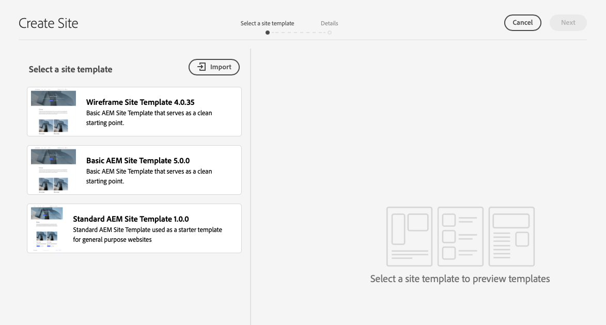

1. In the file browser, locate the template [you downloaded previously](#obtaining-template) and select **Upload**.

1. Once uploaded, it appears in the list of available templates. Select it to select it (which also reveals information about the template in the right column) and then select **Next**.

   

1. Provide a title for your site. A site name can be provided or generated from the title, if omitted.

   * The site title appears in the browsers title bar.
   * The site name becomes part of the URL.

1. Select **Create** and the new site is created from the site template.

   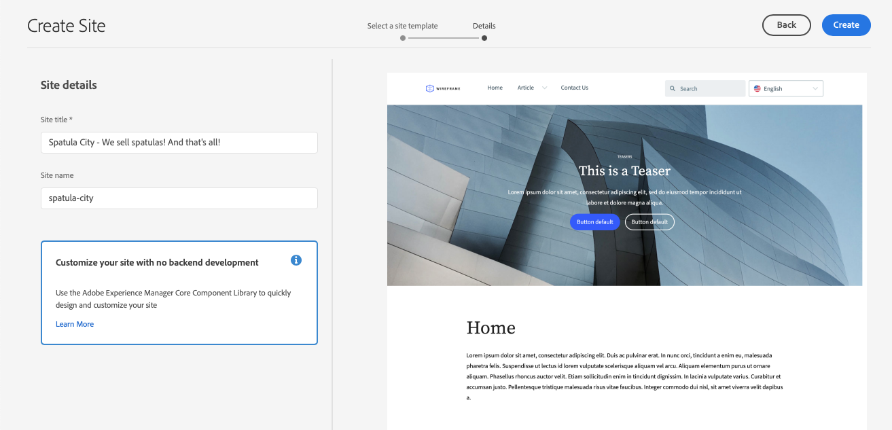

1. In the confirmation dialog that appears, select **Done**.

   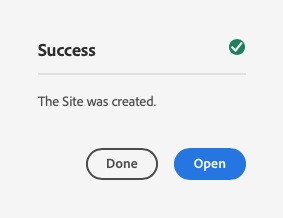

1. In the sites console, the new sites is visible and can be navigated to explore its basic structure as defined by the template.

   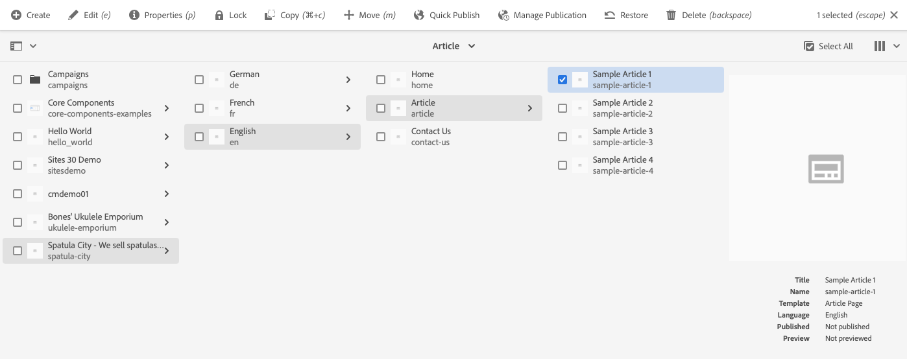

Content authors can now begin authoring.

## Is Further Customization Required? {#customization-required}

Site templates are very powerful and flexible and any number can be created for a project, allowing for easy creation site variations. Depending on the level of customization already performed on the site template you use, you may not even need additional front-end customization.

* If your site does not require additional customization, congratulations! Your journey ends here!
* If you still need additional front-end customization, or if you simply want to understand the full process in case you need future customization, continue reading.

## Example Page {#example-page}

If you do require additional front-end customization, keep in mind that the front-end developer may not be familiar with the details of your content. Therefore it is a good idea to provide the developer with a path to typical content that can be used as a base of reference as the theme is customized. A typical example is the home page for the master language of the site.

1. In the sites browser, navigate to the home page of the master language of the site and then select the page to select it and then select **Edit** in the menu bar.

   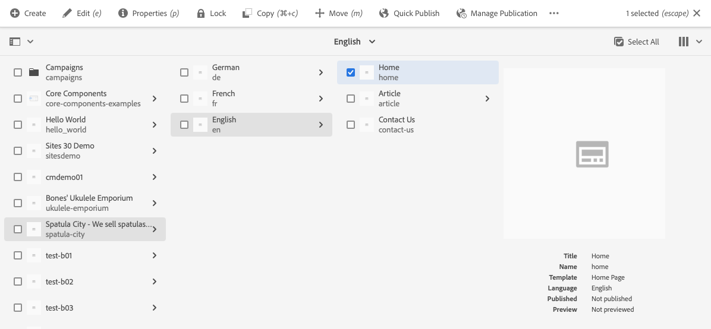

1. In the editor, select the **Page Information** button in the toolbar and then **View as published**.

   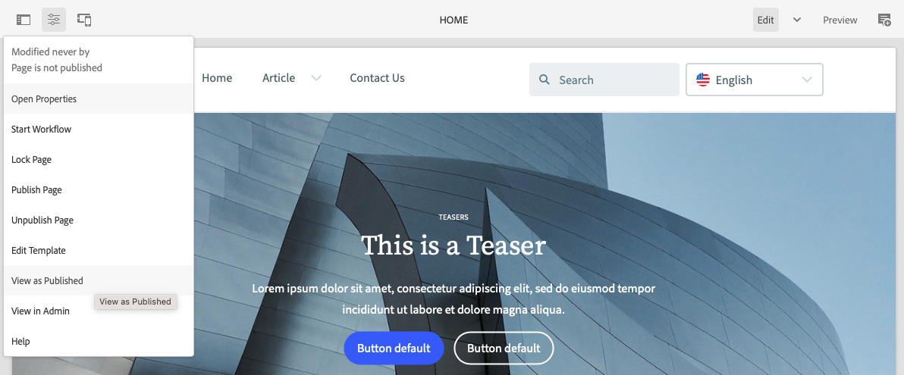

1. In the tab that opens, copy the path of the content from the address bar. It will look something like `/content/<your-site>/en/home.html?wcmmode=disabled`.

   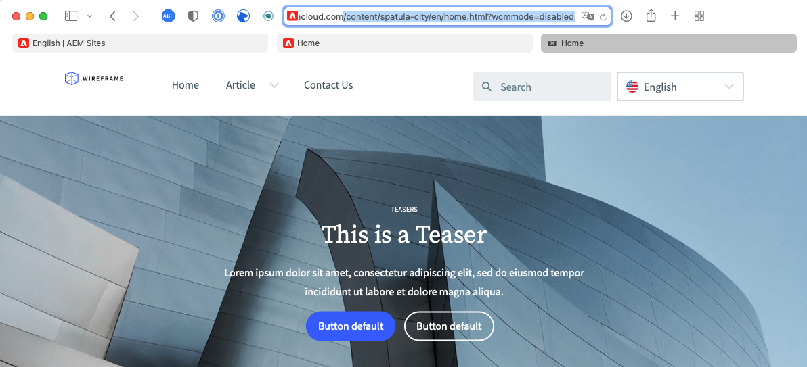

1. Save the path to later provide to the front-end developer.

## Download the Theme {#download-theme}

Now that the site has been created, the theme of the site as generated by the template can be downloaded and provided to the front-end developer for customization.

1. On the sites console, show the **Site** rail.

   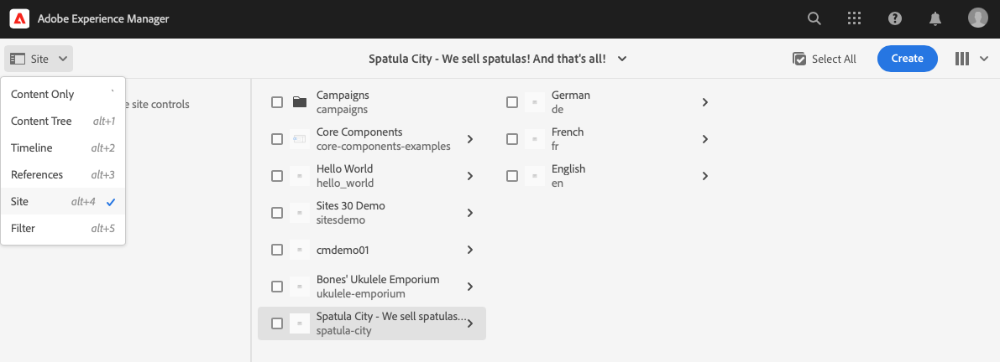

1. Select the root of your new site and then select **Download Theme Sources** in the site rail.

   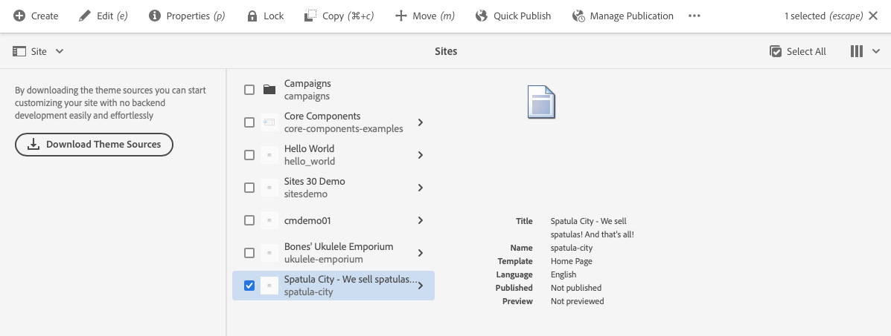

You now have a copy of the theme source files in your download files.

## Set Up Proxy User {#proxy-user}

In order for the front-end developer to preview the customizations using actual AEM content from your site, you must set up a proxy user.

1. In AEM from main navigation go to **Tools** &gt; **Security** &gt; **Users**.
1. In the user management console, select **Create**.

   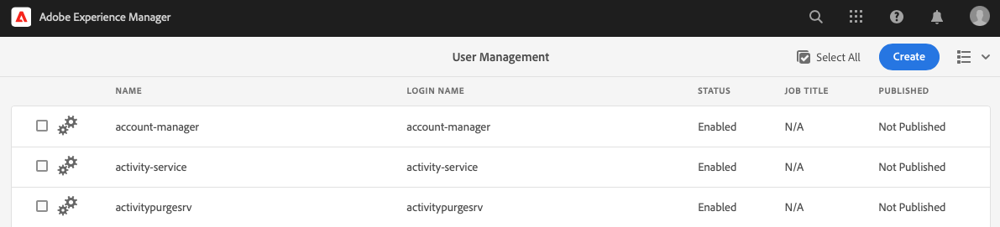
1. In the **Create New User** window you must at a minimum provide:
   * **ID** - Take note of this value as you must provide it to the front-end developer.
   * **Password** - Save this value securely in a password vault as you must provide it to the front-end developer.

   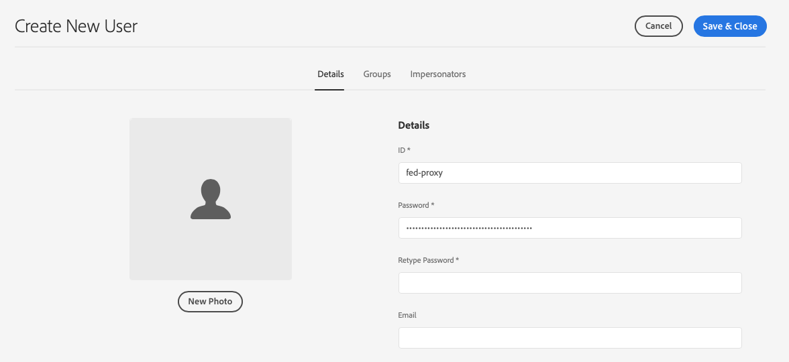

1. On the **Groups** tab, add the proxy user to the `contributors` group.
   * Typing in the term `contributors` triggers AEM's auto-completion feature for easy selection of the group.

   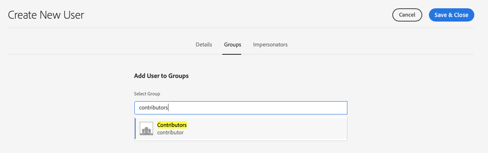

1. Select **Save &amp; Close**.

You now have completed the configuration. Content authors can now begin to create content on the site preparation begins for front-end customization in the next step of the journey.

## What's Next {#what-is-next}

Now that you have completed this part of the AEM Quick Site Creation journey you should:

* Understand how to obtain AEM Site templates.
* Learn how to create a site using a template.
* See how to download the template from your new site to provide to the front-end developer.

Build on this knowledge and continue your AEM Quick Site Creation journey by next reviewing the document [Set Up Your Pipeline](pipeline-setup.md), where you will create a front-end pipeline to manage the customization of your site's theme.

## Additional Resources {#additional-resources}

While it is recommended that you move on to the next part of the Quick Site Creation journey by reviewing the document [Set Up Your Pipeline](pipeline-setup.md), the following are some additional, optional resources that do a deeper dive on some concepts mentioned in this document, but they are not required to continue on the journey.

* [AEM Standard Site Template](https://github.com/adobe/aem-site-template-standard) - This is the GitHub repository of the AEM Standard Site template.
* [Organizing Pages](/help/sites-cloud/authoring/sites-console/organizing-pages.md) - This guide details how to organize the pages of your AEM Site.
* [Creating Pages](/help/sites-cloud/authoring/sites-console/creating-pages.md) - This guide details how to add new pages to your site.
* [Managing Pages](/help/sites-cloud/authoring/sites-console/managing-pages.md) - This guide details how to manage the pages of your site including moving, copying, and deleting.
* [How to Work with Package](/help/implementing/developing/tools/package-manager.md) - Packages enable the importing and exporting of repository content. This document explains how to work with packages in AEM 6.5, which also applies to AEMaaCS.
* [Site Administration Documentation](/help/sites-cloud/administering/site-creation/create-site.md) - Check out the technical docs on site creation for more details on the Quick Site Creation tool's features.
* [Create or add forms to an AEM Sites page](/help/forms/create-or-add-an-adaptive-form-to-aem-sites-page.md) - Learn step-by-step techniques and best practices for integrating forms into your website, optimizing your digital experiences for maximum impact.
