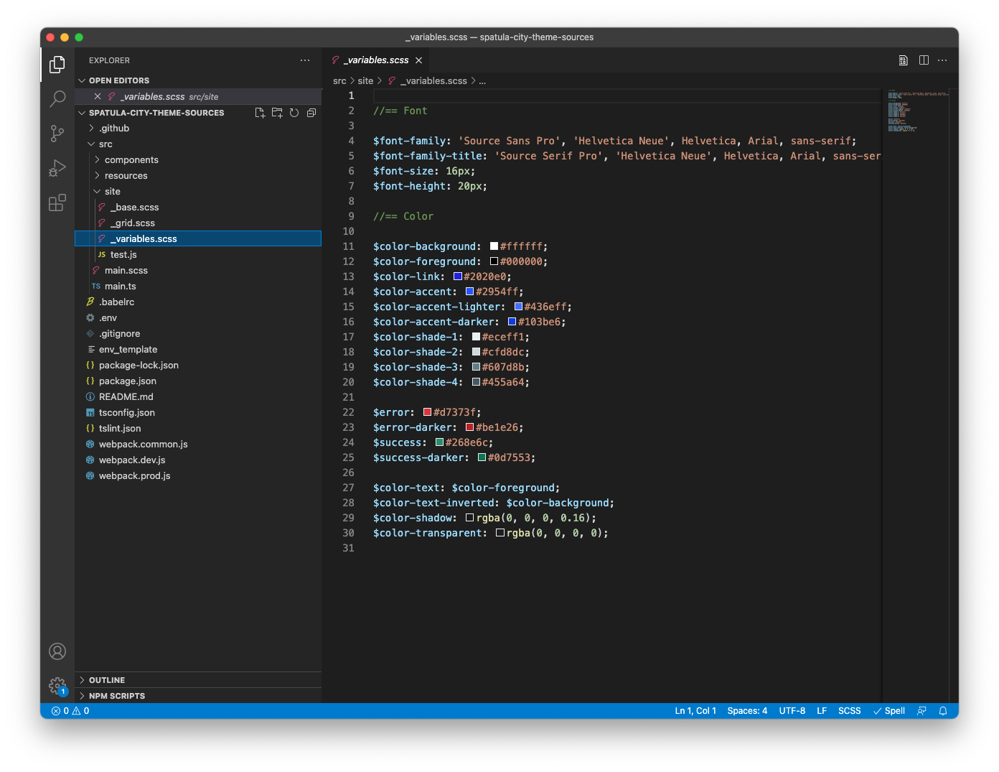
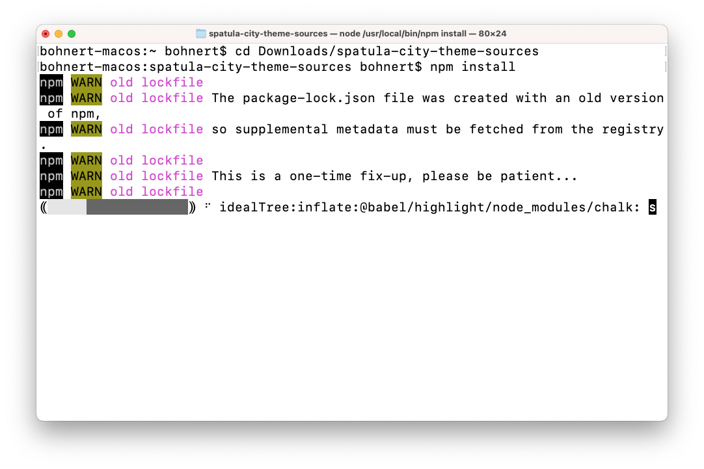
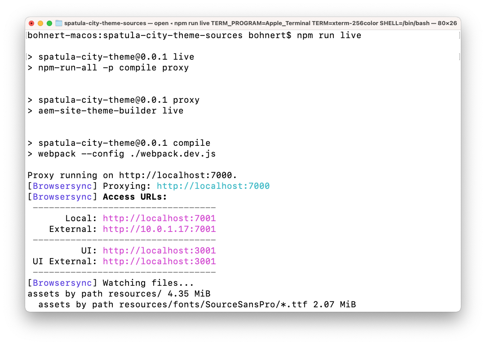
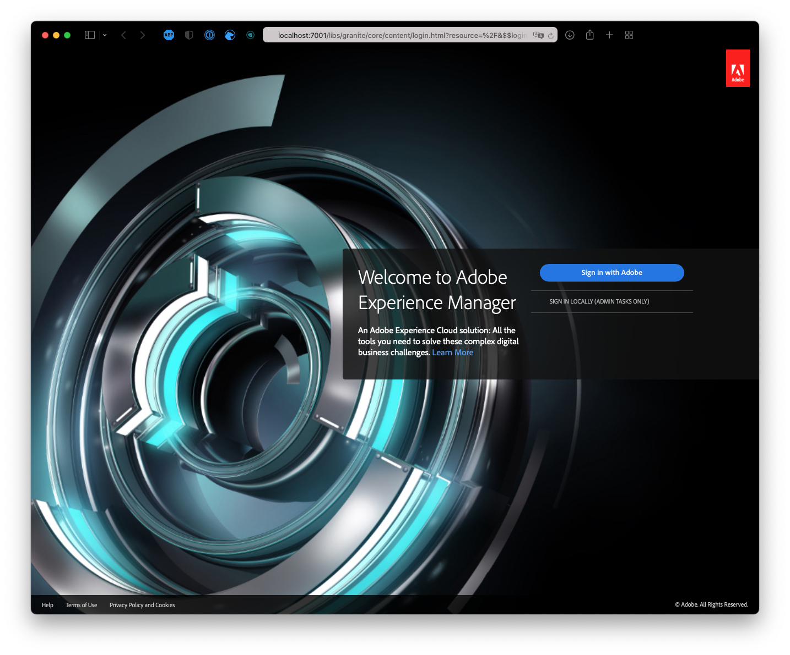
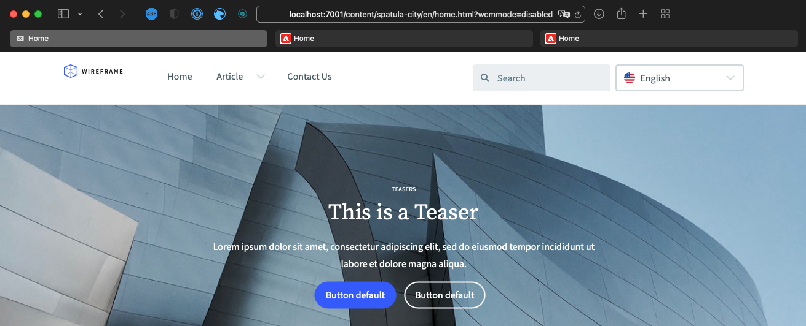
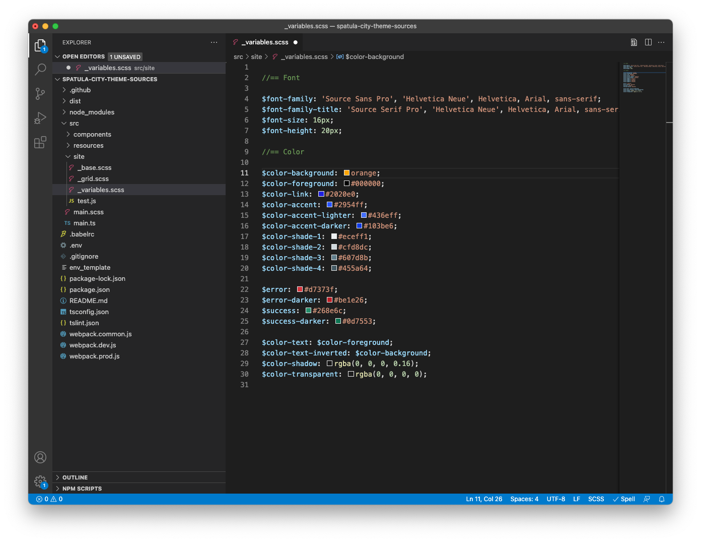
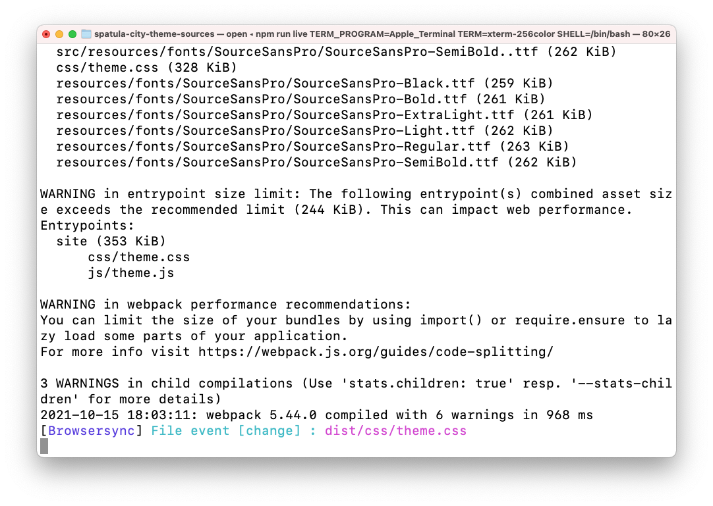
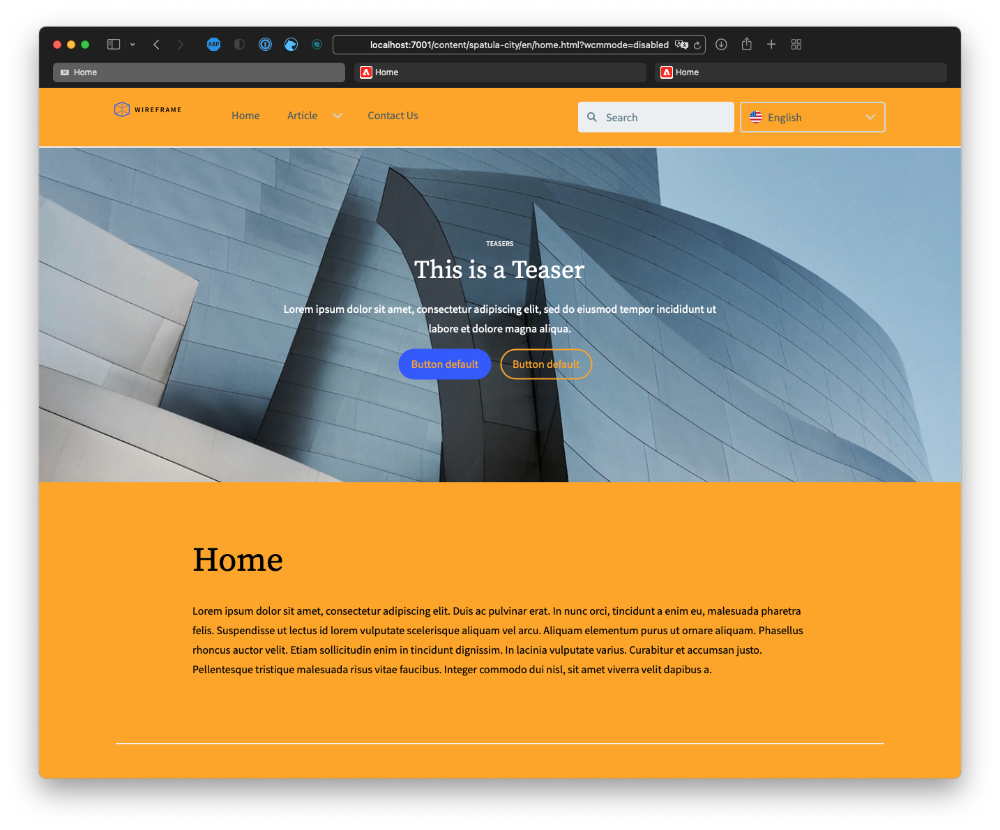
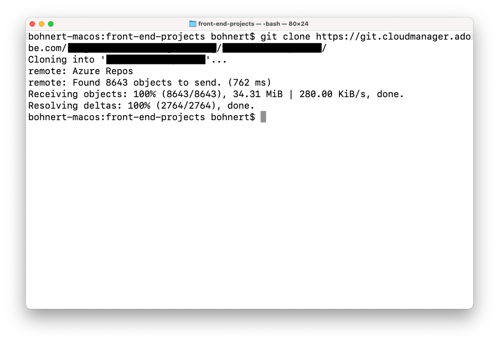
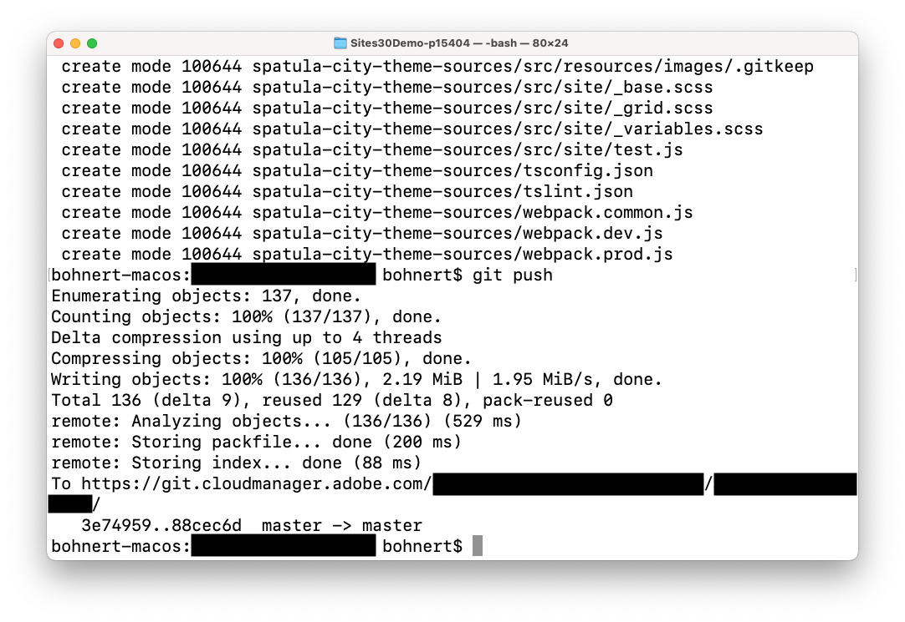

# Customize the Site Theme {#customize-the-site-theme}

Learn how the site theme is built, how to customize, and how to test using live AEM content.

## The Story So Far {#story-so-far}

In the previous document of the AEM Quick Site Creation journey, [Retrieve Git Repository Access Information](retrieve-access.md), you learned how the front-end developer users Cloud Manager to access git repository information, and you should now:

* Understand at a high level what Cloud Manager is.
* Have retrieved your credentials to access the AEM git so you can commit your customizations.

This part of the journey takes the next step and digs into the site theme and shows you how to customize it and then commit those customizations using the access credentials you retrieved.

## Objective {#objective}

This document explains how the AEM site theme is built, how to customize it, and how to test it using live AEM content. After reading you should:

* Understand the basic structure of the site theme and how to edit it.
* See how to test your theme customizations using real AEM content via local proxy.
* Know how to commit your changes to the AEM git repository.

## Responsible Role {#responsible-role}

This part of the journey applies to the front-end developer.

## Understand the Theme Structure {#understand-theme}

Extract the theme provided by the AEM administrator to where you would like to edit the theme and open it in your preferred editor.



You see that the theme is a typical front-end project. The most important parts of the structure are:

* `src/main.ts`: The main entry point of your JS & CSS theme
* `src/site`: JS & CSS files that apply to the entire site
* `src/components`: JS & CSS files specific to AEM components
* `src/resources`: Static files like icons, logos, and fonts

>[!TIP]
>
>If you would like to know more about the standard AEM site theme, see the GitHub link in the [Additional Resources](#additional-resources) section at the end of this document.

Once you are comfortable with the structure of the theme project, start the local proxy so you can see any theme customizations in real time based on actual AEM content.

## Starting the Local Proxy {#starting-proxy}

1. From the command line, navigate to the root of the theme on your local machine.
1. Execute `npm install` and npm retrieves dependencies and installs the project.

   

1. Execute `npm run live` and the proxy server starts.

   

1. When the proxy server starts, it automatically opens a browser to `http://localhost:7001/`. Select **SIGN IN LOCALLY (ADMIN TASKS ONLY)** and sign on with the proxy user credentials provided to you by the AEM administrator.
   
   

   >[!TIP]
   >
   >If you do not have these credentials, speak with your administrator referencing the [Set Up Proxy User section of the Create Site from Template article](/help/journey-sites/quick-site/create-site.md#proxy-user) in this journey.

1. Once signed in, change the URL in the browser to point to the path to the sample content that the AEM administrator provided to you.

   * For example, if the path provided was `/content/<your-site>/en/home.html?wcmmode=disabled`
   * You would change the URL to `http://localhost:7001/content/<your-site>/en/home.html?wcmmode=disabled`

   

You can navigate the site to explore the content. The site is pulled live from the live AEM instance so you can make your theme customizations against real content.

## Customize the Theme {#customize-theme}

Now you can start customizing the theme. The following is a simple example to illustrate how you can see your changes live via the proxy.

1. In your editor, open the file `<your-theme-sources>/src/site/_variables.scss`

   

1. Edit the variable `$color-background` and set it to a value other than white. In this example, `orange` is used.

   

1. When you save the file, you see that the proxy server recognizes the change via the line `[Browsersync] File event [change]`.

   

1. Switching back to your browser of the proxy server, the change is immediately visible.

   

You can continue customizing the theme based on the requirements provided to you by the AEM administrator.

## Committing the Changes {#committing-changes}

Once your customizations are complete, you can commit them to the AEM git repository. First you must clone the repository to your local machine.

1. From the command line, navigate to where you would like to clone the repo.
1. Execute the command you [previously retrieved from Cloud Manager](retrieve-access.md). It should be similar to `git clone https://git.cloudmanager.adobe.com/<my-org>/<my-program>/`. Use the git user name and password that [you retrieved in the previous part of this journey](retrieve-access.md).

   

1. Move the theme project that you were editing into the cloned repo with a command similar to `mv <site-theme-sources> <cloned-repo>`
1. In the directory of the cloned repo, commit the theme files that you just moved into with the following commands.

   ```text
   git add .
   git commit -m "Adding theme sources"
   git push
   ```

1. The customizations are pushed to the AEM git repository.

   

Your customizations are now safely stored in the AEM git repository.

## What's Next {#what-is-next}

Now that you have completed this part of the AEM Quick Site Creation journey you should:

* Understand the basic structure of the site theme and how to edit it.
* See how to test your theme customizations using real AEM content via local proxy.
* Know how to commit your changes to the AEM git repository.

Build on this knowledge and continue your AEM Quick Site Creation journey by next reviewing the document [Deploy Your Customized Theme](deploy-theme.md), where you learn how to deploy the theme using the front-end pipeline.

## Additional Resources {#additional-resources}

While it is recommended that you move on to the next part of the Quick Site Creation journey by reviewing the document [Deploy Your Customized Theme](deploy-theme.md), the following are some additional, optional resources that do a deeper dive on some concepts mentioned in this document, but they are not required to continue on the journey.

* [AEM Site Theme](https://github.com/adobe/aem-site-template-standard-theme-e2e) - This is the GitHub repository of the AEM Site Theme.
* [npm](https://www.npmjs.com) - AEM themes used to quickly build sites are based on npm.
* [webpack](https://webpack.js.org) - AEM themes used to quickly build sites rely on webpack.
