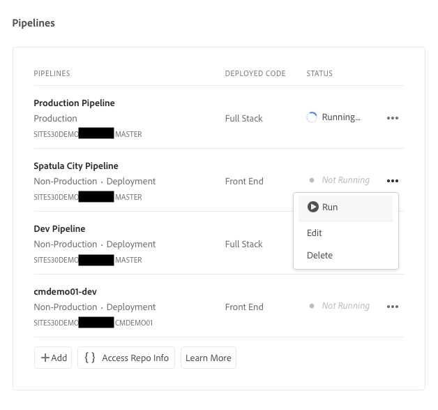
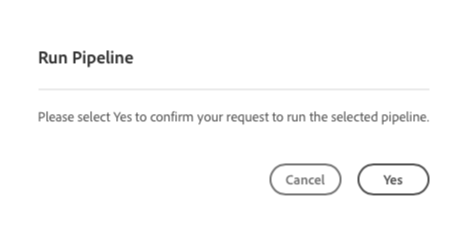
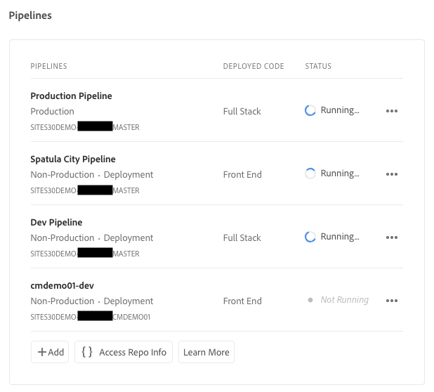
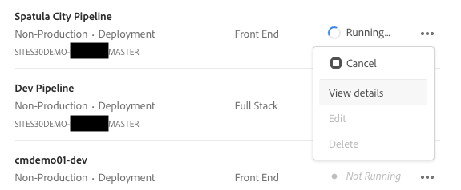
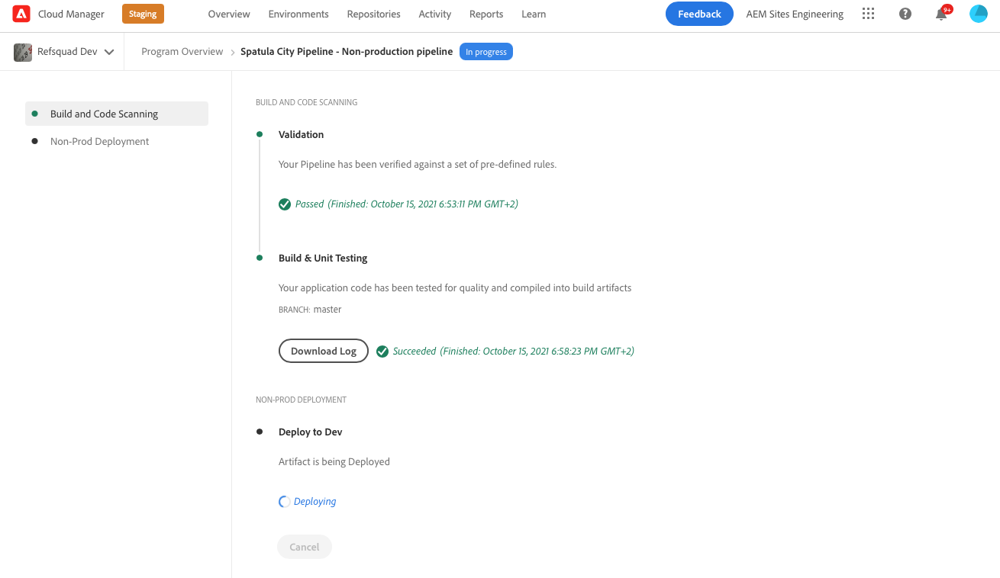

# Deploy Your Customized Theme {#deploy-your-customized-theme}

Learn how to deploy the site theme using the pipeline.

## The Story So Far {#story-so-far}

In the previous document of the AEM Quick Site Creation journey, [Customize the Site Theme](customize-theme.md), you learned how the theme is built, how to customize it, and how to test it using live AEM content, and you should now:

* Understand the basic structure of the site theme and how to edit it.
* See how to test your theme customizations using real AEM content via local proxy.
* Know how to commit your changes to the AEM git repository.

You can now take the final step and use the pipeline to deploy them.

## Objective {#objective}

This document explains how to deploy the theme using the pipeline. After reading you should:

* Know how you can trigger a pipeline deployment.
* See how to check the deployment status.

## Responsible Role {#responsible-role}

This part of the journey applies to the front-end developer.

## Start the Pipeline {#start-pipeline}

After you have committed the theme customization changes to the AEM git repository, you can run [the pipeline that the administrator  created](pipeline-setup.md) to deploy the changes.

1. Sign into Cloud Manager [as you did to retrieve your git access information](retrieve-access.md) And access your program. On the **Overview** tab, you see a card for **Pipelines**.

   

1. Select the ellipsis next to the pipeline you need to start. From the drop-down menu, select **Run**.

   

1. In the **Run Pipeline** confirmation dialog, select **Yes**.

   

1. In the list of pipelines, the status column indicates that your pipeline is now running.

   

## Check Pipeline Status {#pipeline-status}

You can check the status of the pipeline to see the detail of its progress at any time.

1. Select the ellipsis next to your pipeline.

   

1. The pipeline detail window shows the breakdown of the pipeline's progress.

   

>[!TIP]
>
>In the pipeline details window, you can select **Download Log** for any step of the pipeline for debugging purposes if any step should fail. Debugging the pipeline is beyond the scope of this journey. See the technical docs for Cloud Manager in the [Additional Resources](#additional-resources) section of this page.

## Validate the Deployed Customizations {#view-customizations}

Once the pipeline is complete, you can inform the administrator to validate the changes. The administrator will then:

1. Open the AEM authoring environment.
1. Navigate to [the site the administrator previously created](create-site.md).
1. Edit one of the content pages.
1. See the changes applied.

## End of the Journey? {#end-of-journey}

Congratulations! You have completed the AEM Quick Site Creation journey! You should now:

* Understand how Cloud Manager and the front-end pipeline work to manage and deploy front-end customizations.
* Know how to create an AEM site based on a template and how to download the site theme.
* How to onboard a front-end developer so that they can access the AEM git repository.
* How to customize and test a theme using proxied AEM content and commit those changes to AEM git.
* How to deploy front-end customization using the pipeline.

You are now ready to customize the themes of your own AEM site. However before you before begin creating different work streams using multiple front-end pipelines, review the document [Developing Sites with the Front-End Pipeline](/help/implementing/developing/introduction/developing-with-front-end-pipelines.md). It can help you get the most out of your front-end development by:

* Maintaining a single source of truth.
* Maintaining a separation of concerns.

AEM is a powerful tool and there are many additional options available. Check out some of the additional resources available in the [Additional Resources section](#additional-resources) to learn more about the features you saw in this journey.

## Additional Resources {#additional-resources}

The following are some additional resources that do a deeper dive on some concepts mentioned in this document.

* [Using the Site Rail to Manage Your Site Theme](/help/sites-cloud/administering/site-creation/site-rail.md) - Learn the powerful features of the Site rail to help you easily customize and manage your site theme including downloading theme sources and managing theme versions.
* [AEM as a Cloud Service technical documentation](https://experienceleague.adobe.com/docs/experience-manager-cloud-service.html) - If you already have a firm understanding of AEM, you may want to directly consult the in-depth technical docs.
* [Cloud Manager documentation](https://experienceleague.adobe.com/docs/experience-manager-cloud-service/onboarding/onboarding-concepts/cloud-manager-introduction.html) - If you would like more details on Cloud Manager's features, you may want to directly consult the in-depth technical docs.
* [Role Based Permissions](https://experienceleague.adobe.com/docs/experience-manager-cloud-manager/using/requirements/role-based-permissions.html) - Cloud Manager has pre-configured roles with appropriate permissions. See this document for details of these roles and how to administer them.
* [Cloud Manager Repositories](/help/implementing/cloud-manager/managing-code/managing-repositories.md) - If you need more information about how to set up and manage git repositories for your AEMaaCS project, see this document.
* [Configure CI/CD Pipeline - Cloud Services](/help/implementing/cloud-manager/configuring-pipelines/introduction-ci-cd-pipelines.md) - Learn more details about setting up pipelines, both full stack and front end, in this document.
* [AEM Standard Site Template](https://github.com/adobe/aem-site-template-standard) - This is the GitHub repository of the AEM Standard Site template.
* [AEM Site Theme](https://github.com/adobe/aem-site-template-standard-theme-e2e) - This is the GitHub repository of the AEM Site Theme.
* [npm](https://www.npmjs.com) - AEM themes used to quickly build sites are based on npm.
* [webpack](https://webpack.js.org) - AEM themes used to quickly build sites rely on webpack.
* [Organizing Pages](/help/sites-cloud/authoring/sites-console/organizing-pages.md) - This guide details how to organize pages of your AEM site.
* [Creating Pages](/help/sites-cloud/authoring/sites-console/creating-pages.md) - This guide details how to add new pages to your site.
* [Managing Pages](/help/sites-cloud/authoring/sites-console/managing-pages.md) - This guide details how to manage the pages of your site including moving, copying, and deleting.
* [How to Work with Package](/help/implementing/developing/tools/package-manager.md) - Packages enable the importing and exporting of repository content. This document explains how to work with packages in AEM 6.5, which also applies to AEMaaCS.
* [Onboarding Journey](/help/journey-onboarding/overview.md) - This guide serves as your starting point to ensure that your teams are set up and have access to AEM as a Cloud Service.
* [Adobe Experience Manager Cloud Manager Documentation](https://experienceleague.adobe.com/docs/experience-manager-cloud-manager/using/introduction-to-cloud-manager.html) - Explore the Cloud Manager documentation for full details of its features.
* [Site Administration Documentation](/help/sites-cloud/administering/site-creation/create-site.md) - Check out the technical docs on site creation for more details on the Quick Site Creation tool's features.
* [Developing Sites with the Front-End Pipeline](/help/implementing/developing/introduction/developing-with-front-end-pipelines.md) - This document describes some considerations to be aware of so you can get the full potential out of the front-end development process using the front-end pipeline.
