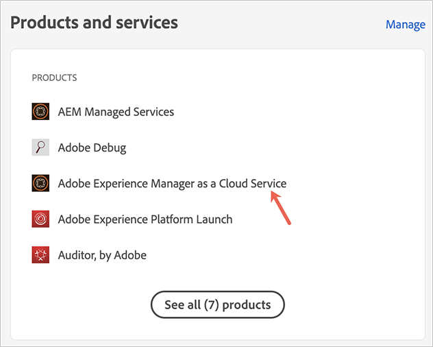

# Grant Access to the Front-End Developer {#grant-fed-access}

Onboard the front-end developers into Cloud Manager so they have access to your AEM site git repository and pipeline.

## The Story So Far {#story-so-far}

In the previous document of the AEM Quick Site Creation journey, [Set Up Your Pipeline](pipeline-setup.md), you learned how to create a front-end pipeline to manage the customization of your site's theme, and you should now:

* Understand what a front-end pipeline is.
* Know how to set up a front-end pipeline in Cloud Manager.

You now need to grant your front-end developer access to Cloud Manager through the onboarding process so the front-end developer can access the AEM git repository and the pipeline you have created.

## Objective {#objective}

The process of granting access to Cloud Manager and assigning user roles to your users is called onboarding. This document will give an overview of the most important steps for onboarding a front-end developer and after reading you will know:

* How to add a front-end developer as a user.
* How to grant the required roles to the front-end developer.

>[!TIP]
>
>There is an entire documentation journey dedicated to onboarding your team onto AEM as a Cloud service, linked to in the [Additional Resources section](#additional-resources) of this document, if you need additional details about the process.

## Responsible Role {#responsible-role}

This part of the journey applies to the Cloud Manager administrator.

## Requirements {#requirements}

* You need to be a member of **Business Owner** role in Cloud Manager.
* You need to be a **Sys Admin** in Cloud Manager.
* You need to have access to the Admin Console.

## Add the Front-End Developer as a User {#add-fed-user}

First you need to add the front-end developer as a user by using the Admin Console.

1. Sign into the Admin Console at [https://adminconsole.adobe.com/](https://adminconsole.adobe.com/).

1. Once signed in, you are presented with an overview page similar to the following image.

   

1. Make sure you are in the appropriate org, by checking the org name in the top-right corner of the screen.

   

1. Select **Adobe Experience Manager as a Cloud Service** from the **Products and services** card.

   

1. You see the list of pre-configured Cloud Manager product profiles. If you do not see these profiles, contact your Cloud Manager administrator as you may not have the correct permissions in your org.

   

1. To assign the front-end developer to the correct profiles, select the **Users** tab and then the **Add User** button.

   

1. In the **Add users to your team** dialog box, type the email ID of the user you want to add. For the ID Type, select Adobe ID, if the Federated ID for your team members has not yet been set up.

   

1. In the **Product** selection, select the plus sign and then select **Adobe Experience Manager as a Cloud Service** and assign the **Deployment Manager** and **Developer** product profiles to the user.

   

1. Select **Save** and a welcome email is sent to the front-end developer you added as a user.

The invited front-end developer can access Cloud Manager by clicking the link in the welcome email and signing in using their Adobe ID.

## Handover to Front-End Developer {#handover}

With an email invitation to Cloud Manager on the way to the front-end developer, you and the AEM administrator can now provide the front-end developer with the remaining necessary information to begin customization.

* A [path to typical content](#example-page)
* The theme source that [you downloaded](#download-theme)
* The [proxy user credentials](#proxy-user)
* The name of the program or the URL to it [copied from Cloud Manager](pipeline-setup.md#login)
* The front-end design requirements

## What's Next {#what-is-next}

Now that you have completed this part of the AEM Quick Site Creation journey you should know:

* How to add a front-end developer as a user.
* How to grant the required roles to the front-end developer.

Build on this knowledge and continue your AEM Quick Site Creation journey by next reviewing the document [Retrieve Git Repository Access Information](retrieve-access.md), which switches perspective exclusively to the front-end developer and explains how the front-end developer users Cloud Manager to access git repository information.

## Additional Resources {#additional-resources}

While it is recommended that you move on to the next part of the Quick Site Creation journey by reviewing the document [Retrieve Front-End Developer Credentials](retrieve-access.md), the following are some additional, optional resources that do a deeper dive on some concepts mentioned in this document, but they are not required to continue on the journey.

* [Onboarding Journey](/help/journey-onboarding/overview.md) - This guide serves as your starting point to ensure that your teams are set up and have access to AEM as a Cloud Service.
