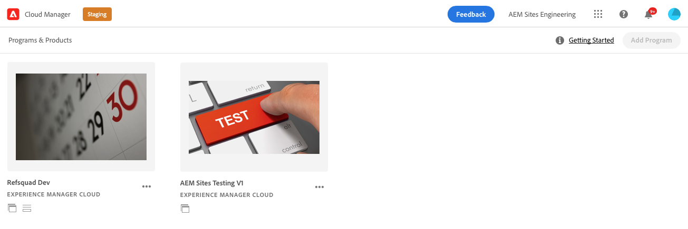

# Set up your pipeline {#set-up-your-pipeline}

Create a front-end pipeline to manage the customization of your site's theme.

>[!CAUTION]
>
>The Quick Site Creation tool is currently a tech preview. It is made available for testing and evaluation purposes and is not intended for production use unless agreed with Adobe Support.

## The Story So Far {#story-so-far}

In the previous document of the AEM Quick Site Creation journey, [Understand Cloud Manager and the Quick Site Creation Workflow,](cloud-manager.md) you learned about Cloud Manager and how it ties together the new Quick Site Creation process and you should now:

* Understand how AEM Sites and the Cloud Manager work together to facilitate front-end development
* See how the front-end customization step is entirely decoupled from AEM and requires no AEM knowledge.

This article builds on those fundamentals so you can take the first configuration step and set up a front-end pipeline, which you will use later in the journey to deploy your front-end customizations.

## Objective {#objective}

This document helps you understand front-end pipelines and how to create one to manage the deployment of your site's customized theme. After reading you should:

* Understand how to set up a front-end pipeline in Cloud Manager.
* Know how to retrieve access credentials for your front-end developer to be able to commit the customized code.

## Requirements {#requirements}

You need to have access to Cloud Manager and be a member of the **Deployment Manager** role.

## Access Cloud Manager {#login}

1. Log into Adobe Experience Cloud at [my.cloudmanager.adobe.com](https://my.cloudmanager.adobe.com/).

1. Once logged in ensure that you are in the correct organization by checking it in the top-right corner of the screen. If you are only member of one org, this step is not necessary. Then tap or click **Experience Manager**.

   

1. On the next page, tap or click the **Launch** to start the **Cloud Manager** app.

   

1. The next page lists the various programs available. Tap or click the one you wish to manage. If you are just starting with AEM as a Cloud Service, you likely only have one program available.

   

You now see an overview of your Cloud Manager. Your page will look different but similar to this example.

## Retrieve Repository Access Information {#repo-access}

Cloud Manager is primarily responsible for deploying custom developer from a git repository to AEM production. For the front-end developer to be able to access the git repository from the command line or favorite development tool, you need to fetch the repository information and credentials.

1. In the **Pipelines** section of the Cloud Manager page, tap or click the **Access Repo Info** button.

   

1. The **Repository Info** dialog opens.

   

1. Tap or click the **Generate password** button to create a password for the user.

1. Save the password generated to a secure password manager. The password will never be displayed again.

1. Also copy the **username** and **Git command line** fields. These values will be used later by the front-end developer to access the repo.

1. Tap or click **Close**.

## Create a Front-End Pipeline {#create-front-end-pipeline}

Now that you have the information to access the repo, you can create a pipeline associated with that repo.

1. In the **Pipelines** section of the Cloud Manager page, tap or click the **Add** button.

   

1. In the pop-up menu that appears beneath the **Add** button select **Add Non-Production Pipeline** for the purposes of this journey.

1. On the **Configuration** tab of the **Add Non-Production Pipeline** dialog that opens:
   * Select **Deployment Pipeline**.
   * Provide the pipeline with a name in the **Non-Production Pipeline Name** field.

   

1. Tap or click **Continue**.

1. On the **Source Code** tab:
   * Select **Front End Code** as the type of code to deploy.
   * Make sure that the correct environment is selected under **Eligible Deployment Environments**.
   * Select the correct **Repository**.
   * Define which **Git Branch** the pipeline should be associated with.
   * Define the **Code Location** if the front-end development is located under a particular path in the selected repository. The default value is the root of the repository, but often front-end development and back end will be under different paths.

   

1. Tap or click **Save**.

The new pipeline is created and visible in the **Pipelines** section of the Cloud Manager window. Tapping of clicking the ellipsis after the pipeline name reveals options to further edit or view details as necessary.

## What's Next {#what-is-next}

Now that you have completed this part of the AEM Quick Site Creation journey you should:

* Understand how to set up a front-end pipeline in Cloud Manager.
* Know how to retrieve access credentials for your front-end developer to be able to commit the customized code.

Build on this knowledge and continue your AEM Quick Site Creation journey by next reviewing the document [Create Site from Template,](create-site.md) where you will learn how to quickly create a new AEM site using a template.

## Additional Resources {#additional-resources}

While it is recommended that you move on to the next part of the Quick Site Creation journey by reviewing the document [Create Site from Template,](create-site.md) the following are some additional, optional resources that do a deeper dive on some concepts mentioned in this document, but they are not required to continue on the journey.

* [Cloud Manager documentation](https://experienceleague.adobe.com/docs/experience-manager-cloud-service/onboarding/onboarding-concepts/cloud-manager-introduction.html) - If you would like more details on Cloud Manager's features, you may want to directly consult the in-depth technical docs.
