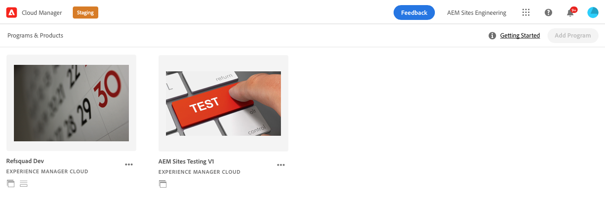
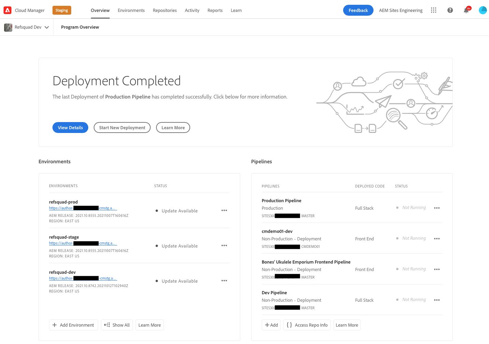
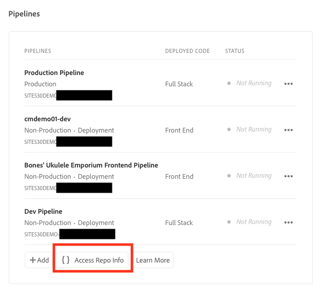
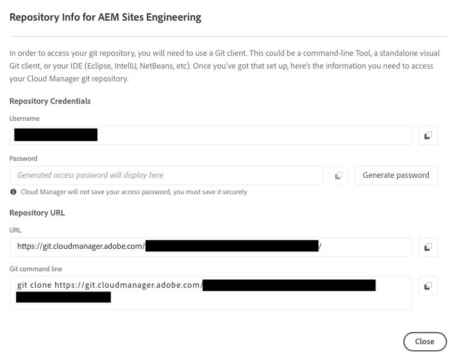

# Retrieve Git Repository Access Information {#retrieve-access}

Learn how the front-end developer uses Cloud Manager to access git repository information.

## The Story So Far {#story-so-far}

If you are a front-end developer only responsible for the customization of the site theme, you do not need any knowledge of how AEM was set up and can skip to the [Objective](#objective) section of this document.

If you also serve the role of Cloud Manager or AEM administrator and front-end developer, you learned in the previous document of the AEM Quick Site Creation journey, [Grant Access to the Front-End Developer](grant-access.md), how to onboard the front-end developer so they have access to the git repository, and you should now know:

* How to add a front-end developer as a user.
* How to grant the required roles to the front-end developer.

This article takes the next step of showing how the front-end developer uses the Cloud Manager access to retrieve credentials to access the AEM git repository.

Now that there is a site created based on a template, there is a pipeline set up, the front-end developer is onboarded and has all the information they need, this article shifts perspective away from the administrators and exclusively to the front-end developer role.

## Objective {#objective}

This document explains how you, in the role of the front-end developer, can access Cloud Manager and retrieve access credentials to the AEM git repository. After reading you will:

* Understand at a high level what Cloud Manager is.
* Have retrieved your credentials to access the AEM git so you can commit your customizations.

## Responsible Role {#responsible-role}

This part of the journey applies to the front-end developer.

## Requirements {#requirements}

The Quick Site Creation tool allows front-end developers to work independently without and knowledge of AEM or how it is set up. However, the Cloud Manager administrator must onboard the front-end developer into the project team and the AEM administrator must provide you with some required information. Make sure that you have the following information before continuing.

* From the AEM administrator:
  * Theme source files to customize
  * Path to an example page to use as a base of reference
  * Proxy user credentials to test your customizations against live AEM content
  * Front-end design requirements
* From the Cloud Manager administrator:
  * A welcome email from Cloud Manager informing you of access
  * The name of the program or the URL to it within Cloud Manager

If you are missing any of these items, contact the AEM administrator or Cloud Manager administrator.

It is assumed that the front-end developer has extensive experience with front-end development workflows and common tools installed including:

* git
* npm
* webpack
* A preferred editor

## Understanding Cloud Manager {#understanding-cloud-manager}

Cloud Manager enables organizations to self-manage AEM in the cloud. It includes a continuous integration and continuous delivery (CI/CD) framework that lets IT teams and implementation partners expedite the delivery of customizations or updates without compromising performance or security.

For the front-end developer, it is the gateway to:

* Access AEM git repository information so you can commit your front-end customizations.
* Start the deployment pipeline to deploy your customizations.

The Cloud Manager administrator will have onboarded you as a Cloud Manager user. You should have received a welcome email similar to the following.

If you have not received this email, contact the Cloud Manager administrator.

## Access Cloud Manager {#access-cloud-manager}

1. Log into Adobe Experience Cloud at [my.cloudmanager.adobe.com](https://my.cloudmanager.adobe.com/) or click the link provided in the welcome email.

1. Cloud Manager lists the various programs available. Select the one you need to access as provided by the Cloud Manager administrator. If this is your first front-end project for AEMaaCS, you likely only have one program available.

   

You now see an overview of your program. Your page will look different but similar to this example.

## Retrieve Repository Access Information {#repo-access}

1. In the **Pipelines** section of the Cloud Manager page, select the **Access Repo Info** button.

   

1. The **Repository Info** dialog opens.

   

1. Select the **Generate password** button to create a password for yourself.

1. Save the password generated to a secure password manager. The password will never be displayed again.

1. Also copy the **username** and **Git command line** fields. You will use this information later to access the repo.

1. Select **Close**.

## What's Next {#what-is-next}

Now that you have completed this part of the AEM Quick Site Creation journey you should:

* Understand at a high level what Cloud Manager is.
* Have retrieved your credentials to access the AEM git so you can commit your customizations.

Build on this knowledge and continue your AEM Quick Site Creation journey by next reviewing the document [Customize the Site Theme](customize-theme.md), where you learn how the site theme is built, how to customize, and how to test using live AEM content.

## Additional Resources {#additional-resources}

While it is recommended that you move on to the next part of the Quick Site Creation journey by reviewing the document [Customize the Site Theme](customize-theme.md), the following are some additional, optional resources that do a deeper dive on some concepts mentioned in this document, but they are not required to continue on the journey.

* [Adobe Experience Manager Cloud Manager Documentation](https://experienceleague.adobe.com/docs/experience-manager-cloud-manager/using/introduction-to-cloud-manager.html) - Explore the Cloud Manager documentation for full details of its features.
