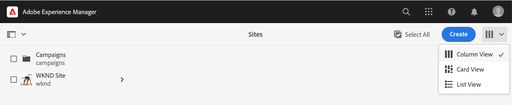
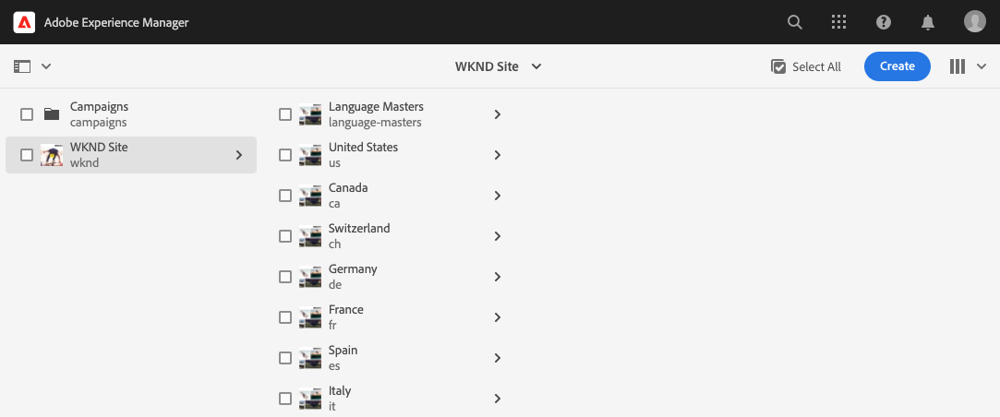
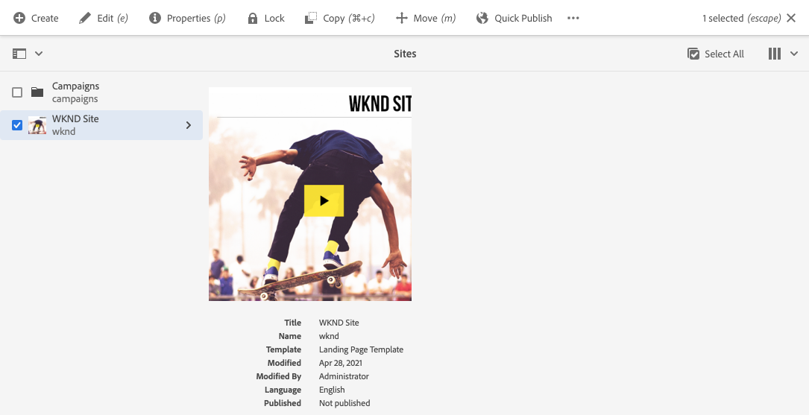
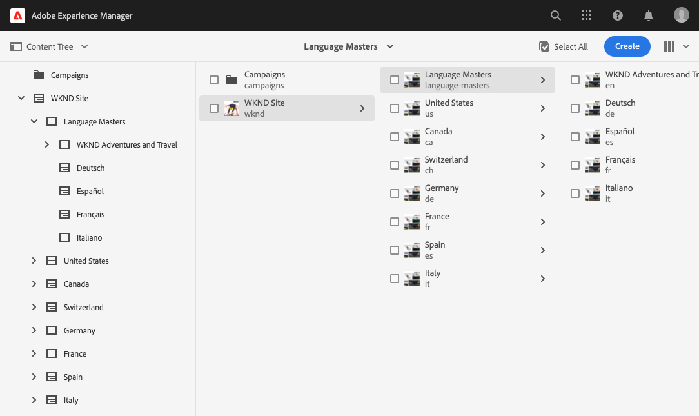
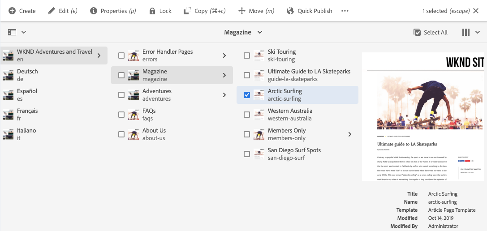
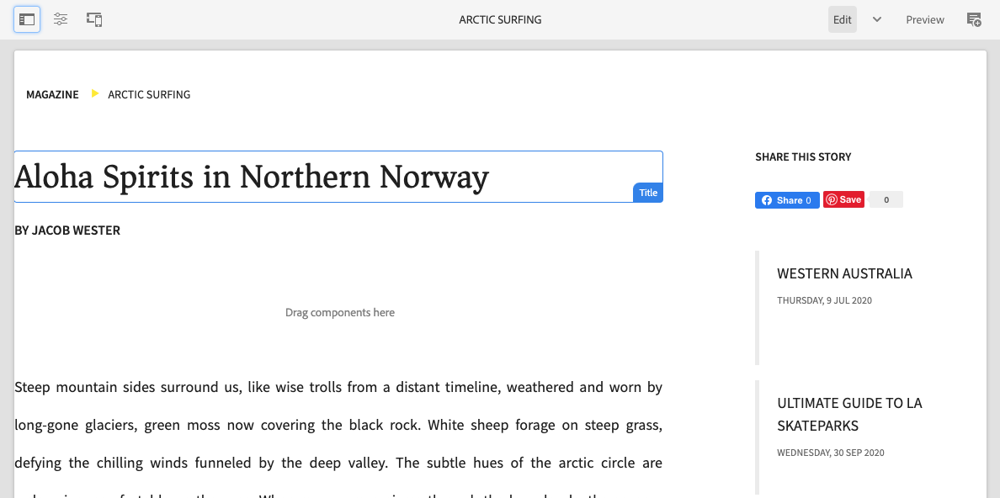

# Get Started with AEM Sites Translation {#getting-started}

Get to know how to organize your AEM Sites content and how AEM's translation tools work.

## The Story So Far {#story-so-far}

In the previous document of the AEM Sites translation journey, [Learn about AEM Sites content and how to translate in AEM](learn-about.md) you learned the basic theory of AEM Sites and you should now:

* Understand the basic concepts of AEM Sites content creation.
* Be familiar with how AEM supports translation.

This article builds on those fundamentals so you understand how AEM stores and manages content and how you can use AEM's translation tools to translate that content.

## Objective {#objective}

This document helps you understand how to get started translating sites content in AEM. After reading you should:

* Understand the importance of content structure to translation.
* Understand how AEM stores content.
* Be familiar with AEM's translation tools.

## Requirements and Prerequisites {#requirements-prerequisites}

There are a number of requirements before you begin translating your AEM content.

### Knowledge {#knowledge}

* Experience translating content in a CMS
* Experience using the basic features of a large-scale CMS
* Have a working knowledge of AEM basic handling
* Understanding of the translation service you are using
* Have a basic understanding of the content you are translating

>[!TIP]
>
>If you are not familiar with using a large-scale CMS like AEM, consider reviewing the [Basic Handling](/help/sites-cloud/authoring/getting-started/basic-handling.md) documentation before proceeding. The Basic Handling documentation is not part of the journey, so please return to this page when complete.

### Tools {#tools}

* Sandbox access for testing translating your content
* Credentials to connect to your preferred translation service
* Be a member of the `project-administrators` group in AEM

## How AEM Stores Content {#content-in-aem}

For the translation specialist, it is not important to understand in-depth how AEM manages content. However being familiar with the basic concepts and terminology will be helpful as you later use AEM's translation tools. Most importantly you need to understand your own content and how it is structured in order to effectively translate it.

### Sites Console {#sites-console}

The sites console provides an overview of the structure of your content making it easy to navigate your content as well as manage it by creating new pages, moving and copying pages, as well as publishing content.

To access the sites console:

1. In the global navigation menu, click or tap **Navigation** -&gt; **Sites**.
1. The sites console opens to the top level of your content.
1. Make sure that the **Column View** is selected using the view selector at the top-right of the window.

   

1. By tapping or clicking on an item in a column, it shows the content beneath it in the hierarchy in the column to the right.

   

1. By tapping or clicking the checkbox of an item in a column, it selects that item and shows the selected item's details in the column to the right as well as revealing a number of actions available for the selected item in the toolbar above.

   

1. By tapping or clicking on the rail selector at the top left, you can also show the **Content Tree** view for a tree overview of your content.

   

Using these simple tools you can intuitively navigate your content structure.

>[!NOTE]
>
>The content architect normally defines the content structure while the content authors create the content within that structure.
>
>As the translation specialist it is important to simply understand how to navigate that structure and understand where content is located.

### Page Editor {#page-editor}

The sites console allows you to navigate your content and provides an overview of its structure. To see the details of an individual page, you need to use the sites editor.

To edit a page:

1. Use the sites console to locate and select a page. Remember that you need to tap or click the check box of an individual page in order to select it.

   

1. Tap the **Edit** option in the toolbar.
1. The sites editor opens with the selected page loaded for editing in a new browser tab.
1. Mousing over or tapping content reveals selectors for individual components. Components are the drag-and-drop building blocks that make up the page.

   

You can return to the sites console by switching back to that tab in your browser at any time. Using the sites editor you can quickly view the content of the page as the content authors and your audience will see it.

>[!NOTE]
>
>The content authors create your site content using the sites editor.
>
>As the translation specialist it is important to simply understand how to view the detail of that content using the sites editor.

## Structure is Key {#content-structure}

AEM's content is driven by its structure. AEM imposes few requirements on the content structure, but careful consideration of your content hierarchy as part of the project planning can make translation much simpler.

>[!TIP]
>
>Plan for translation at the very beginning of your AEM project. Work closely with the project manager and content architects early.
>
>An Internationalization Project Manager may be required as a separate persona whose responsibility it is to define what content should be translated and what not, and what translated content may be modified by regional or local content producers.

## Recommended Content Structure {#recommended-structure}

As previously recommended, work with your content architect to determine the appropriate content structure for your own project. However the following is a proven, simple, and intuitive structure which is quite effective.

Define a base folder for your project under `/content`.

```text
/content/<your-project>
```

The language in which your content is authored is called the language root. In our example it is English and it should be below this path.

```text
/content/<your-project>/en
```

All project content that may need to be localized should be placed under the language root.

```text
/content/<your-project>/en/<your-project-content>
```

Translations should be created as sibling folders alongside the language root with their folder name representing the ISO-2 language code of the language. For example, German would have the following path.

```text
/content/<your-project>/de
```

>[!NOTE]
>
>The content architect generally is responsible for creating these language folders. If they are not created, AEM will not be able to later create translation jobs.

The final structure may look something like the following.

```text
/content
    |- your-project
        |- en
            |- some
            |- exciting
            |- sites
            |- content
        |- de
        |- fr
        |- it
        |- ...
    |- another-project
    |- ...
```

You should take note of the specific path of your content as it will be required later to configure your translation.

>[!NOTE]
>
>It is generally the responsibility of the content architect to define the content structure, often in collaboration with the translation specialist.
>
>It is detailed here for completeness.

## AEM Translation Tools {#translation-tools}

Now that you understand the sites console and editor and the importance of content structure, we can look at how to translate content. The translation tools in AEM are quite powerful, but are simple to understand at a high level.

* **Translation Connector** - The connector is the link between AEM and the translation service that you use.
* **Translation Rules** - Rules define what content under particular paths should be translated.
* **Translation Projects** - Translation projects gather content that should be addressed as a single translation effort and tracks the progress of the translation, interfacing with the connector to transmit the content to be translated and receive it back from the translation service.

You generally only set up your connector once for your instance and rules per project. Then you use translation projects to translate your content and keep its translations up to date on a continual basis.

## What's Next {#what-is-next}

Now that you have completed this part of the AEM Sites translation journey you should:

* Understand the importance of content structure to translation.
* Understand how AEM stores content.
* Be familiar with AEM's translation tools.

Build on this knowledge and continue your AEM Sites translation journey by next reviewing the document [Configure the translation connector](configure-connector.md) where you will learn how to connect AEM to a translation service.|

## Additional Resources {#additional-resources}

While it is recommended that you move on to the next part of the translation journey by reviewing the document [Configure the translation connector](configure-connector.md) the following are some additional, optional resources that do a deeper dive on some concepts mentioned in this document, but they are not required to continue on the journey.

* [AEM Basic Handling](/help/sites-cloud/authoring/getting-started/basic-handling.md) - Learn the basics of the AEM UI to be able to comfortably navigate and perform essential tasks such as finding your content.
* [Identifying Content to Translate](/help/sites-cloud/administering/translation/rules.md) - Learn how translation rules identify content that needs translating.
* [Configuring the Translation Integration Framework](/help/sites-cloud/administering/translation/integration-framework.md) - Learn how to configure the Translation Integration Framework to integrate with third-party translation services.
* [Managing Translation Projects](/help/sites-cloud/administering/translation/managing-projects.md) - Learn how to create and manage both machine and human translation projects in AEM.
