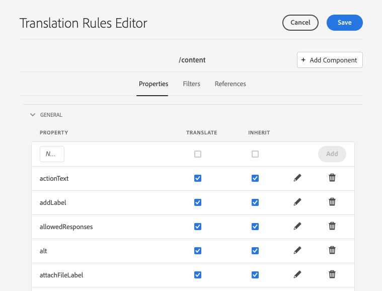

# Configure Translation Rules {#configure-translation-rules}

Learn how to define translation rules to identify content for translation.

## The Story So Far {#story-so-far}

In the previous document of the AEM Sites translation journey, [Configure translation connector](configure-connector.md) you learned how to install and configure your translation connector and should now:

* Understand the important parameters of the Translation Integration Framework in AEM.
* Be able to set up your own connection to your translation service.

Now that your connector is set up, this article takes you through the next step of identifying what content you need to translate.

## Objective {#objective}

This document helps you understand how to use AEM's translation rules to identify your translation content. After reading this document you should:

* Understand what the translation rules do.
* Be able to define your own translation rules.

## Translation Rules {#translation-rules}

AEM Sites pages can contain much information. Depending on your project needs, it is likely that not all of the information within a page must to be translated.

Translation rules identify the content that is included in, or excluded from, translation projects. When content is translated, AEM extracts or harvests the content based on these rules. In this way only content that must be translated is sent to the translation service.

Translation rules include the following information:

* The path of the content to which the rule applies
  * The rule also applies to the descendants of the content
* The names of the properties that contain the content to translate
  * The property can be specific to a specific resource type or to all resource types

AEM automatically creates translation rules, but because each project's requirements are different, it is vital that you review and adapt the rules as required to your project.

## Creating Translation Rules {#creating-rules}

Multiple rules can be created to support complex translation requirements. For example, one project you may be working on requires all page information to be translated, but on another page only descriptions must be translated while titles are left untranslated.

Translation rules are designed to handle such scenarios. However in this example we illustrate how to create rules by focusing on a simple, single configuration.

There is a **Translation Configuration** console available for configuring translation rules. To access it:

1. Navigate to **Tools** -&gt; **General**.
1. Tap or click **Translation Configuration**.

In the **Translation Configuration** UI, there are a number of options available for your translation rules. Here we highlight the most necessary and typical steps required for a basic localization configuration.

1. Tap or click **Add Context**, which allows you to add a path. This is the path of the content that is be affected by the rule.

1. Use the path browser to select the required path and tap or click the **Confirm** button to save. Content is generally located under `/content/<your-project>`.

1. AEM saves the configuration.
1. You must select the context you just created and then tap or click **Edit**. This opens the **Translation Rules Editor** to configure the properties.

1. By default all configurations are inherited from the parent path, in this case `/content`. Uncheck the option **Inherit from `/content`** in order to add additional fields to the configuration.
1. Once unchecked, under the **General** section of the list, add the property names that you want to explicitly include in translation.
   1. Enter the property name in the **New Property** field.
   1. The options **Translate** and **Inherit** are checked automatically.
   1. Tap or click **Add**.
   1. Repeat these steps for all of the fields that you must translate.
   1. Tap or click **Save**.

You have now configured your translation rules.

## Advanced Usage {#advanced-usage}

There are a number of additional properties that can be configured as part of your translation rules. In addition, you can specify your rules by hand as XML, which allows for more specificity and flexibility.

Such features are generally not needed to get started localizing your content, but you can read about them further in the [Additional Resources](#additional-resources) section if you are interested.

## What's Next {#what-is-next}

Now that you have completed this part of the AEM Sites translation journey you should:

* Understand what the translation rules do.
* Be able to define your own translation rules.

Build on this knowledge and continue your AEM Sites translation journey by next reviewing the document [Translate content](translate-content.md) where you will learn how your connector and rules work together to translate content.

## Additional Resources {#additional-resources}

While it is recommended that you move on to the next part of the translation journey by reviewing the document [Translate content,](translate-content.md) the following are some additional, optional resources that do a deeper dive on some concepts mentioned in this document, but they are not required to continue on the journey.

* [Identifying Content to Translate](/help/sites-cloud/administering/translation/rules.md) - Learn how translation rules identify content that needs translating.
