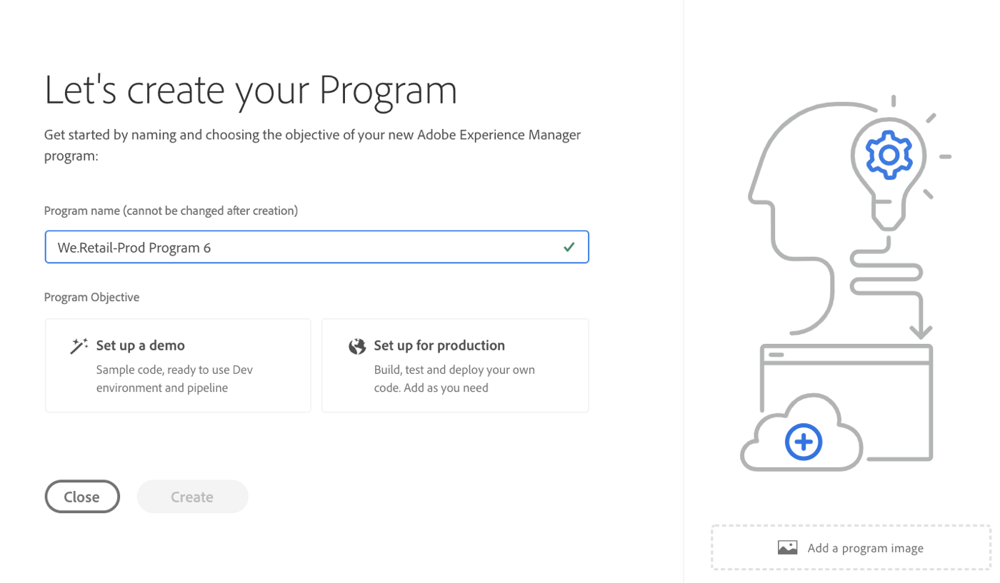
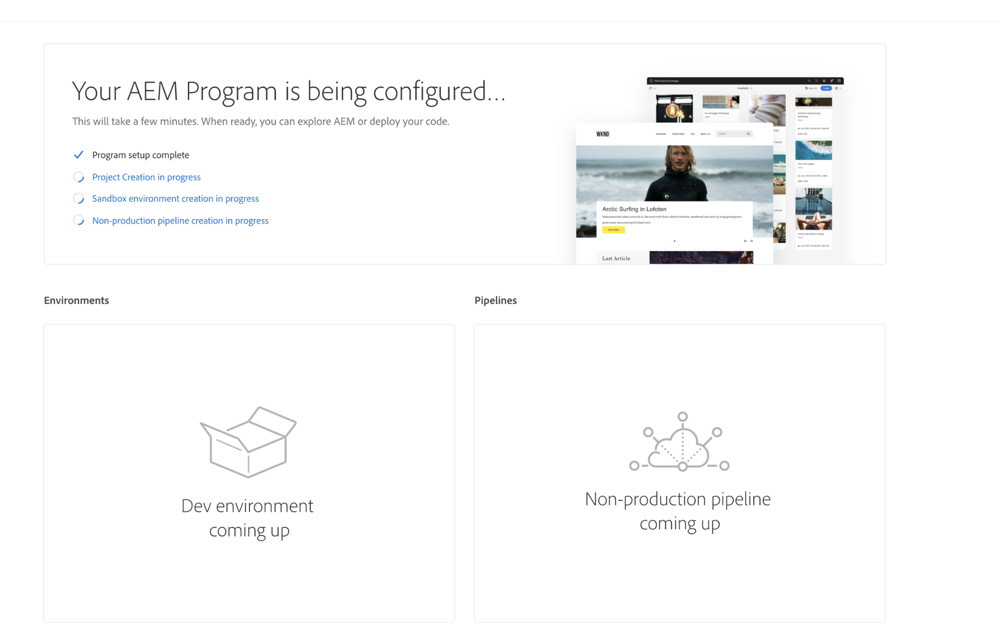
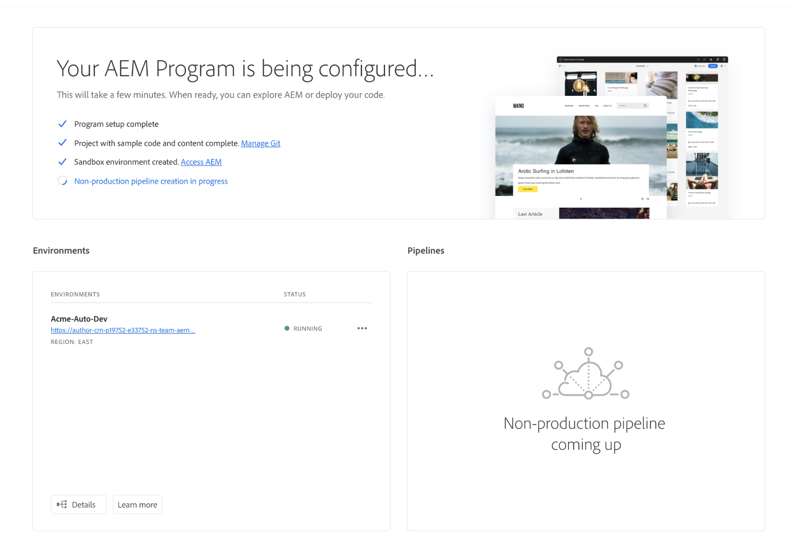
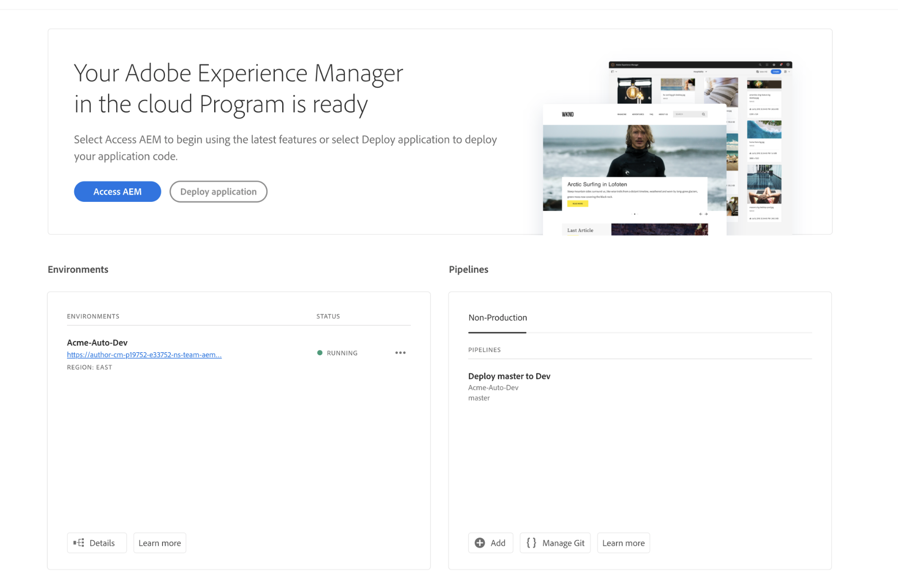
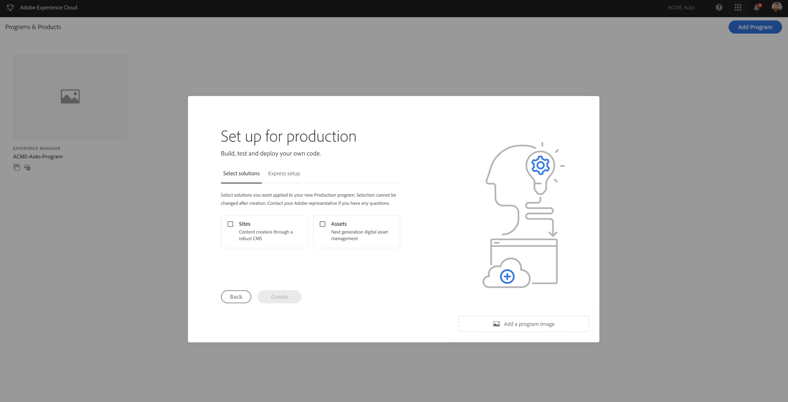

# Create a Program {#create-a-program}

The cloud-native solution gives the user with requisite permissions the ability to create a program on a self-service model.

A program creation wizard will ask the user to submit details, depending on the user’s objective in creating the program within the bounds of what is available to the specific customer or organization. 

## Program Types {#program-types}

A user can create a Sandbox or a Regular program. 
A *Sandbox* is typically created to serve the purposes of training, running demo’s, enablement, POC’s, or documentation. It is not meant to carry live traffic and will have restrictions that a regular program will not. It will include Sites and Assets and will be delivered auto-populated with a Git branch that includes sample code, a Dev environment, and a non-production pipeline.

A *Regular* program is created to enable live traffic at the appropriate time in the future.

## Usage Limits {#usage-limits}
  
Credits are consumed in any of the following ways:

1. **Core Credits**: 

   Core Credits are consumed when a prod/stage environment set is created manually or by  self-service via the Cloud Manager UI inside a Regular program.
   * Consumed when a regular Program is created and user selects solutions to be applied to the Program. A core credit is consumed for each solution that is applied to the Program that is created.
   * Defined by the business value metric applied to size the application 
   Meant for setting up and deploying sites/applications that will carry live traffic
   * A user will only be allowed to create a Production + Stage environment set within the Program if a credit of this type is available in the credit quota for the tenant.

1. **Non-core Credits**:   

   Non-core Credits  are consumed when a dev environment is created manually/self-service via the Cloud Manager UI inside a Regular program.

   * Consumed when a Dev environment is created, for example, a Dev environment created in an Sites+Assets application consumes a Dev credit.
   * Defined by default dimensions.
   * Meant to support business needs such as QA, testing, development within an existing Program
   * A user will only be allowed to create a Dev environment type within a Program if a credit of this type is available in the credit quota for the tenant. The available and remaining quota will be displayed in the create environment wizard

1. **Unlimited Credits**: 

   Sandbox program creation will not consume any credits. Technically, this means that if an organization has the AEM Cloud Service product context, a Business Owner or Deployment manager shall be able to create an unlimited number of Sandbox programs in that organization.

   * Defined by default dimensions
   * Meant for setting up demo's, POC's, training and other applications that will not carry live traffic.
   * Sandbox program credit includes a development, and production+stage environments.

## Using Create Program Wizard {#using-create-program-wizard}

>[!NOTE]
   >
   >The User is displayed with one or either program types depending on whether or not the corresponding credits are available in the tenant. The cloud-native solution gives the user with requisite permissions the ability to create a program on a self-service model.

In the event of first-time access to Cloud Manager, or if no programs exist in the tenant, the user will see **Create your first Program** screen. If user select *Esc* or clicks out of the dialog box, the following screen displays:

 

Depending upon the user’s objective in creating the program within the bounds of what is available to the specific customer/organization, a program creation wizard will ask the user to submit one or more details.

  

## Creating a Sandbox Program {#create-sandbox-program}

Follow the steps below describe how to create a Sandbox program: 
 
1. Select **Setup for Demo** in the Create Program wizard. User submits program name before selecting **Create**.
1. User will see the new sandbox program card on the landing page, and can hover over it to select the Cloud Manager icon to navigate to the Cloud Manager overview page. The card will inform the user on the status of auto-setup of the newly created sandbox program. User will see progression.

   

1. After the project with sample code and content completes, the user can access **Manage Git** link, as shown in the figure below:

   

1. Once the development environment is created, the user can **Access AEM** link, as shown in the figure below:

   

1. Once the Non-production pipeline deploying to development is complete, the wizard guides the user to either access AEM (on development) or deploy code to development environment:

   

## Creating a Regular Program {#create-regular-program}

A *Regular* program is intended for a user who is familiar with AEM and Cloud Manager and is ready to start writing, building and testing code with the objective of deploying it to Production.

The steps below describe how to create a program intended for production:

1. Select **Setup for Production** in the Create Program wizard to create a regular program. User can accept the default program name or edit it before selecting **Create**.

1. User will select solutions that are to be included in the Program in the screen that will be presented following the screen above.

   >[!NOTE]
   >
   >The screen below is only displayed for the segment of customers who have purchased more than one solution. For customers who have purchased just one solution, the solution selection screen below will not be displayed.

   

1.  Once you see your program card on the landing page, hover over it to select the Cloud Manager icon to navigate to the Cloud Manager overview page. The main CTA card will guide the user to create an environment, create a non-production pipeline, and finally a production pipeline.

    >[!CAUTION]
    >
    >A regular program does not have **Auto-setup** feature.

