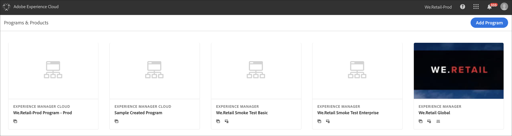
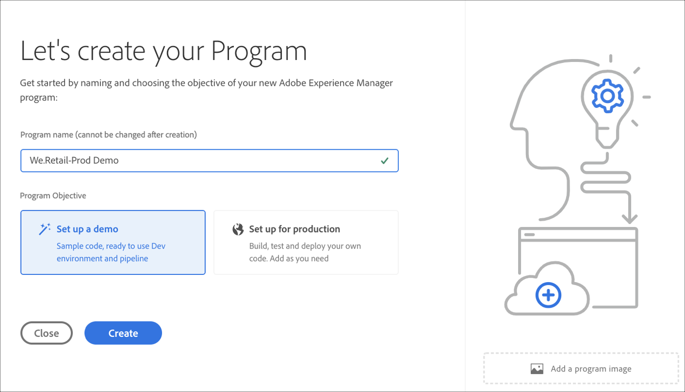
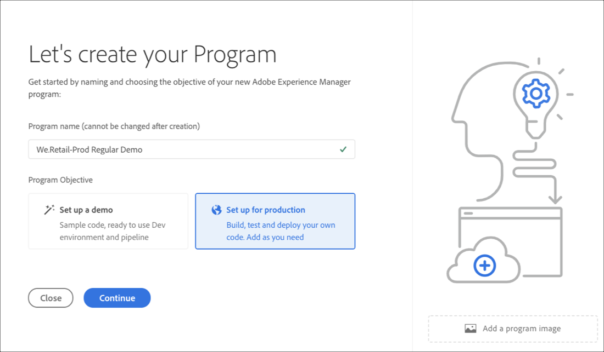

# Create a Program {#create-a-program}

The cloud-native solution provides the user with requisite permissions and the ability to create a program on a self-service model.

A program creation wizard will ask the user to submit details, depending on the user’s objective in creating the program within the bounds of what is available to the specific customer or organization.

In the event of first-time access to Cloud Manager or if no programs exist in the tenant, the user will see **Create your first Program** screen. If user select *Esc* or clicks out of the dialog box, the following screen displays:

 

## Using Create Program Wizard {#using-create-program-wizard}

>[!NOTE]
   >
   >The cloud-native solution gives the user with requisite permissions the ability to create a program on a self-service model.

Depending upon the user’s objective in creating the program within the bounds of what is available to the specific customer/organization, a program creation wizard will ask the user to submit one or more details.

  

>![NOTE]
>If a program already exists, then the **Add Program** button will be seen on the top right of the landing page, as shown in the figure below.

## Creating a Demo Program {#create-demo-program} 

>[!NOTE]
>A demo program is analogous to a sandbox program in Cloud Manager UI.

Follow the steps below describe how to create a Sandbox program: 
 
1. From the create program wizard, select **Set up a demo**. User submits program name before selecting **Create**.

   

1. User will see the new sandbox program card on the landing page, and can hover over it to select the Cloud Manager icon to navigate to the Cloud Manager overview page. The card will inform the user on the status of auto-setup of the newly created sandbox program. User will see progression.

    

1. After the project with sample code and content completes, the user can access **Manage Git** link, as shown in the figure below:

   

1. Once the development environment is created, the user can **Access AEM** link, as shown in the figure below:

   

1. Once the Non-production pipeline deploying to development is complete, the wizard guides the user to either access AEM (on development) or to deploy code to development environment:

   

## Creating a Regular Program {#create-regular-program}

A *Regular* program is intended for a user who is familiar with AEM and Cloud Manager and is ready to start writing, building and testing code with the objective of deploying it to Production.

The steps below describe how to create a program intended for production:

1. Select **Set up for Production** in the Create Program wizard to create a regular program. User can accept the default program name or edit it before selecting **Continue**.

   

1. User will select solutions that are to be included in the Program in the screen that will be presented following the screen above.

   

   >[!NOTE]
   >
   >The screen below is only displayed for the segment of customers who have purchased more than one solution. For customers who have purchased just one solution, the solution selection screen below will not be displayed.

   

1. Once you have selected the solutions, click **Create**.

   

1.  Once you see your program card on the landing page, hover over it to select the Cloud Manager icon to navigate to the Cloud Manager **Overview** page. 

    

1. The main call-to-action card will guide the user to create an environment, create a non-production pipeline, and finally a production pipeline.
   

    >[!NOTE]
    >
    >A regular program does not have **Auto-setup** feature.

    

