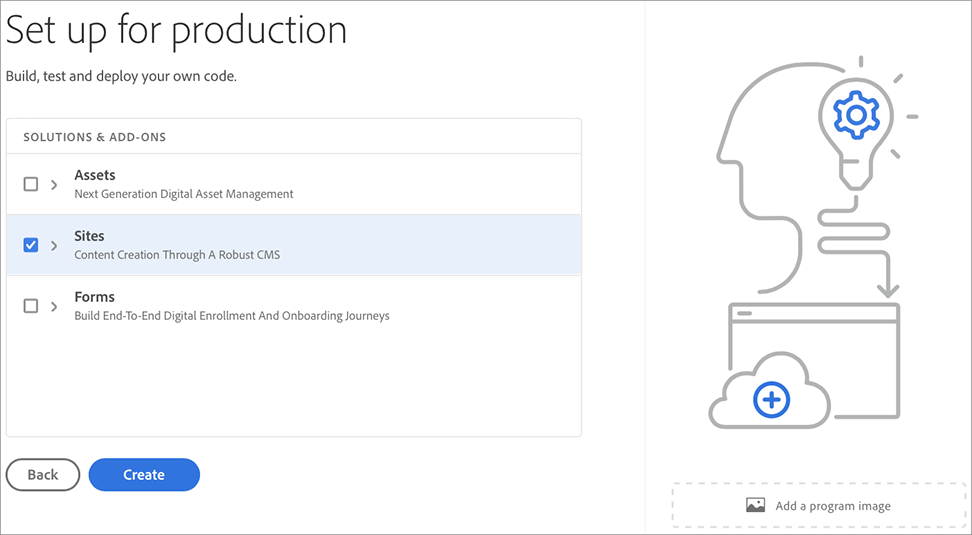
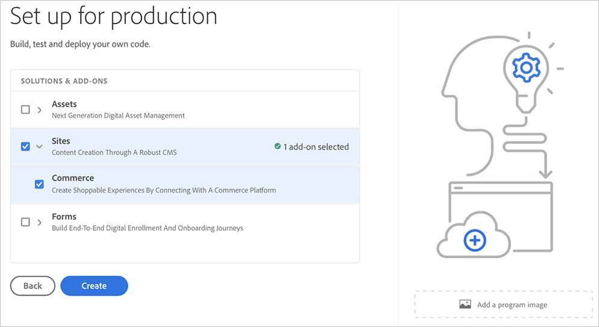

# Creating a Production Program {#create-production-program}

A *Production* program is intended for a user who is familiar with AEM and Cloud Manager and is ready to start writing, building and testing code with the objective of deploying it to Production.

Follow the steps below to create a Production program:

1. Launch the Cloud Manager's landing page and click on **Add Program** from the top right corner of the screen.

    

   >[!NOTE]
   >To learn how to access Cloud Manager, refer to [Cloud Manager Landing Page](/help/onboarding/what-is-required/navigate-to-cloud-manager.md) for more details.

1. Select **Set up for Production** in the Create Program wizard to create a Production program. User can accept the default program name or edit it before selecting **Create**.

   

1. User will select solutions that are to be included in the program in the screen that will be presented following the screen above. Once you have selected the required solution or solutions, click **Create**.

   

   Additionally, you can select the **Commerce** add-on option under **Sites**, as shown  in the figure below, and click on **Create**.

   

1.  Once you see your program card on the landing page, hover over it to select the Cloud Manager icon to navigate to the Cloud Manager **Overview** page. 

    

1. The main call-to-action card will guide the user to create an environment, create a non-production pipeline, and finally a production pipeline.
   

    >[!NOTE]
    >A Production program does not have **Auto-setup** feature.
