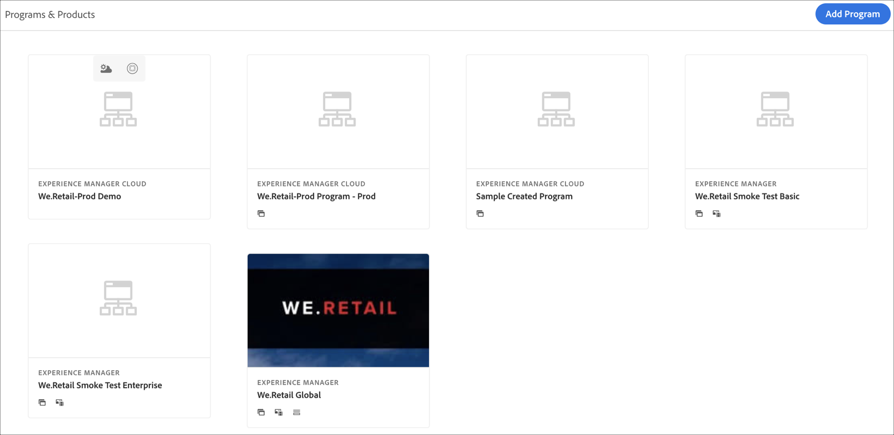
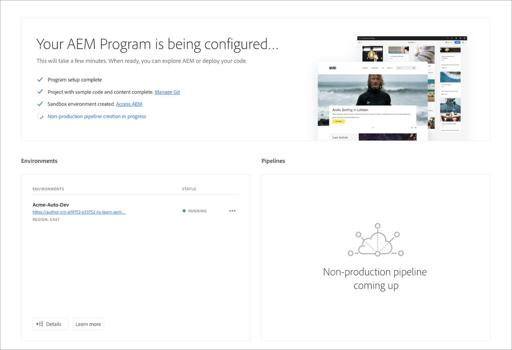

# Creating a Sandbox Program {#create-sandbox-program}

Follow the steps below to create a sandbox program:
 
1. Launch the Cloud Manager's landing page and click on **Add Program** from the top right corner of the screen.

    

   >[!NOTE]
   >To learn how to access Cloud Manager, refer to [Cloud Manager Landing Page](/help/onboarding/what-is-required/navigate-to-cloud-manager.md) for more details.

1. From the create program wizard, select **Set up a sandbox**. User submits program name before selecting **Create**.

   

1. User will see the new sandbox program card on the landing page, and can hover over it to select the Cloud Manager icon to navigate to the Cloud Manager overview page. The card will inform the user on the status of auto-setup of the newly created sandbox program. User will see progression.

    

1. After the program set up and the project creation step completes, the user can access **Manage Git** link, as shown in the figure below:

   
   
   >[!NOTE]
   >
   >To learn more about accessing and managing your Git Repository using Self-Service Git Account Management from Cloud Manager UI, refer to [Accessing Git](/help/implementing/cloud-manager/accessing-git.md).

1. Once the development environment is created, the user can **Access AEM** link, as shown in the figure below:

   

1. Once the Non-production pipeline deploying to development is complete, the wizard guides the user to either access AEM (on development) or to deploy code to development environment:

   

   >[!NOTE]
   >You can also edit, switch or add a program from Cloud Manager Overview page, as shown below:

   
