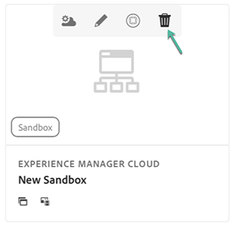
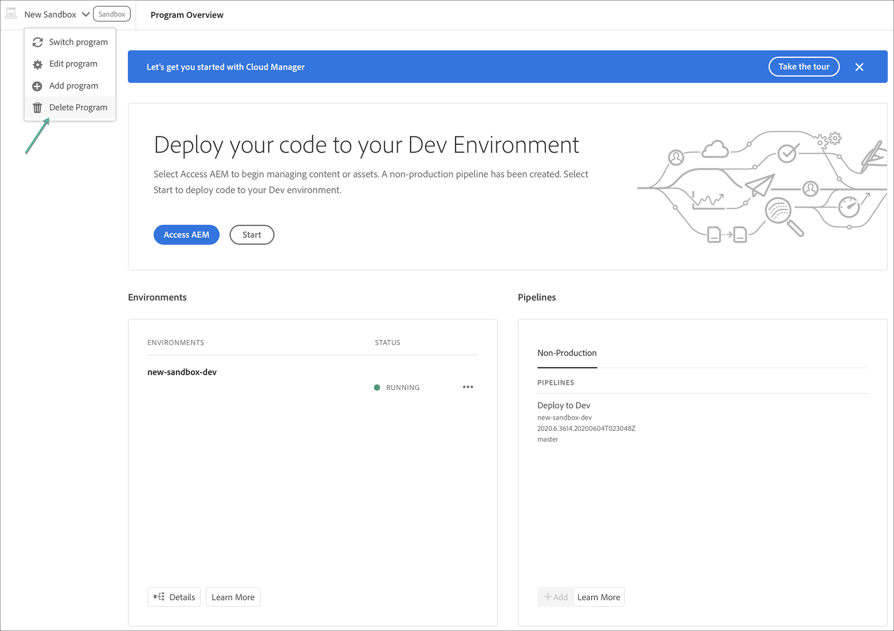

# Deleting a Sandbox Program {#delete-sandbox-program}

A Sandbox Program user in *Business Owner* or *Deployment Manager* role in Cloud Manager can delete their Production and Stage environment set via the Cloud Manager UI. 

>[!NOTE]
>Selecting the delete option on either Production or Stage also deletes the other in the set.

The delete option is available from the landing page, as shown below:

   

Or,

Select **Delete Program** from the **Program Overview** page to delete your Sandbox Program.

   
