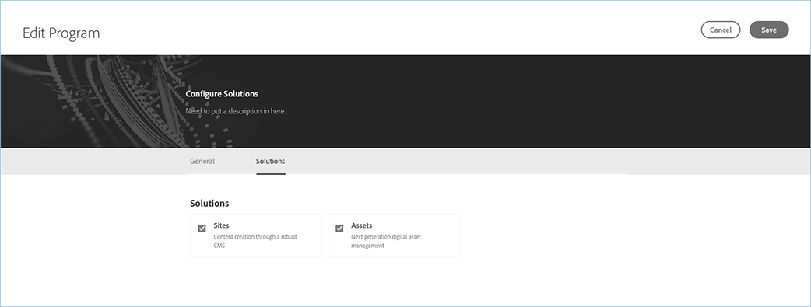

# Editing a Production Program {#create-production-program}

Users with requisite permissions can now edit a Production program, allowing them to do the following in a self-service manner:

* Add Sites solution to an existing program with Assets (or vice-versa).
* Remove Sites (or Assets) from an existing program with both Sites and Assets.
* Add second, unused solution entitlement either to an existing program or as a new Program.

   >[!NOTE]
   >A user in the Business Owner role must be logged in to successfully edit the program.

Follow the steps below to edit a Production program:

1. 1. Navigate to the **Edit Program** page from the Cloud Manager's *Overview* page

1. The **Edit Program** page will display two tabs (General and Solutions) for both Production and Sandbox programs.

   

   >[!NOTE]
   >While both Sites and Assets will be displayed, one of them may be disabled based on what has been purchased and unused. Specifically, If the organization does not have unused entitlement(s) for a particular solution, that solution will be displayed but disabled.

## Considerations while Editing a Program {#considerations-editing}

Few considerations should be reviewed while editing a program:

* At least one solution must be selected for a Program that is, use will not be allowed to deselect all solutions during Edit program workflow. 

* Clicking the **Save** button, if the selected solutions have changed, solution updates to environments will take effect following the next deployment.