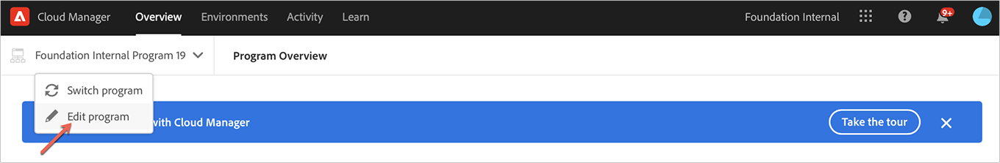
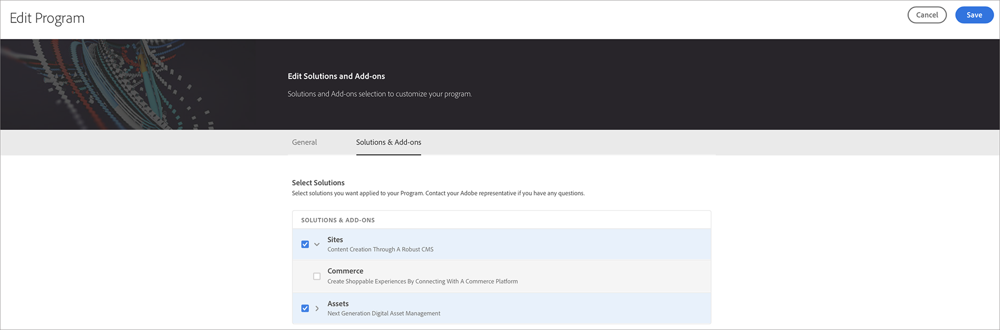

# Editing a Production Program {#create-production-program}

Users with requisite permissions can now edit a Production program, allowing them to do the following in a self-service manner:

* Add Sites solution to an existing program with Assets (or vice versa).
* Remove Sites (or Assets) from an existing program with both Sites and Assets.
* Add second, unused solution entitlement either to an existing program or as a new Program.

   >[!NOTE]
   >A user in the Business Owner role must be logged in to successfully edit the program.

Follow the steps below to edit a Production program:

1. Click on **Edit program** option from the Cloud Manager's *Overview* page

   

1. The **Edit Program** page displays two tabs **General** and **Solutions & Add-ons**.

   Navigate to the **General** tab to edit the program description.

   

   The **Solutions & Add-ons** tab displays two options, such as, **Sites** and **Assets** for both Production and Sandbox programs. Also, you can select **Commerce** add-on option, that is available under **Sites**, as shown in the figure below.

   

   >[!NOTE]
   >At least one solution must be selected for a Program, that is, user is not allowed to deselect all solutions during Edit program workflow. 

1. Click on **Save** to complete the edit program  workflow.

## Considerations while Editing a Program {#considerations-editing}

Few considerations should be reviewed while editing a program:

* At least one solution must be selected for a Program, that is, user is not allowed to deselect all solutions during Edit program workflow. 

* Clicking the **Save** button, if the selected solutions have changed, solution updates to environments will take effect following the next deployment.
