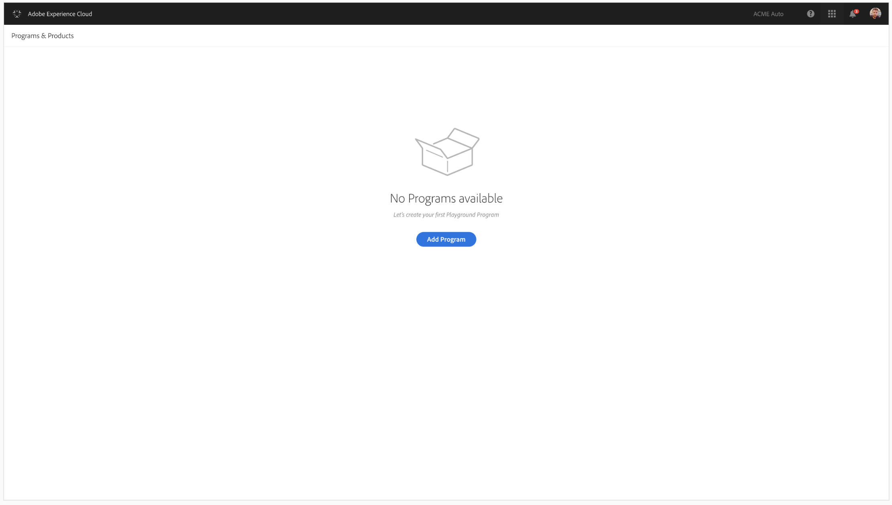

# Accessing Programs {#first-time-login} 

Once you have successfully logged in to [!UICONTROL Cloud Manager], you are ready to use the User Interface (UI).

>[!NOTE]
>
>Depending on the roles assigned in [!UICONTROL Cloud Manager] and the state of the application, you will see different screens while using [!UICONTROL Cloud Manager] UI.

## Cloud Manager Landing Page {#landing-page}

Once you have successfully logged in to [!UICONTROL Cloud Manager], you will see the landing page as shown in the figure below.

>[!NOTE]
>
>Programs that are on the Cloud Service are indicated by the subtitle **Experience Manager Cloud** (as opposed to **Experience Manager** for AMS programs), as shown below.

Based on your circumstances, you will see either of the two options:

* **No programs exist in Cloud Manager**

* **Programs already exist in Cloud Manager**

## Adding a New Program in Cloud Service with no Existing Programs {#no-program}

The landing page directs you to create your first program, as shown in the figure below.
   
      

## Adding a New Program in Cloud Service with Existing Programs {#existing-program}

1. Log in to the **Adobe [!UICONTROL Experience Cloud]** and you will see the list of **Programs & Products**.

   

   Programs that are on the Cloud Service are indicated by the subtitle **Experience Manager Cloud** (as opposed to **Experience Manager** for AMS programs). 
   
   >[!NOTE]
   >For example, in the figure above, **We.Retail Global** is an AMS program and **We.Retail-Prod Program - Prod** is a program available via Cloud Service.

1. To learn how to add a program from the **Programs & Products** screen to create a new program in Cloud Service refer to [Create a Program](/help/onboarding/getting-access-to-aem-in-cloud/creating-a-program.md).

  
