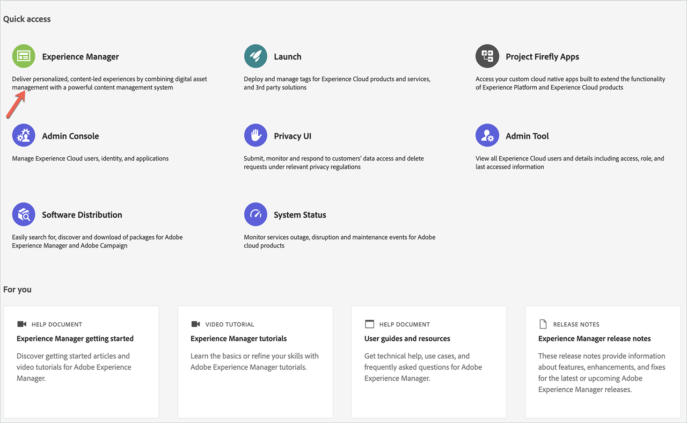
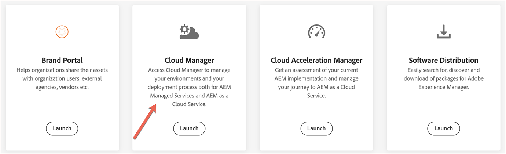
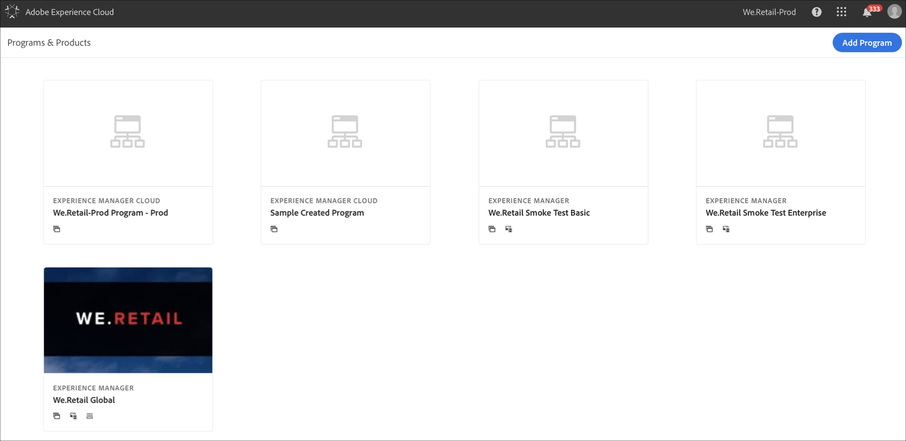

# Cloud Manager Landing Page {#first-time-login} 

Once your System Administrator grants you access to Cloud Manager, you will receive an email that will take you to Cloud Manager login page. 

Follow the steps below to access Cloud Manager:

1. Navigate to [Experience Cloud](https://experience.adobe.com/) using your Adobe ID.
1. Select **Experience Manager**.
   
   
1. Click on **Launch** from the Cloud Manager card.
   Once you have successfully logged in to [!UICONTROL Cloud Manager], you are ready to use the User Interface (UI).
   

   >[!NOTE]
   >
   >Depending on the roles assigned in [!UICONTROL Cloud Manager] and the state of the application, you will see different screens while using [!UICONTROL Cloud Manager] UI.

## Programs in Cloud Manager {#cloud-manager-landing-page}

Once you have successfully logged in to [!UICONTROL Cloud Manager], the landing page will show the card for any existing program(s) that are in your Organization.

>[!NOTE]
>
>Programs that are on the Cloud Service are indicated by the subtitle **Experience Manager Cloud** (as opposed to **Experience Manager** for AMS programs), as shown below.

Based on your circumstances, you will see either of the two options:

* **No programs exist in Cloud Manager**

* **Programs already exist in Cloud Manager**

If no programs exist in your Organization, then your landing page directs you to create your first program, as shown in the figure below.
   
      

If program(s) already exist in your Organization, then your landing page directs you to add another program and displays all your existing programs too, as shown in the figure below.

   
   
   >[!NOTE]
   >Programs that are on the Cloud Service are indicated by the subtitle **Experience Manager Cloud** (as opposed to **Experience Manager** for AMS programs). 
   >For example, in the figure above, **We.Retail Global** is an AMS program and **We.Retail-Prod Program - Prod** is a program available via Cloud Service.

To learn how to add a program in Cloud Manager, refer to:

   * [Creating a Production Program](/help/onboarding/getting-access-to-aem-in-cloud/creating-production-program.md)
   * [Creating a Sandbox Program](/help/onboarding/getting-access-to-aem-in-cloud/creating-sandbox-program.md)

  
