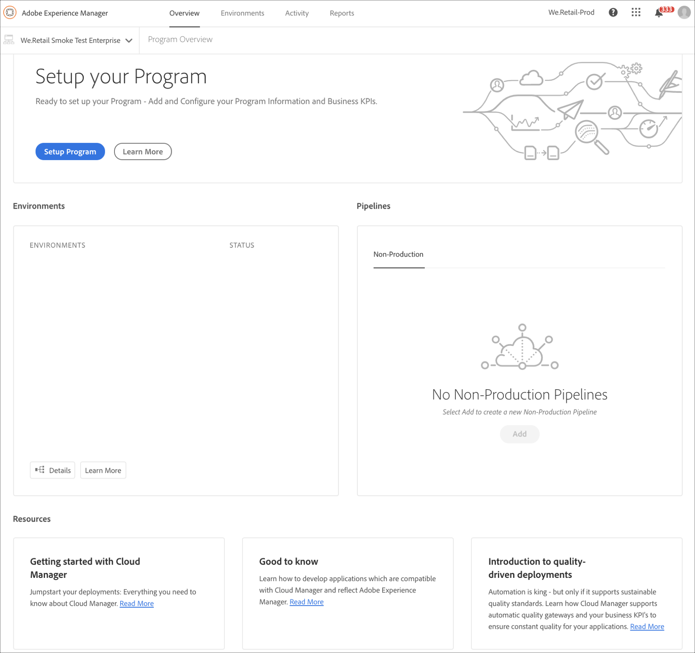

# First Time Login {#first-time-login} 

Once you have setup the general configurations for [!UICONTROL Cloud Manager], you are ready to use the User Interface (UI) for [!UICONTROL Cloud Manager].

>[!NOTE]
>
>Depending on the roles assigned in [!UICONTROL Cloud Manager] and the state of the application, you will see different screens while using [!UICONTROL Cloud Manager] UI.

## Logging in for the First Time {#logging-in-for-the-first-time}

>[!NOTE]
   >
   >Programs that are on the cloud service are indicated by the subtitle **Experience Manager Cloud** as opposed to **Experience Manager** for AMS programs), as shown below.

1. Log in to the **Adobe [!UICONTROL Experience Cloud]** and you will see the list of **Programs & Products**.

   

1. Select the program (for example, **We.Retail Intranet**) and click on the tile to open [!UICONTROL Cloud Manager].

   

1. The dashboard for [!UICONTROL Cloud Manager] displays.

   

1. Click **Setup Program** for setting the **Program** description and defining the Key Performance Indicators (KPIs).

