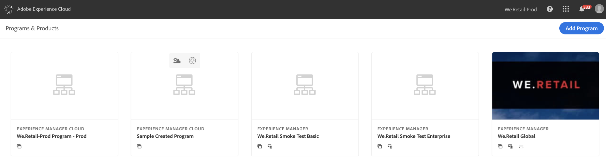

# Access Programs {#first-time-login} 

Once you have setup the general configurations for [!UICONTROL Cloud Manager], you are ready to use the User Interface (UI) for [!UICONTROL Cloud Manager].

>[!NOTE]
>
>Depending on the roles assigned in [!UICONTROL Cloud Manager] and the state of the application, you will see different screens while using [!UICONTROL Cloud Manager] UI.

## Logging in for the First Time {#logging-in-for-the-first-time}

>[!NOTE]
   >
   >Programs that are on the cloud service are indicated by the subtitle **Experience Manager Cloud** as opposed to **Experience Manager** for AMS programs), as shown below.

Based on your circumstances:

1. *If no programs exist in Cloud Manager*

   The Landing page directs you to create your first program, as shown in the figure below.
      
      

1. *If programs already exist in Cloud Manager*
   
   Programs that are on the Cloud Service are indicated by the subtitle **Experience Manager Cloud** (as opposed to **Experience Manager** for AMS programs). 
   
   For example, in the screenshot below, **We.Retail Global** is an AMS program and **We.Retail-Prod Program - Prod** is a program available via the Cloud Service.
      
      
## Logging in for the First Time with Existing Programs {#logging-in-for-the-first-time-existing}

1. Log in to the **Adobe [!UICONTROL Experience Cloud]** and you will see the list of **Programs & Products**.

   

1. Select the program (for example, **Sample Created Program**) and click on the tile to open [!UICONTROL Cloud Manager].

   

1. The [!UICONTROL Cloud Manager] **Overview** screen displays.

   

1. Click **Setup Program** for setting the Program description and defining the Key Performance Indicators (KPIs).
