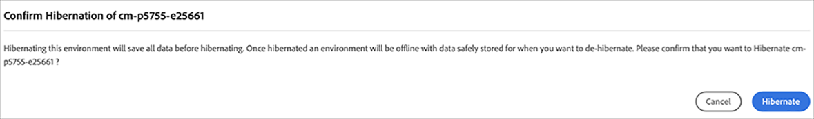
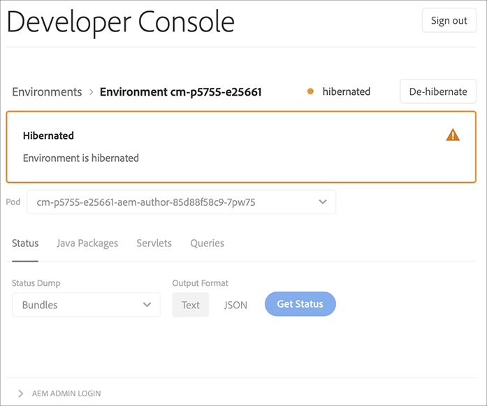
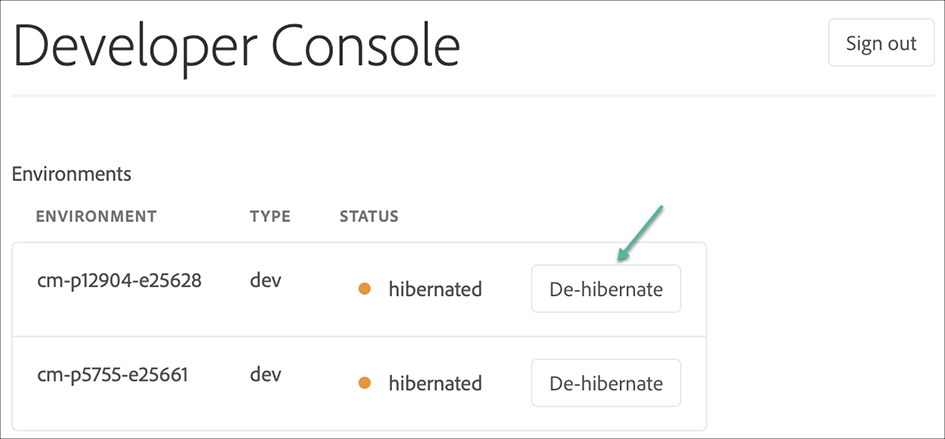
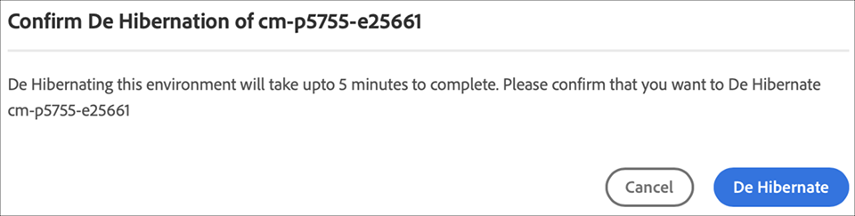
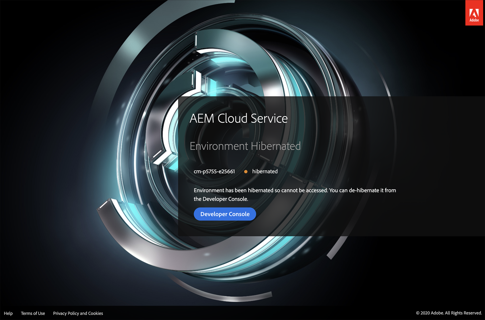

# Hibernating and De-hibernating Sandbox Environments {#hibernating-introduction}

Sandbox Program environments enter a *hibernation mode* if no activity is detected for a certain period of time.

>[!NOTE]
>Hibernation is unique to Sandbox Program environments. Production program environments do not hibernate.

## Hibernation {#hibernation-introduction}

Hibernation can occur either automatically or manually. It may take up to a few minutes for Sandbox Program environments to enter a *hibernation mode*. Data is preserved during hibernation.

Hibernation is categorized as:

* **Automatic**  Sandbox Program environments are automatically hibernated after eight hours of inactivity, meaning that neither the author nor publish services receive requests.

* **Manual**: As a user you may manually hibernate a Sandbox Program environment, although there is no requirement to do so since hibernation will occur automatically after a certain period (eight hours) of inactivity.

>[!CAUTION]
>In the latest release, linking to the Developer Console directly from Cloud Manager will not give you the option to hibernate a Sandbox Program environment. The workaround is once at the Developer Console, add the following pattern to the end of the url `#release-cm-p1234-e5678 where 1234` 1234 is your *Program ID* and 5678 is your *Environment ID*.

### Using Manual Hibernation {#using-manual-hibernation}

You can manually hibernate your Sandbox Program from the Developer Console in two different ways, using:

* Environment detail screen 
* Environment listing screen 

>[!NOTE]
>Access to Developer Console for a Sandbox Program is available to any user of Cloud Manager.

Follow the steps below to manually hibernate your Sandbox Program environments:

1. Navigate to the **Developer Console**. 
Refer to [Accessing Developer Console](/help/implementing/cloud-manager/manage-environments.md#accessing-developer-console) to learn how to access the **Developer Console** from the **Environments** card.
   >[!IMPORTANT]
   >Linking to the **Developer Console** directly from Cloud Manager will not give you the option to hibernate a Sandbox Program environment. The workaround is once at the Developer Console, add the following pattern to the end of the url `#release-cm-p1234-e5678 where 1234` 1234 is your *Program ID* and 5678 is your *Environment ID*.  

1. Click **Hibernate**, as shown in the figure below:

   

   Or,

   Click the **Environments** link in top left to view the environments listing and then click **Hibernate**, as shown in the figure below:

   

1. Click **Hibernate** to confirm the step.

   

1. When the hibernation is successful, you will see the hibernation process complete notification for your environment in the **Developer Console** screen.

   

## De-hibernation {#de-hibernation-introduction}

1. Navigate to the **Developer Console**. 
Refer to [Accessing Developer Console](/help/implementing/cloud-manager/manage-environments.md#accessing-developer-console) to learn how to access the **Developer Console** from the **Environments** card.

   >[!IMPORTANT]
   >Linking to the **Developer Console** directly from Cloud Manager will not give you the option to de-hibernate a Sandbox Program environment. The workaround is once at the Developer Console, add the following pattern to the end of the url `#release-cm-p1234-e5678 where 1234` 1234 is your *Program ID* and 5678 is your *Environment ID*.

   >[!NOTE]
   >Alternatively, you can navigate to the **Developer Console** to de-hibernate by trying to access the author or publish service of an already hibernated environment; in that case, a landing page will appear with a link to the Developer Console. See the Accessing a Hibernated Environment section below.

   >[!IMPORTANT]
   >Access to the Developer Console is defined by the **Cloud Manager - Developer Role** in the **Admin Console**. A user with a developer role permission can de-hibernate a Sandbox Program environment.

1. Click on **De-hibernate**, as shown in the figure below:

    

    Or,

    Click the **Environments** link in top left to view the environments listing and then click **De-hibernate**, as shown in the figure below
 
    

1. Click **De Hibernate** to confirm the step.

   

1. You will receive the notification that the de-hibernation process has started and you will be updated with the progress.
   
   
   
1. Once the process completes, the Sandbox Program environment is active again.
 
   

### Permissions to De-hibernate {#permissions-de-hibernate}

Any user with a product profile giving them access to AEM as a Cloud Service should be able to access the **Developer Console**, allowing them to de-hibernate the environment. 

## Accessing a Hibernated Environment {#accessing-hibernated-environment}

When making any browser requests against either the author or publish tier of a hibernated environment, the user will encounter a landing page describing the hibernated status of the environment, as shown in the figure below:

## Important Considerations {#important-considerations}

Few key considerations related to hibernated and de-hibernated environments are:

* A user may use a pipeline to deploy custom code to hibernated environments. The environment will remain hibernated and the new code will appear in the environment once de-hibernated.

* AEM upgrades can be applied to hibernated environments, which customers can manually trigger from Cloud Manager. The environment will remain hibernated and the new release will appear in the environment once de-hibernated.

>[!NOTE]
>Currently, Cloud Manager does not indicate whether an environment is hibernated.

## AEM Updates to Sandbox Environments {#aem-updates-sandbox}

Refer to [AEM version updates](/help/implementing/deploying/aem-version-updates.md) for more details.

A user can manually apply AEM updates to the environments in a Sandbox Program.

Refer to [Updating Environment](/help/implementing/cloud-manager/manage-environments.md#updating-dev-environment) to learn how to update an environment.

>[!NOTE]
>* A manual update can only be run when the targeted environment has a properly configured pipeline. 
>* A manual update to either *Production* or *Stage* environment will automatically update the other. The Production+Stage environment set must be on the same AEM release.
