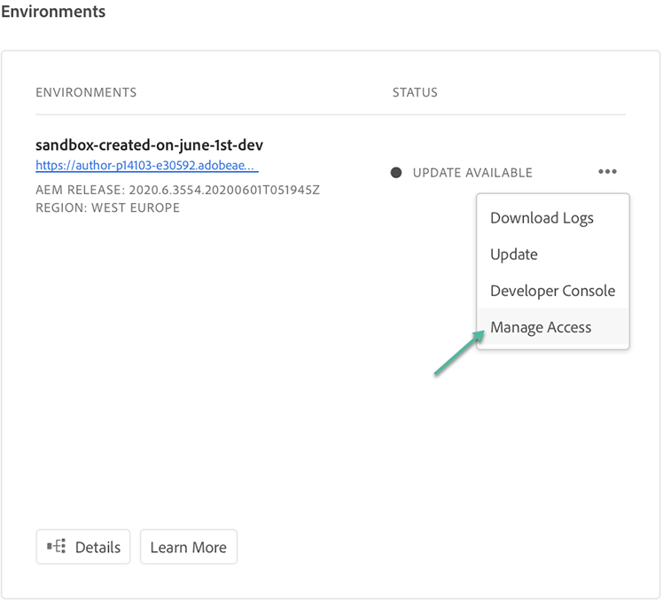

# Accessing Experience Manager as a Cloud Service {#navigation} 

Once your System Administrator grants you access to Cloud Manager, you will receive an email that will take you to Cloud Manager login page which is also accessible through [Adobe Experience Cloud](https://my.cloudmanager.adobe.com/). 

Upon successful login, you will be directed to the landing page of Cloud Manager as shown below.

   

## SysAdmin Access {#sysadmin-access}

A user in the SysAdmin role has one-click access to the location in Admin Console from where user roles or permissions to Cloud Manager are managed.

   

### Managing Roles {#manage-roles}

As a user in the SysAdmin, a **Manage Roles** option is available on the landing page next to the **Add Program**. This gives you one-click access to the location in Admin Console from where user roles or permissions to Cloud Manager can be managed.

Refer to [Accessing Cloud Manager](https://docs.adobe.com/content/help/en/experience-manager-cloud-service/security/ims-support.html#accessing-cloud-manager) to get more information on how to add users to a profile refer accessing Cloud Manager 

### Managing Access to AEM {#manage-access-aem}

As a user in the SysAdmin, you have one-click access to the Author instance directly from Cloud Manager.

Refer to [Accessing an Instance in AEM as a Cloud Service](https://docs.adobe.com/content/help/en/experience-manager-cloud-service/security/ims-support.html#accessing-instance-cloud-service) for more details.

## For Existing AMS Customers {#existing-aem}

If you are an existing AMS (Adobe Managed Services) customer and you have access to Cloud Service, you will see your existing program(s) and the **Add Program** button on the top right corner of the landing page. 

If you do not see the **Add Program** button and have questions about access to Cloud Service, please contact your Adobe representative.

Refer to [Adding a New Program in Cloud Service with Existing Programs](/help/onboarding/getting-access-to-aem-in-cloud/first-time-login.md#existing-program) for more details.

## For New Cloud Service Customers {#new-cloud-services}

If you are a new Cloud Service customer, then you will see the **Add Program** button on the top right corner of an empty landing page. You will want to add a new program to your Cloud Service.

Refer to [Adding a New Program in Cloud Service with no Existing Programs](/help/onboarding/getting-access-to-aem-in-cloud/first-time-login.md#no-program) for more details.

