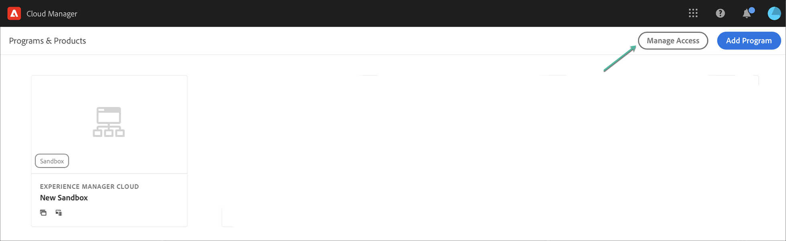
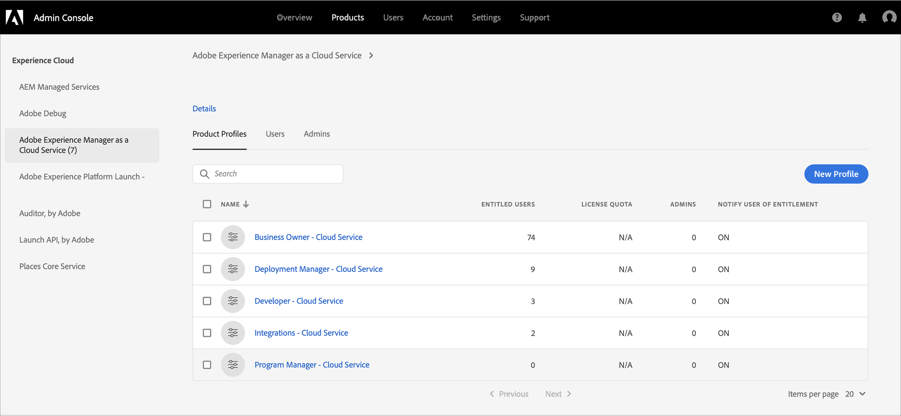

# Getting Access to Cloud Manager for AEM as a Cloud Service {#navigation} 

Once your System Administrator grants you access to Cloud Manager, you will receive an email that will take you to Cloud Manager login page which is also accessible through [Adobe Experience Cloud](https://my.cloudmanager.adobe.com/). 

Upon successful login, you will be directed to the landing page of Cloud Manager as shown below.

   

## SysAdmin Tasks {#sysadmin-tasks}

A user in the SysAdmin role can select **Manage Access** to directly access the Admin Console to manage roles and permissions and access to AEM instances.

### Managing Roles {#manage-roles}

As a user in the SysAdmin role, you have one-click access to the location in **Admin Console** from where user roles or permissions to Cloud Manager are managed.

Refer to [Accessing Cloud Manager](https://docs.adobe.com/content/help/en/experience-manager-cloud-service/security/ims-support.html#accessing-cloud-manager) to get more information on how to add users to a profile. 

>[!NOTE]
>For some organizations which were given access to AEM as a Cloud Service before January 2020, those will be taken to the Adobe Admin Console and the Product and Environment Product Profile will have to be selected.

1. Navigate to the landing page of the Cloud Manager and click on **Manage Access**.

   

1. Once you click on **Manage Access**, you are navigated to **Admin Console** from where you can manage the user roles or permissions to Cloud Manager.

   

### Managing Access to Author Instance {#manage-access-aem}

As a user in the SysAdmin role, you have one-click access to the **Admin Console** from where you can navigate to the author instance directly and manage access.

>[!NOTE]
>For some organizations which were given access to AEM as a Cloud Service before January 2020, those will be taken to the Adobe Admin Console and the Product and Environment Product Profile will have to be selected.

   Refer to [Accessing an Instance in AEM as a Cloud Service](https://docs.adobe.com/content/help/en/experience-manager-cloud-service/security/ims-support.html#accessing-instance-cloud-service) for more details.

1. Navigate to **Environments** card from **Program Overview** page and click on **Manage Access**.

   

   Or,

   **Manage Access** is also available from the **Manage** button, if you click on **Details** from the **Environments** card.

   

1. Once you click on **Manage Access**, you are navigated to **Admin Console** from where you have the access to the author instance of the environment.

   

## For Existing AMS Customers {#existing-aem}

If you are an existing AMS (Adobe Managed Services) customer and you have access to Cloud Service, you will see your existing program(s) and the **Add Program** button on the top right corner of the landing page. 

If you do not see the **Add Program** button and have questions about access to Cloud Service, please contact your Adobe representative.

Refer to [Adding a New Program in Cloud Service with Existing Programs](/help/onboarding/getting-access-to-aem-in-cloud/first-time-login.md#existing-program) for more details.

## For New Cloud Service Customers {#new-cloud-services}

If you are a new Cloud Service customer, then you will see the **Add Program** button on the top right corner of an empty landing page. You will want to add a new program to your Cloud Service.

Refer to [Adding a New Program in Cloud Service with no Existing Programs](/help/onboarding/getting-access-to-aem-in-cloud/first-time-login.md#no-program) for more details.

