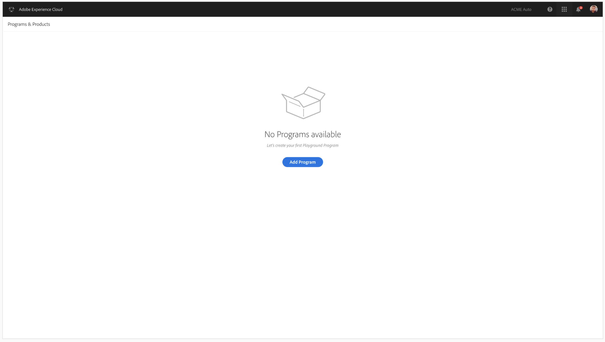

# Getting Access to Cloud Manager for AEM as a Cloud Service {#navigation} 

Once your System Administrator grants you access to Cloud Manager, you will receive an email that will take you to Cloud Manager login page which is also accessible through [Adobe Experience Cloud](https://my.cloudmanager.adobe.com/). 

>[!NOTE]
>You must be added as a user and assigned to a Cloud Manager Role (Product Profile in Admin Console) by your System Administrator. 

1. From your Welcome email select Get started, or navigate to [Cloud Manager](experience.adobe.com) and login using your Adobe ID.  

1. Select **Experience Manager**.
   
   
1. Click on **Launch** from the Cloud Manager card.
   Once you have successfully logged in to [!UICONTROL Cloud Manager], you are ready to use the User Interface (UI).
   

   >[!NOTE]
   >
   >Depending on the roles assigned in [!UICONTROL Cloud Manager] and the state of the application, you will see different screens while using [!UICONTROL Cloud Manager] UI.

## Cloud Manager Landing Page {#cloud-magaer-landing}

Upon successful login, you will be directed to the landing page of Cloud Manager.

You will see one of the three options described below:

* **When No Programs exist in Cloud Manager**

   If no programs exist in your Organization, then your landing page directs you to create your first program, as shown in the figure below.
   

* **When Programs already exist in Cloud Manager**

   If program(s) already exist in your Organization, then your landing page directs you to add another program and displays all your existing programs too, as shown in the figure below.

   

* **When a Program exists and user is System Administrator**

   If program(s) already exist in your Organization, and you are a System Administrator, then your landing page displays **Manage Access** button along with **Add Program** option, as shown in the figure below.

   

From here, a user with the right permissions, such as a Business Owner role in Cloud Manager is able to select **Add Program** to launch the wizard.

>[!NOTE]
> Refer to [Understanding User Roles and Permissions](/help/onboarding/what-is-required/user-roles-permissions.md).
> Refer to [Program Types](/help/onboarding/getting-access-to-aem-in-cloud/understand-program-types.md) to learn more about Program types.
>To learn how to add a program in Cloud Manager, refer to:
>* [Creating a Production Program](/help/onboarding/getting-access-to-aem-in-cloud/creating-production-program.md)
>* [Creating a Sandbox Program](/help/onboarding/getting-access-to-aem-in-cloud/creating-sandbox-program.md)

## Granting Users Access to an AEM instance {aem-instances-access}

1. Navigate to Cloud Manager and select the **Manage Access** button from the context of the environment of interest as shown below.

1. Navigate to Cloud Manager and from the **Environments** card, click on **Manage Access**.

   

   Or,

   **Manage Access** is also available from the **Manage** button, if you click on **Details** from the **Environments** card.

   

1. Once you click on **Manage Access**, a new tab navigates you to **Admin Console** from where you have the access to the author instance of the environment. Select the **Users** tab and click on **Add User**.

    

   >[!NOTE]
   >You can also navigate directly to the [Admin Console](https://adminconsole.adobe.com).

1. Select the AEM instance of interest as shown below. You can select the Adobe Experience Manager as a Cloud Service (Product Context) Card to get to the table with the list of AEM instances. Select the instance of interest as shown below.

   

1. Click on **Add User** to add the user(s) who you wish to give access to.

   >[!NOTE]
   >For some organizations which were given access to AEM as a Cloud Service before January 2020, those will be taken to the Adobe Admin Console and the Product and Environment Product Profile will have to be selected.

