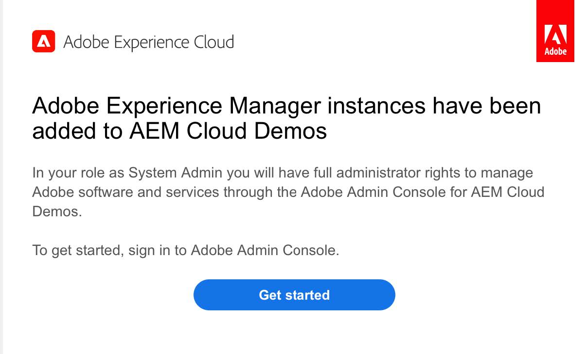
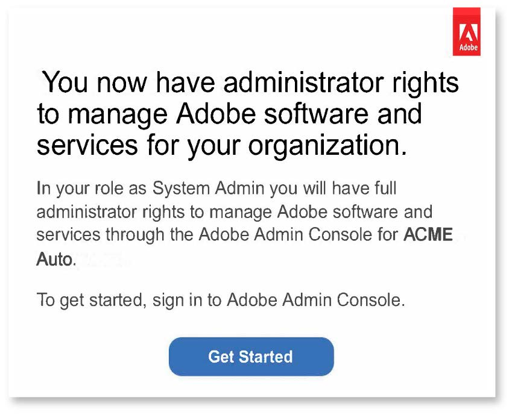
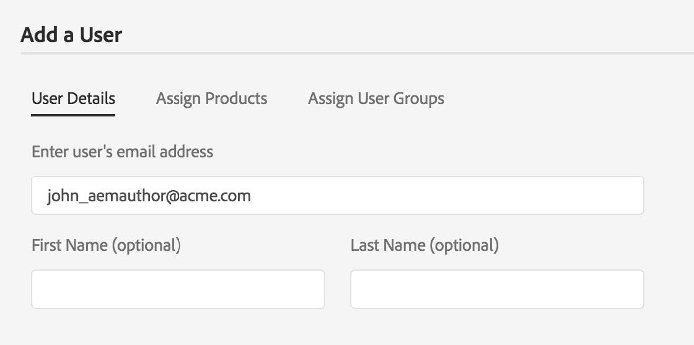

# AEM as a Cloud Service: Onboarding and Access  

## AEM as a Cloud Service Onboarding Overview
   

### Accessing AEM as a Cloud Service  
 
Once auto-provisioning is complete:

* Access Rights Granted – Adobe will create an Organization within Adobe Identity Management System (IMS)
* Designated Administrator will have administrator permissions by default
* Administrator can add users and roles for additional team members through the Admin Console
* Review role-based permissions for users to determine permission assignments in Cloud Manager
   
> 
  

For more information, please visit [Onboarding to Experience Manager as a Cloud Service on Experience League](https://experienceleague.adobe.com/docs/experience-manager-cloud-service/onboarding/home.html?lang=en)
   
### Resources and Links   
• [IMS Support for AEM as a Cloud Service](https://experienceleague.adobe.com/docs/experience-manager-cloud-service/security/ims-support.html?lang=en)   
• [Role Based Permissions in Cloud Manager](https://experienceleague.adobe.com/docs/experience-manager-cloud-service/onboarding/what-is-required/role-based-permissions.html?lang=en#what-is-required)  
• [Accessing Experience Manager as a Cloud Service](https://experienceleague.adobe.com/docs/experience-manager-cloud-service/onboarding/getting-access/navigation.html?lang=en#getting-access)  

## Adobe Experience Manager as a Cloud Service Onboarding Process

### 1. Purchase order Triggers autoprovisioning.  
### 2. Onboard Organizations to Adobe Admin Console:   
 >    
* System Administrator:  
    * Provision AEM programs and environments.
    * Navigate to Admin Console for administrative tasks.  
    * Claims a domain to confirm ownership of respective domain  
    * Sets up User directories.  
    * IDP Configuration.
* AEM Administrator:  
    * Manage local groups, permissions, and privileges.
### 3. Onboard Users and Manage Access in Admin Console:  
>    

Three methods to onboard users, depending on size and preference:
* Manually create users in Admin Console
* Upload .csv file
* Sync users from enterprise Active
Directory

### 4. Admin configures org and grants users and group access to environments
 
## Customer Kickoff with Adobe 

* First Customer Meeting
    * Admin Console walk-through
    * Standard support processes
    * Experience League Walkthrough for Enablement

## First Customer Call - Admin Console & Support Walk Through 

* Onboarding Call
    * Admin Console introduction
    * Standard support processes
    * Introduction to other resources

* AEM-specific Best Practices
    * Ensure involvement from the following stakeholders: Cloud SMEs, Post-sales stakeholders, and Onboarding team.

