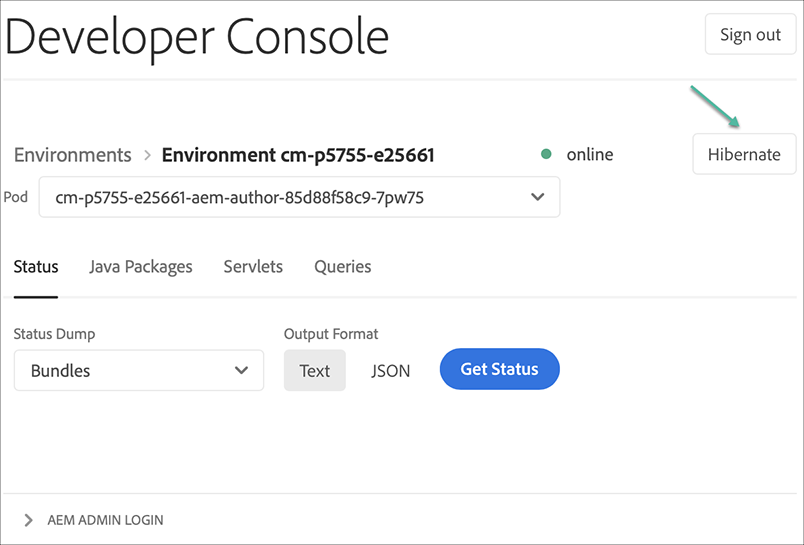
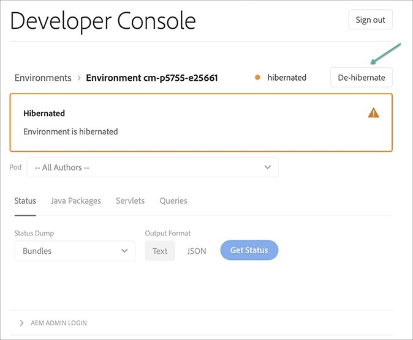
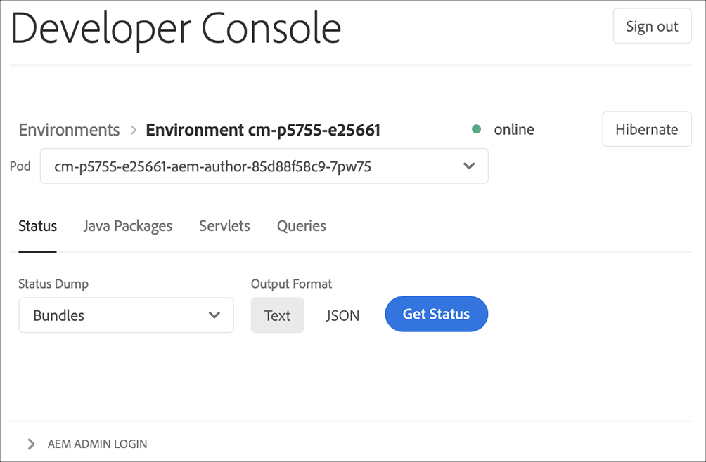

# Sandbox Programs {#sandbox-programs}

## Introduction {#introduction}

A Sandbox program is one of the two types of programs available in AEM Cloud Service, the other being a Regular program. 

A Sandbox is typically created to serve the purposes of training, running demos, enablement, or Proof of Concept (POC)s. They are not meant to carry live traffic.

Sandbox programs include Sites and Assets and is auto-populated with a Git branch that includes sample code, a development environment, and a non-production pipeline.

Refer to [Understanding Programs and Program Types](https://docs.adobe.com/content/help/en/experience-manager-cloud-service/onboarding/getting-access/understand-program-types.html) to learn more about the Program Types.

### Attributes of Sandbox Programs {#attributes-sandbox}

Sandbox Programs have the following attributes:

1. **Program Creation:** The Sandbox program creation includes automatic:
   * setup of project with sample code and content
   * creation of development environment
   * creation of non-production pipeline deploying to development environment (master branch deploying to development environment)
 
1. **Solutions:** Sandbox programs include AEM Sites and Assets.

1. **AEM Updates:** AEM updates can be applied manually to environments in a Sandbox program, and are not automatically pushed.

1. **Hibernation:** Environments in a Sandbox program are automatically hibernated if no activity is detected for a certain period of time. Hibernated environments can be manually de-hibernated.

### Creating a Sandbox Program {#creating-sandbox-program}

A program creation wizard lets you create a Sandbox Program.

To learn how to create a Sandbox Program, refer to.

### Creating Sandbox Environments {#creating-sandbox-environments}

Sandbox Programs are delivered a development environment at the time of program creation in an auto-created manner. The development environment includes an author and a publish tier by default.

The Production-Stage environment set can be manually added to the Sandbox Program, when the user is ready to setup a production pipeline. 

To learn how to manually create an environment, refer to [Adding Environments](https://docs.adobe.com/content/help/en/experience-manager-cloud-service/implementing/using-cloud-manager/manage-environments.html#adding-environments) for more details.

### Deleting Sandbox Environments {#deleting-sandbox-environments}

User with the requisite permissions can delete a Development or Production/Stage environment  or sets. 

To delete an environment, refer to [Deleting Environments](https://docs.adobe.com/content/help/en/experience-manager-cloud-service/implementing/using-cloud-manager/manage-environments.html#deleting-environment) for more details.

## Hibernating and De-hibernating Sandbox Environments {#hibernating-introduction}

Sandbox Program environments enter a *hibernation mode* if no activity is detected for a certain period of time.

>[!NOTE]
>Hibernation is unique to Sandbox Program environments. Regular program environments do not hibernate.

### Hibernation {#hibernation-introduction}

Hibernation can occur either automatically or manually. It may take up to a few minutes for Sandbox Program environments to enter a *hibernation mode*. Data is preserved during hibernation.

Hibernation is categorized as:

* **Automatic**  Sandbox Program environments are automatically hibernated after eight hours of inactivity, meaning that neither the author nor publish services receive request.

* **Manual**: As a user you may manually hibernate a Sandbox Program environment, although there is no requirement to do so since hibernation will occur automatically after certain period (eight hours) of inactivity.

#### Using Manual Hibernation {#using-manual-hibernation}

You can manually hibernate your Sandbox Program from the Developer Console in two different ways, using:

* Environment detail screen 
* Environment listing screen 

Follow the steps below to manually hibernate your Sandbox Program environments:

1. Navigate to the **Developer Console**. 
Refer to [Accessing Developer Console](https://docs.adobe.com/content/help/en/experience-manager-cloud-service/implementing/using-cloud-manager/manage-environments.html#accessing-developer-console) to learn how to access the **Developer Console** from the **Environments** card.

1. Click **Hibernate**, as shown in the figure below:

   

   Or,

   Click **Hibernate** from the Environments listing, as shown in the figure below:

   

1. Click **Hibernate** to confirm the step.

   

1. When the hibernation is successful, you will see the hibernation process complete notification for your environment in the **Developer Console** screen.

   

### De-hibernation {#de-hibernation-introduction}

1. Navigate to the **Developer Console**. 
Refer to [Accessing Developer Console](https://docs.adobe.com/content/help/en/experience-manager-cloud-service/implementing/using-cloud-manager/manage-environments.html#accessing-developer-console) to learn how to access the **Developer Console** from the **Environments** card.

   >[!IMPORTANT]
   >Access to the Developer Console is defined by the **Cloud Manager - Developer Role** in the **Admin Console**. A user with a developer role permission can de-hibernate a Sandbox Program environment.

1. Click on **De-hibernate**, as shown in the figure below:

    

    Or,

    Click on **De-hibernate** from the **Environments** listing, as shown in the figure below:
 
    

1. Click **De Hibernate** to confirm the step.

   

1. You will receive the notification that the de-hibernation process has started and you will be updated with the progress.
   
   
   
1. Once the process completes, the Sandbox Program environment is active again.
 
   

#### Accessing a Hibernated Environment {#accessing-hibernated-environment}

When making any browser requests against either the author or publish tier of a hibernated environment, the user will encounter a landing page describing the hibernated status of the environment, as shown in the figure below:

A user with the **Cloud Manager - Developer Role** can click on the **Developer Console** to access the developer console and de-hibernate the environment. 

>[!NOTE]
> Many features in Cloud Manager require specific permissions to operate. To learn more about roles for users which govern the availability of specific features, refer to[Add Users and Roles](https://docs.adobe.com/content/help/en/experience-manager-cloud-service/onboarding/what-is-required/add-users-roles.html).

## AEM Updates to Sandbox Environments {#aem-updates-sandbox}

Refer to [AEM version updates](https://docs.adobe.com/content/help/en/experience-manager-cloud-service/implementing/deploying/overview.html#version-updates) for more details.

A user can manually apply AEM updates to the environments in a Sandbox Program.

Refer to [Updating Environment](https://docs.adobe.com/content/help/en/experience-manager-cloud-service/implementing/using-cloud-manager/manage-environments.html#updating-dev-environment) to learn how to update an environment.

>[!NOTE]
>A *Non-production Pipeline* deploying to the development environment of interest must be configured in order for a manual update pipeline to be initiated. 

>[!NOTE]
>A *Production Pipeline* must be configured in order for a manual update pipeline to Production+Stage environment set to be initiated. 

>[!NOTE] 
>Manual update to either *Production* or *Stage* environment will automatically update the other. The Production+Stage environment set must be on the same AEM release. 

