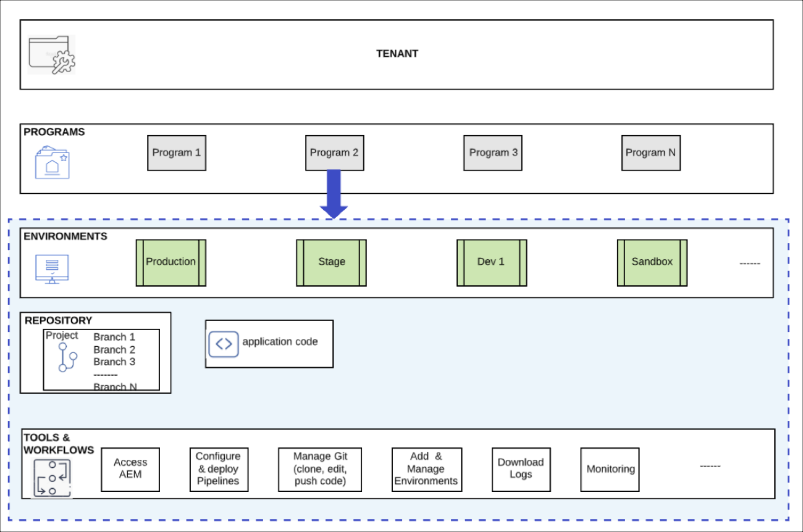

# Understanding Programs and Program Types {#understanding-programs} 

In Cloud Manager you have the Tenant entity at the very top which can have multiple Programs within it.  Each Program can contain no more than one Production environment, and multiple non-production environments. 

The following diagram shows the hierarchy of entities in Cloud Manager.

## Program Types {#program-types}

A user can create a **Sandbox** or a **Regular** program. 

A *Sandbox* is typically created to serve the purposes of training, running demo’s, enablement, POC’s, or documentation. It is not meant to carry live traffic and will have restrictions that a regular program will not. It will include Sites and Assets and will be delivered auto-populated with a Git branch that includes sample code, a Dev environment, and a non-production pipeline.

A *Regular program* is created to enable live traffic at the appropriate time in the future.