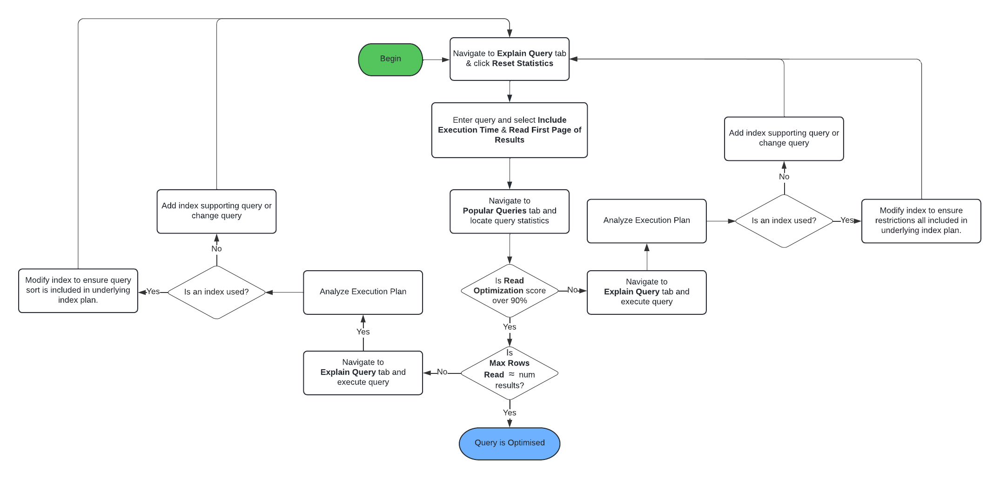
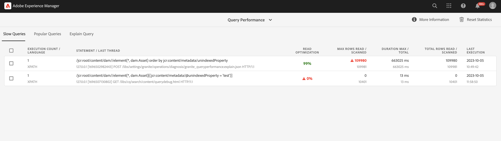
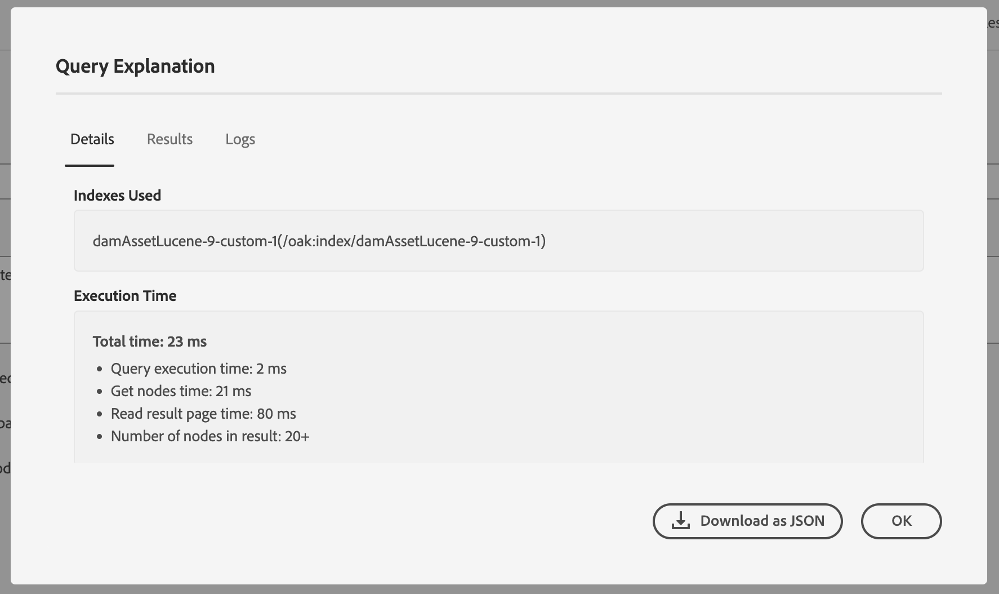

# Query and Indexing Best Practices {#query-and-indexing-best-practices}

In AEM as a Cloud Service, all operational aspects regarding indexing are automated. This allows developers to focus on creating efficient queries and their corresponding index definitions.

## When to Use Queries {#when-to-use-queries}

Queries are a way to access content, but are not the only possibility. In many situations, content in the repository can be accessed more effectively by other means. You should consider if queries are the best and most efficient way to access content for your use case.

### Repository and Taxonomy Design {#repository-and-taxonomy-design}

When designing the taxonomy of a repository, several factors need to be taken into account. These include access controls, localization, component and page property inheritance, and more.

While designing a taxonomy that addresses these concerns, it is also important to consider the "traversability" of the indexing design. In this context, the traversability is the ability of a taxonomy to allow content to be predictably accessed based on its path. This makes for a more efficient system that is easier to maintain than one that requires multiple queries to be executed.

Also, when designing a taxonomy, it is important to consider whether ordering is important. In cases where explicit ordering is not required and a large number of sibling nodes are expected, it is preferred to use an unordered node type such as `sling:Folder` or `oak:Unstructured`. In cases where ordering is required, `nt:unstructured` and `sling:OrderedFolder` would be more appropriate.

### Queries in Components {#queries-in-components}

Since queries can be one of the more taxing operations done on an AEM system, it is a good idea to avoid them in your components. Having several queries execute each time a page is rendered can often degrade the performance of the system. There are two strategies that can be used to avoid executing queries when rendering components: **[traversing nodes](#traversing-nodes)** and **[prefetching results](#prefetching-results)**.

### Traversing Nodes {#traversing-nodes}

If the repository is designed in a way that allows prior knowledge of the location of the required data, code that retrieves this data from the necessary paths can be deployed without having to run queries to find it.

An example of this would be rendering content that fits within a certain category. One approach would be to organize the content with a category property that can be queried to populate a component that shows items in a category.

A better approach would be to structure this content in a taxonomy by category so that it can be manually retrieved.

For example, if the content is stored in a taxonomy similar to:

```xml
/content/myUnstructuredContent/parentCategory/childCategory/contentPiece
```

the `/content/myUnstructuredContent/parentCategory/childCategory` node can simply be retrieved, its children can be parsed and used to render the component.

Also, when you are dealing with a small or homogenous result set, it can be faster to traverse the repository and gather the required nodes, rather than crafting a query to return the same result set. As a general consideration, queries should be avoided where it is possible to do so.

### Prefetching Results {#prefetching-results}

Sometimes the content or the requirements around the component does not allow the use of node traversal as a method of retrieving the required data. In such cases, the required queries need to be executed before the component is rendered so that optimal performance is ensured.

If the results that are required for the component can be calculated at the time that it is authored and there is no expectancy that the content will change, the query can be executed after a change has been done.

If the data or content will change regularly, the query can be executed on a schedule or via a listener for updates to the underlying data. Then, the results can be written to a shared location in the repository. Any components that need this data can then pull the values from this single node without needing to execute a query at runtime.

A similar strategy can be used to keep the result in an in-memory cache, which is populated on startup and updated whenever changes are done (using a JCR `ObservationListener` or a Sling `ResourceChangeListener`).

## Optimizing Queries {#optimizing-queries}

The Oak documentation provides a [high-level overview how queries are executed](https://jackrabbit.apache.org/oak/docs/query/query-engine.html#query-processing). This forms the basis of all optimization activities described in this document.

AEM as a Cloud Service provides the [Query Performance Tool](#query-performance-tool), which is designed to support implementing efficient queries.

* It displays already executed queries with their relevant performance characteristics and the query plan.
* It allows performing ad-hoc queries in various levels, starting from just displaying the query plan up to executing the full query.

The Query Performance Tool is reachable via the [Developer Console in Cloud Manager](https://experienceleague.adobe.com/docs/experience-manager-learn/cloud-service/debugging/debugging-aem-as-a-cloud-service/developer-console.html#queries). AEM as a Cloud Service's Query Performance Tool delivers more information about the details of the query execution over the AEM 6.x version.

This chart illustrates the general flow to use the Query Performance Tool to optimize queries.



### Use an Index {#use-an-index}

Every query should use an index to deliver optimal performance. In the majority of cases, existing out-of-the-box indexes should be sufficient to handle queries.

Sometimes custom properties need to be added to an existing index, so additional constraints can be queried using the index. See the document [Content Search and Indexing](/help/operations/indexing.md#changing-an-index) for more details. The [JCR Query Cheatsheet](#jcr-query-cheatsheet) section of this document describes how a property definition on an index has to look to support a specific query type.

### Use the Right Criteria {#use-the-right-criteria}

The primary constraint on any query should be a property match, as this is the most efficient type. Adding more property constraints limits the result further.

The query engine considers just a single index. That means that an existing index can and should be customized by adding more custom index properties to it.

The [JCR Query cheatsheet](#jcr-query-cheatsheet) section of this document lists the available constraints and also outlines how an index definition must look so it picked up. Use the [Query Performance Tool](#query-performance-tool) to test the query and to make sure that the right index is used and that the query engine does not need to evaluate constraints outside of the index. 

### Ordering {#ordering}

If a specific order of the result is requested, there are two ways for the query engine to achieve this:

1. The index can deliver the result completely and in the right order.
   * This works if the properties which are used for ordering are annotated with `ordered=true` in the index definition.
1. The query engine performs the ordering process.
   * This can occur when the query engine performs filtering outside of the index or the ordering property is not annotated with the `ordered=true` property.
   * This requires that the complete result set is read into memory for sorting, which is much slower than the first option.

### Restrict the Result Size {#restrict-result-size}

The retrieved size of the query result is an important factor in query performance. As the result is fetched in a lazy manner, there is a difference in just fetching the first 20 results compared to fetching 10,000 results, both in runtime and memory usage.

This also means that the size of the result set can only be determined correctly if all results are fetched. For this reason, the fetched result set should always be limited, either by augmenting the query (see the [JCR Query cheatsheet](#jcr-query-cheatsheet) section of this document for details) or by limiting the reads of the results.

Such a limit also prevents the query engine of hitting the **traversal limit** of 100,000 nodes, which leads to a forced stop of the query.

See the section [Queries with large result sets](#queries-with-large-result-sets) of this document if a potentially large result set must be processed completely.

## Query Performance Tool {#query-performance-tool}

The Query Performance Tool (located at `/libs/granite/operations/content/diagnosistools/queryPerformance.html` and available via the [Developer Console in Cloud Manager](https://experienceleague.adobe.com/docs/experience-manager-learn/cloud-service/debugging/debugging-aem-as-a-cloud-service/developer-console.html#queries)) provides -
* A list of any 'Slow Queries'; currently defined as those reading / scanning more than 5000 rows.
* A list of 'Popular Queries'
* The 'Explain Query' tool for understanding how a particular query will be executed by Oak.



The 'Slow Queries' and 'Popular Queries' tables include -
* The query statement itself.
* Details of the last Thread which executed the query, allowing the page or application feature executing the query to be identified.
* A 'Read Optimization' score for the query.
  * This is calculated as the ratio between the number of rows / nodes scanned to run the query and the number of matching results read.
  * A query for which every restriction (and any ordering) can be handled at the index will typically score 90% or above.
* Details of the maximum number of rows -
  * Read - indicating that a row was included as part of a result set.
  * Scanned - indicating that a row was included in the results from the underlying index query (in the case of an indexed query) or read from the nodestore (in the case of a repository traversal). 

These tables help identifying queries which are not fully indexed (see [Use an Index](#use-an-index) or are reading too many nodes (see also [Repository Traversal](#repository-traversal) and [Index Traversal](#index-traversal)). Such queries will be highlighted - with the appropriate areas of concern marked in red.

The `Reset Statistics` option is provided to remove all existing statistics collected in the tables. This allows the execution of a particular query (either via the application itself or the Explain Query tool) and the analysis of the execution statistics. 

### Explain Query

The Explain Query Tool allows developers to understand the Query Execution Plan (see [Reading the Query Execution Plan](#reading-query-execution-plan)), including details of any indexes used when executing the query. This can be used to understand how effectively a query is indexed to predict, or retrospectively analyse its performance.

#### Explaining a query

To explain a query, do the following:

* Select the appropriate query language using the `Language` drop-down list.
* Enter the query statement into the `Query` field.
* If necessary, select how the query will be executed using the provided checkboxes.
    * By default, JCR queries do not need to be run to identify the Query Execution Plan (this is not the case for QueryBuilder queries).
    * Three options are provided for executing the query -
      * `Include Execution Time` - execute the query but do not attempt to read any results.
      * `Read first page of results` - execute the query and read the first 'page' of 20 results (replicating the best practices for executing queries).
      * `Include Node Count` - execute the query and read the entire result set (generally this is not advised - see [Index Traversal](#index-traversal)).

#### Query Explanation pop-up {#query-explanation-popup}



After selecting `Explain`, the user is presented with a pop-up describing the result of the query explain (and execution, if selected). 
This pop-up includes details of -
* The Indexes Used when executing the query (or no index if the query would be executed using [Repository Traversal](#repository-traversal)).
* The execution time (if `Include Execution Time` checkbox was checked) and count of results read (if `Read first page of results` or `Include Node Count` checkboxes were checked).
* The execution plan, allowing detailed analysis of how the query is executed - see [Reading the Query Execution Plan](#reading-query-execution-plan) for how to interpret this.
* The paths of the first 20 query results (if `Read first page of results` checkbox was checked)
* The full logs of the query planning, showing the relative costs of the indexes which were considered for the execution of this query (the index with the lowest cost will be the one chosen).
  
#### Reading the Query Execution Plan {#reading-query-execution-plan}

The Query Execution Plan contains everything required to predict (or explain) the performance of a particular query. Understand how efficiently the query will be executed by comparing the restrictions and ordering in the original JCR (or Query Builder) query to the query executed in the underlying index (Lucene, Elastic or Property).

Consider the following query -

```
/jcr:root/content/dam//element(*, dam:Asset) [jcr:content/metadata/dc:title = "My Title"] order by jcr:created
```

...which contains -
* 3 restrictions
  * Nodetype (`dam:Asset`)
  * Path (descendants of `/content/dam`)
  * Property (`jcr:content/metadata/dc:title = "My Title"`) 
* Ordering by the `jcr:created` property

Explaining this query results in the following plan -

```
[dam:Asset] as [a] /* lucene:damAssetLucene-9(/oak:index/damAssetLucene-9) +:ancestors:/content/dam +jcr:content/metadata/dc:title:My Title ordering:[{ propertyName : jcr:created, propertyType : UNDEFINED, order : ASCENDING }] where ([a].[jcr:content/metadata/dc:title] = 'My Title') and (isdescendantnode([a], [/content/dam])) */
```

Within this plan, the section describing the query executed in the underlying index is -

```
lucene:damAssetLucene-9(/oak:index/damAssetLucene-9) +:ancestors:/content/dam +jcr:content/metadata/dc:title:My Title ordering:[{ propertyName : jcr:created, propertyType : UNDEFINED, order : ASCENDING }]
```

This section of the plan states that - 
* An index is used to execute this query -
  * In this case the Lucene index `/oak:index/damAssetLucene-9` will be used, so the remaining information is in Lucene Query Syntax.
* All 3 restrictions are handled by the index -
    * The nodetype restriction
      * implicit, because `damAssetLucene-9` only indexes nodes of type dam:Asset.
    * The path restriction
      * because `+:ancestors:/content/dam` appears in the Lucene query.
    * The property restriction
      * because `+jcr:content/metadata/dc:title:My Title` appears in the Lucene query.
* The ordering is handled by the index
  * because `ordering:[{ propertyName : jcr:created, propertyType : UNDEFINED, order : ASCENDING }]`  appears in the Lucene query.

Such a query is likely to perform well, since the results returned from the index query will not be further filtered in the query engine (aside from Access Control filtering). However, it is still possible for such a query to execute slowly if best practices are not followed - see [Index Traversal](#index-traversal) below. 

Considering a different query -

```
/jcr:root/content/dam//element(*, dam:Asset) [jcr:content/metadata/myProperty = "My Property Value"] order by jcr:created
```

...which contains -
* 3 restrictions
  * Nodetype (`dam:Asset`)
  * Path (descendants of `/content/dam`)
  * Property (`jcr:content/metadata/myProperty = "My Property Value"`) 
* Ordering by the `jcr:created` property**

Explaining this query results in the following plan -

```
[dam:Asset] as [a] /* lucene:damAssetLucene-9-custom-1(/oak:index/damAssetLucene-9-custom-1) :ancestors:/content/dam ordering:[{ propertyName : jcr:created, propertyType : UNDEFINED, order : ASCENDING }] where ([a].[jcr:content/metadata/myProperty] = 'My Property Value') and (isdescendantnode([a], [/content/dam])) */
```

Within this plan, the section describing the query executed in the underlying index is -

```
lucene:damAssetLucene-9(/oak:index/damAssetLucene-9) :ancestors:/content/dam ordering:[{ propertyName : jcr:created, propertyType : UNDEFINED, order : ASCENDING }]
```

This section of the plan states that - 
* Only 2 (of the 3) restrictions are handled by the index -
    * The nodetype restriction
      * implicit, because `damAssetLucene-9` only indexes nodes of type dam:Asset.
    * The path restriction
      * because `+:ancestors:/content/dam` appears in the Lucene query.
* The property restriction `jcr:content/metadata/myProperty = "My Property Value"` is not executed at the index, but rather will be applied as Query Engine filtering on the results of the underlying Lucene query.
  * This is because `+jcr:content/metadata/myProperty:My Property Value` does not appears in the Lucene query, since this property is not indexed in the `damAssetLucene-9` index used for this query.

This query execution plan will result in every asset beneath `/content/dam` being read from the index, and then filtered further by the query engine (which will only include those matching the non-indexed property restriction in the result set). 

Even if only a small percentage of assets match the restriction `jcr:content/metadata/myProperty = "My Property Value"`, the query must read a large number of nodes to (attempt to) fill the requested 'page' of results. This can result in a poorly performing query, which will be shown as having a low `Read Optimization` score in the Query Performance tool) and can lead to WARN messages indicating that large numbers of nodes are being traversed (see [Index Traversal](#index-traversal)).

To optimize the performance of this second query, create a custom version of the `damAssetLucene-9` index (`damAssetLucene-9-custom-1`) and add the following property definition - 

```
"myProperty": {
  "jcr:primaryType": "nt:unstructured",
  "propertyIndex": true,
  "name": "jcr:content/metadata/myProperty"
}
```

## JCR Query Cheat Sheet {#jcr-query-cheatsheet}

To support the creation of efficient JCR queries and index definitions, the [JCR Query Cheat Sheet](https://experienceleague.adobe.com/docs/experience-manager-65/deploying/practices/best-practices-for-queries-and-indexing.html#jcrquerycheatsheet) is available for download and use as a reference during development.

It contains sample queries for QueryBuilder, XPath, and SQL-2, covering multiple scenarios which behave differently in terms of query performance. It also provides recommendations for how to build or customize Oak indexes. The content of this Cheat Sheet applies to AEM as a Cloud Service and AEM 6.5.

## Index Definition Best Practices {#index-definition-best-practices}

Below are some best practices to consider when defining or extending indexes. 

* For nodetypes which have existing indexes (such as `dam:Asset` or `cq:Page`) prefer extension of OOTB indexes to the addition of new indexes.
  * Adding new indexes - particularly fulltext indexes - on the `dam:Asset` nodetype is strongly discouraged (see [this note](/help/operations/indexing.md##index-names-index-names)).
* When adding new indexes
  * Always define indexes of type 'lucene'. 
  * Use an index tag in the index definition (and associated query) and `selectionPolicy = tag` to ensure that the index is only used for the intended queries.
  * Ensure `queryPaths` and `includedPaths` are both provided (typically with the same values).
  * Use `excludedPaths` to exclude paths which will not contain useful results.
  * Use `analyzed` properties only when required, for example, when you need to use a fulltext query restriction against only that property.
  * Always specify `async = [ async, nrt ] `, `compatVersion = 2` and `evaluatePathRestrictions = true`. 
  * Only specify `nodeScopeIndex = true` if you require a nodescope fulltext index.

>[!NOTE]
>
>For more information, see [Oak Lucene Index documentation](https://jackrabbit.apache.org/oak/docs/query/lucene.html).

Automated Cloud Manager pipeline checks will enforce some of the best-practices described above.

## Queries with Large Result Sets {#queries-with-large-result-sets}

Although it is recommended to avoid queries with large result sets, there are valid cases where large result sets must be processed. Often the size of result is not known up front, thus some precautions should be taken to make the processing reliable.

* The query should not be executed within a request. Instead the query should be executed as part of a Sling Job or an AEM workflow. These do not have any limitations in their total runtime, and are restarted in case the instance goes down during the processing of the query and its results.
* To overcome the query limit of 100,000 nodes, you should consider using [Keyset Pagination](https://jackrabbit.apache.org/oak/docs/query/query-engine.html#Keyset_Pagination) and split the query in multiple subqueries.

## Repository Traversal {#repository-traversal}

Queries traversing the repository do not use an index and are logging with a message similar to the following.

```text
28.06.2022 13:32:52.804 *WARN* [127.0.0.1 [1656415972414] POST /libs/settings/granite/operations/diagnosis/granite_queryperformance.explain.json HTTP/1.1] org.apache.jackrabbit.oak.plugins.index.Cursors$TraversingCursor Traversed 98000 nodes with filter Filter(query=select [jcr:path], [jcr:score], * from [nt:base] as a /* xpath: //* */, path=*) called by com.adobe.granite.queries.impl.explain.query.ExplainQueryServlet.getHeuristics; consider creating an index or changing the query
```

With this log snippet you can determine:

* The query itself: `//*`
* The Java code which executed this query: `com.adobe.granite.queries.impl.explain.query.ExplainQueryServlet::getHeuristics` to help identify the creator of the query.

With this information, it is possible to optimize this query using the methods described in the [Optimizing Queries](#optimizing-queries) section of this document.

### Index Traversal {#index-traversal}

Queries which use an index, but yet still read large numbers of nodes are logged with a message similar to the following (note the term `Index-Traversed` rather than `Traversed`).

```text
05.10.2023 10:56:10.498 *WARN* [127.0.0.1 [1696502982443] POST /libs/settings/granite/operations/diagnosis/granite_queryperformance.explain.json HTTP/1.1] org.apache.jackrabbit.oak.plugins.index.search.spi.query.FulltextIndex$FulltextPathCursor Index-Traversed 60000 nodes with filter Filter(query=select [jcr:path], [jcr:score], * from [dam:Asset] as a where isdescendantnode(a, '/content/dam') order by [jcr:content/metadata/unindexedProperty] /* xpath: /jcr:root/content/dam//element(*, dam:Asset) order by jcr:content/metadata/unindexedProperty */, path=/content/dam//*)
```

This can occur for several reasons -

1. Not all the restrictions in the query can be handled at the index. 
   * In this case, a superset of the final result set is being read from the index and subsequently filtered in the query engine.
   * This is many times slower than applying restrictions in the underlying index query.
1. The query is sorted by a property which is not marked as 'ordered' in the index.
   * In this case, all results returned by the index must be read by the query Engine and sorted in-memory.
   * This is many times slower than applying sorting in the underlying index query. 
1. The executor of the query is attempting to iterate a large result set.
   * This situation might happen for several reasons, as listed below:
   
| Cause    | Mitigation   | 
|----------|--------------|
| The ommission of `p.guessTotal` (or the use of a very large guessTotal) causing QueryBuilder to iterate large numbers of results counting results |Provide `p.guessTotal` with an appropriate value |
| The use of a large or unbounded limit in Query Builder (ie `p.limit=-1`) |Use an appropriate value for `p.limit` (ideally 1000 or below) |
| The use of a filtering predicate in Query Builder which is filtering large numbers of results from the underlying JCR query | Replace filtering predicates with restrictions which can be applied in the underlying JCR query |
| The use of a Comparator-based sorting in QueryBuilder |Replace with property-based ordering in the underlying JCR query (using properties indexed as ordered) |
| Filtering of large numbers of results due to Access Control |Apply additional indexed property or path restriction to the query to mirror the Access Control |
| The use of 'offset pagination' with a large offset |Consider using [Keyset Pagination](https://jackrabbit.apache.org/oak/docs/query/query-engine.html#Keyset_Pagination)|
| Iteration of large or unbounded numbers of results |Consider using [Keyset Pagination](https://jackrabbit.apache.org/oak/docs/query/query-engine.html#Keyset_Pagination)|
| Incorrect index chosen |Use Tags in query and index definition to ensure the expected index is used| 
