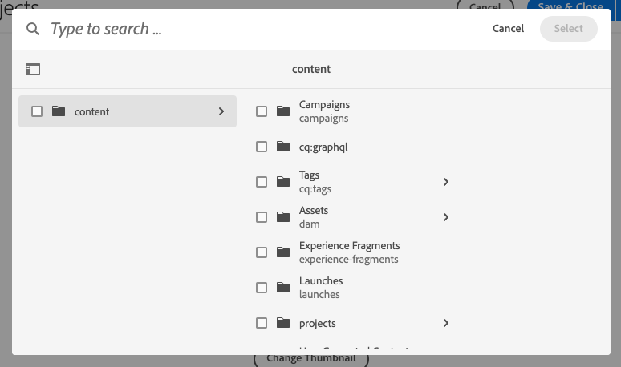
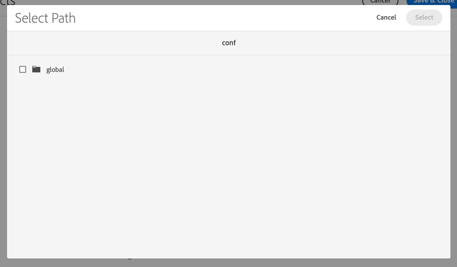

# Generic Lucene Index Removal {#generic-lucene-index-removal}

Adobe intends to remove the "generic Lucene" index (`/oak:index/lucene-*`) from Adobe Experience Manager as a Cloud Service. This index has been deprecated since AEM 6.5. In this document the impact of this decision is described, along with detailed descriptions how to examine if an AEM instance is affected. It also contains ways to change queries so they continue to function without the generic Lucene index.

## Background {#background}

In AEM, full text queries are those using the following functions:

* `jcr:contains()` in JCR XPATH
* `CONTAINS` in JCR-SQL2

Such queries cannot return results without using an index. Unlike a query containing only path or property restrictions, a query containing a full text restriction for which no index can be found (and thus a traversal is performed) will always return zero results.

The generic Lucene index (`/oak:index/lucene-*`) has existed since AEM 6.0 / Oak 1.0 in order to provide a full text search across most of the repository hierarchy, although some paths, such as `/jcr:system` and `/var` have always been excluded from this. However this index has largely been superseded by indexes on more specific node types (for example `damAssetLucene-*` for the `dam:Asset` node type), which support both full text and property searches.

In AEM 6.5 the generic Lucene index was marked as deprecated, indicating that it would be removed in future versions. Since then, a WARN has been logged when the index has been used as illustrated by the following log snippet:

```text
org.apache.jackrabbit.oak.plugins.index.lucene.LucenePropertyIndex This index is deprecated: /oak:index/lucene-2; it is used for query Filter(query=select [jcr:path], [jcr:score], * from [nt:base] as a where contains(*, 'search term') and isdescendantnode(a, '/content/mysite') /* xpath: /jcr:root/content/mysite//*[jcr:contains(.,"search term")] */ fullText="search" "term", path=/content/mysite//*). Please change the query or the index definitions.
```

In recent AEM versions, the generic Lucene index has been used to support a very small number of features. These are being reworked to use other indexes or otherwise modified to remove the dependency on this index.

For example, reference lookup queries, such as in the following example, should now use the index at `/oak:index/pathreference`, which indexes only `String` property values which match a regular expression that looks for JCR paths. 

```text
//*[jcr:contains(., '"/content/dam/mysite"')]
```

In order to support larger customer data volumes, Adobe will no longer create the generic Lucene index on new AEM as a Cloud Service environments. Additionally, Adobe will begin removing the index from existing repositories. [See the timeline](#timeline) at the end of this document for more details.

Adobe has already adjusted the index costings via the `costPerEntry` and `costPerExecution` properties to ensure that other indexes such as `/oak:index/pathreference` are used in preference wherever possible. 

Customer applications which use queries which still depend on this index should be updated immediately to leverage other existing indexes, which can be customized if required. Alternatively new custom indexes can be added to the customer application. Full instructions for index management in AEM as a Cloud Service can be found in the [indexing documentation.](/help/operations/indexing.md)

## Are You Affected? {#are-you-affected}

The generic Lucene index is currently used as a fallback if no other full text index can service a query. When this deprecated index is used, a message like this will be logged at WARN level:

```text
org.apache.jackrabbit.oak.plugins.index.lucene.LucenePropertyIndex This index is deprecated: /oak:index/lucene-2; it is used for query Filter(query=select [jcr:path], [jcr:score], * from [nt:base] as a where contains(*, 'test') /* xpath: //*[jcr:contains(.,"test")] */ fullText="test", path=*). Please change the query or the index definitions.
```

In some circumstances, Oak might attempt to use another full text index (such as `/oak:index/pathreference`) to support the full text query, but if the query string does not match the regular expression on the index definition, a message will be logged at WARN level and the query will likely not return results.

```text
org.apache.jackrabbit.oak.query.QueryImpl Potentially improper use of index /oak:index/pathReference with queryFilterRegex (["']|^)/ to search for value "test"
```

Once the generic Lucene index has been removed, a message as shown below will be logged at WARN level if a full text query is not able to locate any suitable index definition:

```text
org.apache.jackrabbit.oak.query.QueryImpl Fulltext query without index for filter Filter(query=select [jcr:path], [jcr:score], * from [nt:base] as a where contains(*, 'test') /* xpath: //*[jcr:contains(.,"test")] */ fullText="test", path=*); no results will be returned
```

>[!IMPORTANT]
>
>**Customer Action Required**
>
> If any of the aforementioned warning messages are logged, you may need to rework the query to use a different full text index, or provide a new index to support the query. 
>
>Details of the types of dependencies you might see and how to address them are provided in the following sections.

## Potential Dependencies on Generic Lucene Indexes {#potential-dependencies}

There are a number of areas where your applications and AEM installations may be dependent on generic Lucene indexes both on author and publish instances.

### Publish Instance {#publish-instance}

#### Custom Application Queries {#custom-application-queries}

The most common source of queries using the generic Lucene index on a publish instance will be custom application queries.

In the simplest cases these might be queries with no node type specified thus implying `nt:base` or `nt:base` specified explicitly, such as:

```text
/jcr:root/content/mysite//*[jcr:contains(., 'search term')]
/jcr:root/content/mysite//element(*, nt:base)[jcr:contains(., 'search term')]
```

>[!IMPORTANT]
>
>**Customer Action Required**
>
>The aforementioned queries should be modified to use an appropriate node type as detailed in the following section.

For example, the queries can be modified to return results matching pages or any of the aggregates beneath the `cq:Page node`. The query could thus become:

```text
/jcr:root/content/mysite//element(*, cq:Page)[jcr:contains(., 'search term')]
```

In other cases, a query might specify a node type but contain a full text restriction that cannot be handled by another full text index, such as:

```text
/jcr:root/content/dam//element(*, dam:Asset)[jcr:contains(jcr:content/metadata/@cq:tags, 'NewsTopics:cateogries/domestic'))]
```

In this case the query has the `dam:Asset` node type, but contains a full text restriction on the relative `jcr:content/metadata/@cq:tags` property.

This property is not marked as analyzed in the `damAssetLucene` index, which is the full text index most commonly used for queries against the `dam:Asset` node type. Therefore this index cannot be used for this query.

As such, the query falls back on the generic full text index where all the included properties are marked as analysed by the wildcard match at `/oak:index/lucene-2/indexRules/nt:base/properties/prop`.

>[!IMPORTANT]
>
>**Customer Action Required**
>
>Marking the `jcr:content/metadata/@cq:tags` property as analyzed in a custom version of the `damAssetLucene` index will result in this query being handled by this index, and no WARN will be logged.

### Author Instance {#author-instance}

In addition to queries in customer application servlets, OSGi components, and rendering scripts there can be a number of author-specific usages of the generic Lucene index. 

#### Reference Search {#reference-search}

Historically the generic Lucene index has been used to support reference search or searching for content which contains references to another content path. Such queries should already have updated to use the new `/oak:index/pathreference` index.

#### Path Field Picker Search {#picker-search}

AEM includes a custom dialog component with the Sling resource type `granite/ui/components/coral/foundation/form/pathfield`, which provides a browser/picker for selecting another AEM path. The default path field picker, which is used when no custom `pickerSrc` property is defined in the content structure, renders a search bar in the popup dialog box.

The node types against which to search can be specified using the `nodeTypes` property.

At present, if no `nodeTypes` property is present, the underlying search query will use the `nt:base` node type, and thus is likely to use the generic Lucene index, typically logging WARN messages similar to the following.

```text
20.01.2022 18:56:06.412 *WARN* [127.0.0.1 [1642704966377] POST /mnt/overlay/granite/ui/content/coral/foundation/form/pathfield/picker.result.single.html HTTP/1.1] org.apache.jackrabbit.oak.plugins.index.lucene.LucenePropertyIndex This index is deprecated: /oak:index/lucene-2; it is used for query Filter(query=select [jcr:path], [jcr:score], * from [nt:base] as a where contains(*, 'test') and isdescendantnode(a, '/content') /* xpath: /jcr:root/content//element(*, nt:base)[(jcr:contains(., 'test'))] order by @jcr:score descending */ fullText="test", path=/content//*). Please change the query or the index definitions.
```

Prior to removal of the generic Lucene index, the `pathfield` component will be updated so that the search box is hidden for components using the default picker, which do not provide a `nodeTypes` property.

|Path Field Picker with Search|Path Field Picker without Search|
|---|---|
|||

>[!IMPORTANT]
>
>**Customer Action Required**
>
>If the customer would like to retain the search functionality within the path field picker, a `nodeTypes` property should be provided listing the node types against which they would like to query. These can be specified as a comma-separated list of node types in a `String` property. If no search is required, no action is required from the customer.

>[!NOTE]
>
>The Content Fragment Model Editor uses a specialized path fields with the Sling resource type `dam/cfm/models/editor/components/contentreference`.
> * At present these perform queries without node types specified, resulting in a WARN being logged due to usage of the generic Lucene index.
> * Instances of these components will soon automatically default to using `cq:Page` and `dam:Asset` node types without further customer action.
> * The `nodeTypes` property can be added to override these default node types.

## Timeline for Generic Lucene Removal {#timeline}

Adobe will take a two-phase approach to remove the generic Lucene index.

* **Phase 1** (planned start 31 January 2022): No longer create `/oak:index/lucene-*` on new AEM as a Cloud Service environments.
* **Phase 2** (planned start 31 March 2022): Remove `/oak:index/lucene-*` index from existing AEM as a Cloud Service environments.

Adobe will monitor the log messages noted above and will attempt to contact customers who remain dependant on the generic Lucene index.

As a short term mitigation, Adobe will add custom index definitions directly to customer systems to prevent functional or performance issues as a result of the removal of the generic Lucene index as necessary.

In such cases, the customer will be provided with the updated index definition and advised to include this in future releases of their application via Cloud Manager.
