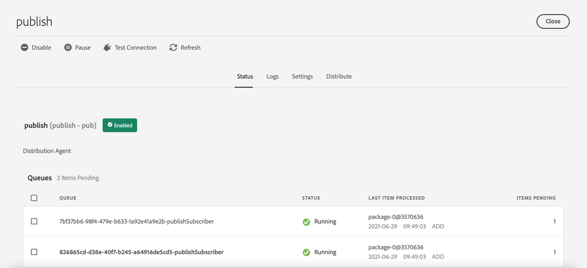
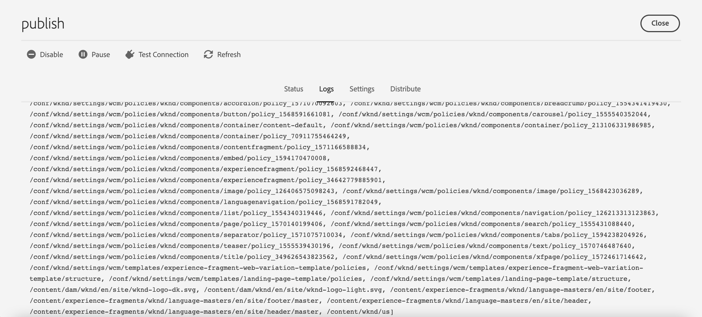

# Replication {#replication}

Adobe Experience Manager as a Cloud Service  uses the [Sling Content Distribution](https://sling.apache.org/documentation/bundles/content-distribution.html) capability to move the content to replicate to a pipeline service run on Adobe I/O that is outside of the AEM runtime.

>[!NOTE]
>
>Read [Distribution](/help/overview/architecture.md#content-distribution) for more information.

## Methods of Publishing Content {#methods-of-publishing-content}

### Quick Un/Publish - Planned Un/Publish {#publish-unpublish}

This allows you to publish the selected page(s) immediately, without the additional options possible through the Manage Publication approach.

For more information, see [Manage Publication](/help/sites-cloud/authoring/fundamentals/publishing-pages.md#manage-publication).

### On and Off Times - Trigger Configuration {#on-and-off-times-trigger-configuration}

The additional possibilities of **On Time** and **Off Time** are available from the [Basic tab of Page Properties](/help/sites-cloud/authoring/fundamentals/page-properties.md#basic).

To realize the automatic replication for this you need to enable **Auto Replicate** in the [OSGi configuration](/help/implementing/deploying/configuring-osgi.md) **On Off Trigger Configuration**: 

   

### Manage Publication {#manage-publication}

Manage Publication offers more options than Quick Publish, allowing for the inclusion of child pages, customization of the references, and starting any applicable workflows as well as offering the option to publish at a later date.

Including a folder's children for the "publish later" option will invoke the Publish Content Tree workflow, described in this article.

You can find more detailed information on Manage Publication on the [Publishing Fundamentals documentation](/help/sites-cloud/authoring/fundamentals/publishing-pages.md#manage-publication).

### Publish Content Tree Workflow {#publish-content-tree-workflow}

You can trigger a tree replication by choosing **Tools - Workflow - Models** and copying the **Publish Content Tree** out-of-the-box workflow model, as shown below:


Do not modify or invoke the original model. Instead, make sure to first copy the model and then modify or invoke that copy.

Like all workflows, it can also be invoked via API. For more information, see [Interacting with Workflows Programatically](https://experienceleague.adobe.com/docs/experience-manager-65/developing/extending-aem/extending-workflows/workflows-program-interaction.html?lang=en#extending-aem).

Alternatively, you can also achieve this by creating a Workflow Model that uses the `Publish Content Tree` process step:

1. From the AEM as a Cloud Service homepage, go to **Tools - Workflow - Models**
1. In the Workflow Models page, press **Create** in the upper right corner of the screen
1. Add a title and a name to your model. For more information, see [Creating Workflow Models](https://experienceleague.adobe.com/docs/experience-manager-65/developing/extending-aem/extending-workflows/workflows-models.html)
1. Select the newly created model from the list, and press **Edit**
1. In the following window, drag and drop the Process Step to the current model flow:
   
   

1. Click the Process step in the flow and select **Configure** by pressing the wrench icon
1. Click on the **Process** tab and select `Publish Content Tree` from the drop down list
   
   

1. Set any additional parameters in the **Arguments** field. Multiple comma separated arguments can be stringed together. For example:
   
   `enableVersion=true,agentId=publish,includeChildren=true`  

   
   >[!NOTE]
   >
   >For the list of parameters, see the **Parameters** section below.

1. Press **Done** to save the Workflow model.

**Parameters**

* `includeChildren` (boolean value, default: `false`). false means only the path is published. true means children are published too.
* `replicateAsParticipant` (boolean value, default: `false`). If configured as `true`, the replication is using the `userid` of the principal which performed the participant step.
* `enableVersion` (boolean value, default: `true`). This parameter determines if a new version is created upon replication.
* `agentId` (string value, default means only agents for publish are used). It is recommended to be explicit about the agentId; for example, setting it the value: publish. Setting the agent to `preview` will publish to the preview service
* `filters` (string value, default means all paths are activated). Available values are: 
  * `onlyActivated` - only paths which are not marked as activated will be activated.
  * `onlyModified` - activate only paths which are already activated and have a modification date later than the activation date.
  * The above can be ORed with a pipe "|". For example, `onlyActivated|onlyModified`.  

**Logging**

When the tree activation workflow step starts, it will log its configuration parameters on the INFO loglevel. When paths are activated, an INFO statement is also logged.

A final INFO statement will then be logged after the workflow step has replicated all paths.

Additionally you can increase the loglevel of the loggers below `com.day.cq.wcm.workflow.process.impl` to DEBUG/TRACE to get even more log information.

In case of errors, the workflow step terminates with a `WorkflowException`, which wraps the underlying Exception.

Below you will find examples of logs that are generated during a sample publish content tree workflow:

```
21.04.2021 19:14:55.566 [cm-p123-e456-aem-author-797aaaf-wkkqt] *INFO* [JobHandler: /var/workflow/instances/server60/2021-04-20/brian-tree-replication-test-2_1:/content/wknd/us/en/adventures] com.day.cq.wcm.workflow.process.impl.treeactivation.TreeActivationWorkflowProcess TreeActivation options: replicateAsParticipant=false(userid=workflow-process-service), agentId=publish, chunkSize=100, filter=, enableVersion=false
```

```
21.04.2021 19:14:58.541 [cm-p123-e456-aem-author-797aaaf-wkkqt] *INFO* [JobHandler: /var/workflow/instances/server60/2021-04-20/brian-tree-replication-test-2_1:/content/wknd/us/en/adventures] com.day.cq.wcm.workflow.process.impl.ChunkedReplicator closing chunkedReplication-VolatileWorkItem_node1_var_workflow_instances_server60_2021-04-20_brian-tree-replication-test-2_1, 17 paths replicated in 2971 ms
```

**Resume Support**

The workflow processes content in chunks, each of which represents a subset of the full content to be published. If for any reason the workflow is stopped by the system, it will restart and process the chunk that was not yet processed. A log statement will state that content has been resumed from a specific path.

### Replication API {#replication-api}

You can publish content using the Replication API featured in AEM as a Cloud Service.

For more information, see the [API Documentation](https://javadoc.io/doc/com.adobe.aem/aem-sdk-api/latest/com/day/cq/replication/package-summary.html).

**Basic Usage of the API**

```
@Reference
Replicator replicator;
@Reference
ReplicationStatusProvider replicationStatusProvider;

....
Session session = ...
// Activate a single page to all agents, which are active by default
replicator.replicate(session,ReplicationActionType.ACTIVATE,"/content/we-retail/en");
// Activate multiple pages (but try to limit it to approx 100 at max)
replicator.replicate(session,ReplicationActionType.ACTIVATE, new String[]{"/content/we-retail/en","/content/we-retail/de"});

// ways to get the replication status
Resource enResource = resourceResolver.getResource("/content/we-retail/en");
Resource deResource = resourceResolver.getResource("/content/we-retail/de");
ReplicationStatus enStatus = enResource.adaptTo(ReplicationStatus.class);
// if you need to get the status for more more than 1 resource at once, this approach is more performant
Map<String,ReplicationStatus> allStatus = replicationStatusProvider.getBatchReplicationStatus(enResource,deResource);
```

**Replication with Specific Agents**

When replicating resources as in the example above, only the agents which are active by default will be used. In AEM as a Cloud Service, this will only be the agent called "publish", which connects the author to the publish tier.

To support the preview functionality, a new agent called "preview" has been added, which is not active by default. This agent is used to connect the author to the preview tier. If you want to replicate only via the preview agent, you need to explicitly select this preview agent via an `AgentFilter`.

See the example below on how to do this:

```
private static final String PREVIEW_AGENT = "preview";

ReplicationStatus beforeStatus = enResource.adaptTo(ReplicationStatus.class); // beforeStatus.isActivated == false

ReplicationOptions options = new ReplicationOptions();
options.setFilter(new AgentFilter() {
  @Override
  public boolean isIncluded (Agent agent) {
    return agent.getId().equals(PREVIEW_AGENT);
  }
});
// will replicate only to preview
replicator.replicate(session,ReplicationActionType.ACTIVATE,"/content/we-retail/en", options);

ReplicationStatus afterStatus = enResource.adaptTo(ReplicationStatus.class); // afterStatus.isActivated == false
ReplicationStatus previewStatus = afterStatus.getStatusForAgent(PREVIEW_AGENT); // previewStatus.isActivated == true
```

In case you do not provide such a filter and only use the "publish" agent, the "preview" agent is not used and the replication action does not affect the preview tier.

The overall `ReplicationStatus` of a resource is only modified if the replication action includes at least one agent which is active by default. In the above example this is not the case, as the replication is just using the "preview" agent. Therefore, you need to use the new `getStatusForAgent()` method, which allows querying the status for a specific agent. This method also works for the "publish" agent. It returns a non-null value if there has been any replication action done using the provided agent.


**Replication API capacity limits**

It is recommended to replicate fewer than 100 paths at a time, with 500 being the hard limit. Above the hard limit, a `ReplicationException` will be thrown. 
If your application logic does not require atomic replication, this limit can be overcome by setting the `ReplicationOptions.setUseAtomicCalls` to false, which will accept any number of paths, but internally create buckets to stay below this limit.

The size of the content transmitted per replication call must not exceed `10 MB`. This includes the nodes and properties, but not any binaries (workflow packages and content packages are considered binaries). 

## Troubleshooting {#troubleshooting}

To troubleshoot replication, navigate to the Replication Queues in the AEM Author Service Web UI:

1. From the AEM Start Menu navigate to **Tools > Deployment > Distribution**
2. Select the card **publish**

3. Check the queue status which should be green
4. You can test the connection to the replication service
5. Select the **Logs** tab which shows the history of content publications



If the content couldn't be published, the whole publication is reverted from the AEM Publish Service.
In that case, the main, editable queue will show a red status and should be reviewed in order to identify which item(s) caused the cancelation of the publication. By clicking that queue, its pending items will show up, from which a single item or all items can be cleared if needed.
