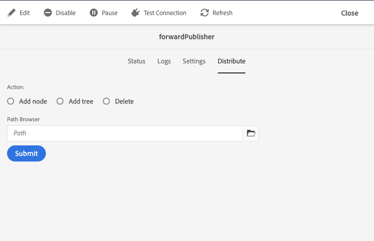
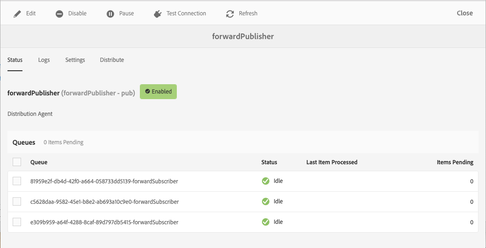
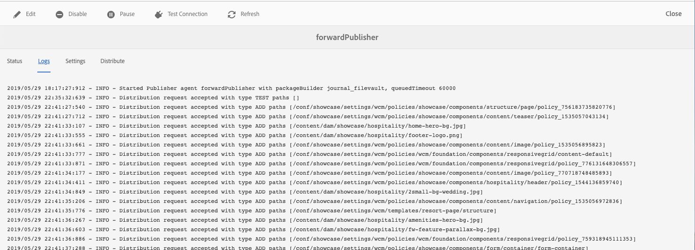

# Replication {#replication}

Adobe Experience Manager as a Cloud Service  uses the [Sling Content Distribution](https://sling.apache.org/documentation/bundles/content-distribution.html) capability to move the content to replicate to a pipeline service run on Adobe I/O that is outside of the AEM runtime. 

>[!NOTE]
>
>Read [Distribution](/help/core-concepts/architecture.md#content-distribution) for more information.

## Methods of Publishing Content {#methods-of-publishing-content}

### Quick Un/Publish - Planned Un/Publish {#publish-unpublish}

These standard AEM functionalities for the authors do not change with AEM Cloud Service.

### On and Off Times - Trigger Configuration {#on-and-off-times-trigger-configuration}

The additional possibilities of **On Time** and **Off Time** are available from the [Basic tab of Page Properties](/help/sites-cloud/authoring/fundamentals/page-properties.md#basic).

To realize the automatic replication for this you need to enable **Auto Replicate** in the [OSGi configuration](/help/implementing/deploying/configuring-osgi.md) **On Off Trigger Configuration**: 

   

### Tree Activation {#tree-activation}

To perform a tree activation:

1. From the AEM Start Menu navigate to **Tools > Deployment > Distribution**
2. Select the card **forwardPublisher**
3. Once in the forwardPublisher Web console UI, **select Distribute**

4. Select the path in the path browser, choose to add a node, tree or delete as required and select **Submit**

## Troubleshooting {#troubleshooting}

To troubleshoot replication, navigate to the Replication Queues in the AEM Author Service Web UI:

1. From the AEM Start Menu navigate to **Tools > Deployment > Distribution**
2. Select the card **forwardPublisher**

3. Check the queue status which should be green
4. You can test the connection to the replication service
5. Select the **Logs** tab which shows the history of content publications

If the content couldn't be published, the whole publication is reverted from the AEM Publish Service.
In that case, the queues should be reviewed in order to identify which items caused the cancelation of the publication. By clicking on a queue showing a red status, the queue with pending items would show up, from which single or all items can be cleared if needed.
