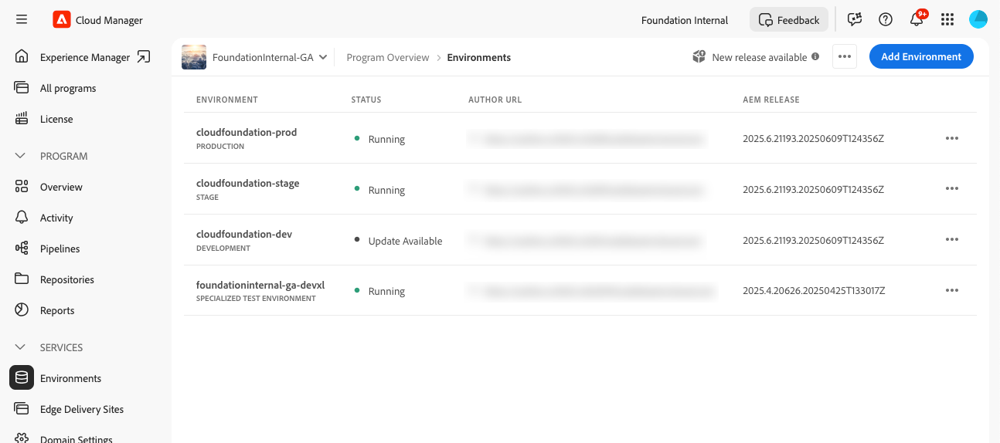
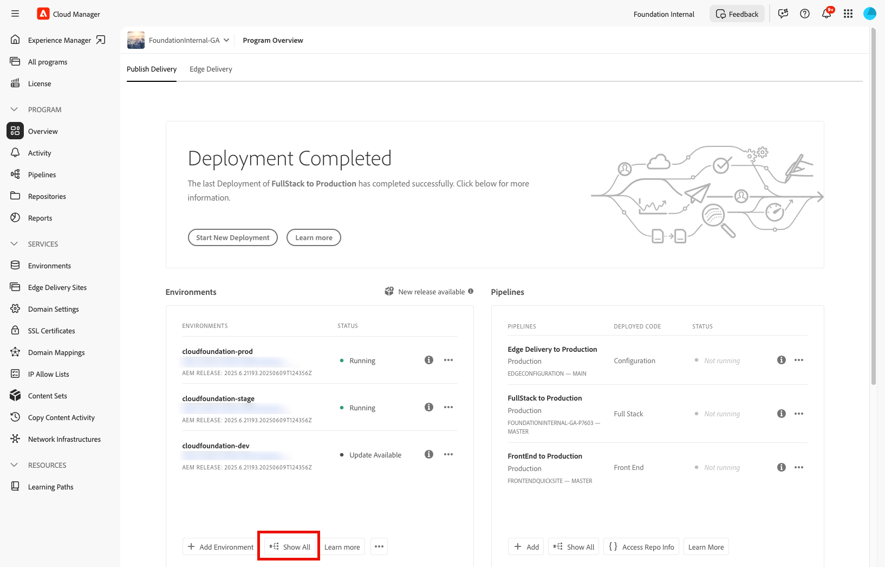

# Restore the previous source code deployed in AEM as a Cloud Service {#restore-previous-code-deployed}

>[!NOTE]
>
>>The feature described in this article is only available through the early adopter alpha program. To sign up for the alpha, see [One-click rollback for pipeline deployments](/help/implementing/cloud-manager/release-notes/current.md##one-click-rollback).

Use **Restore previous code deployed** to roll an environment back instantly to its last successful build—no pipeline run required.

You simply open the selected environment's  menu and choose **Restore** > **Previous code deployed** to roll back the most recently deployed source code in seconds.

>[!TIP]
>
>You can view the active source-code version in use in the environment's details view, under the **General** tab. See [View details of an environment](/help/implementing/cloud-manager/manage-environments.md#viewing-environment).
>
> 

The **Restore previous code deployed** feature becomes available only when **every** condition below is true:

* You hold **Environment Restore Create** permission. For details on managing permissions, see [Custom Permissions](/help/implementing/cloud-manager/custom-permissions.md).
* Your organization is enrolled in the Early Adopter program and the feature flag is on.
* The program runs on **AEM as a Cloud Service**.
* The chosen environment is a **DEV** environment (temporary Alpha limit).
* The last pipeline for that environment finished **successfully** and ran **fewer than 10 days** ago.
* The environment status is **Running** and no pipeline is in progress.
* The target source code version that you want to restore was deployed **within 30 days**.

If any check fails, Cloud Manager opens the following dialog box that lists one or more unmet conditions and disables **Confirm**, preventing the restore.

.

If you just want to restore data, which has been lost, damaged, or accidentally deleted, to its original condition, you can use [Restore Content in AEM as a Cloud Service](/help/operations/restore.md). This restore process only affects content, leaving your source code and version of AEM unchanged.

**To restore the previous code deployed:**

1. Log into Cloud Manager at [my.cloudmanager.adobe.com](https://my.cloudmanager.adobe.com/) and select the appropriate organization.

1. Click the program for which you want to initiate a restore.

1. List all environments for the program by doing one of the following:

   * From the left side menu, under **Services**, click  **Environments**.

      

   * From the left side menu, under **Program**, click **Overview**, then from the **Environments** card, click  **Show All**.

     

      >[!NOTE]
      >
      >The **Environments** card lists three environments only. Click **Show All** in the card to see *all* environments of the program.

1. In the Environments table, to the right of an environment whose source code you want to restore, click , then click **Restore** > **Previous code deployed**.

   

1. In the **Restore previous code deployed** dialog box, review the currently deployed version and the version you want to restore, then click **Confirm**.

     

1. Cloud Manager rolls the environment back to the earlier build, keeps content and configuration intact, and marks the environment **Restoring** on the Environments page until deployment completes.

    
