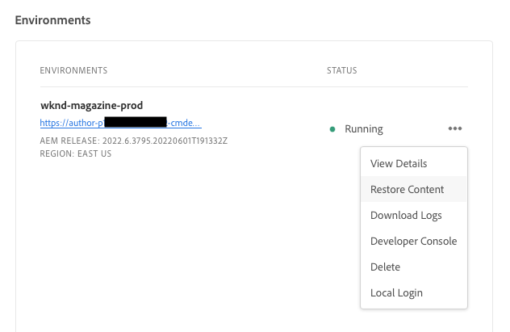
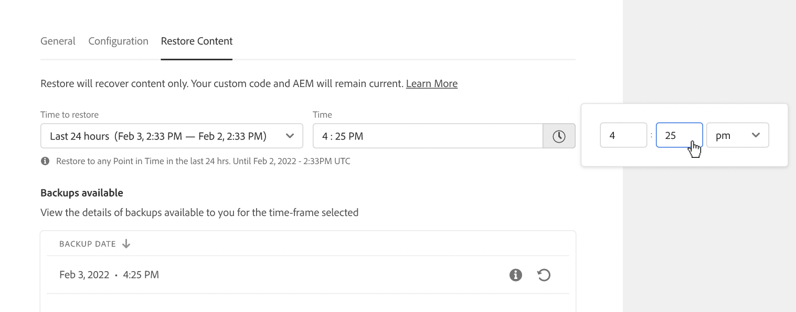
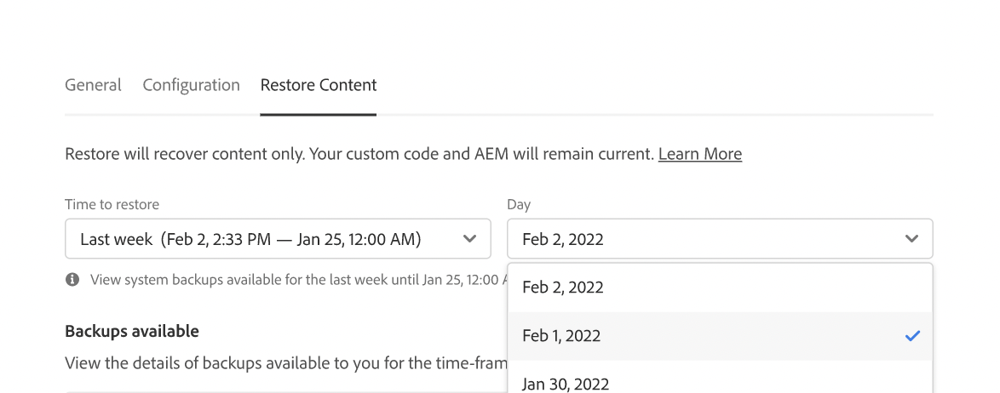
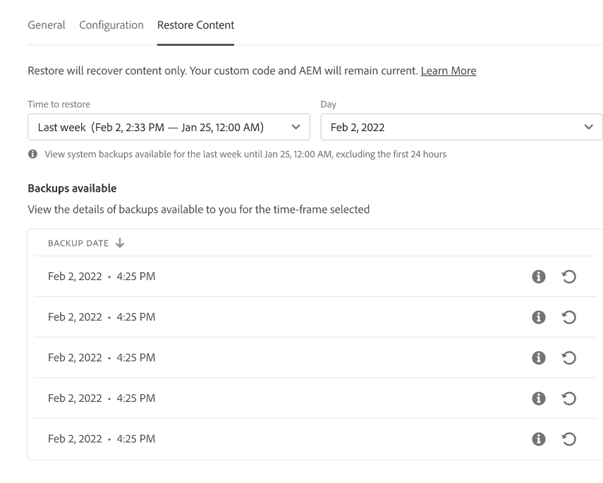
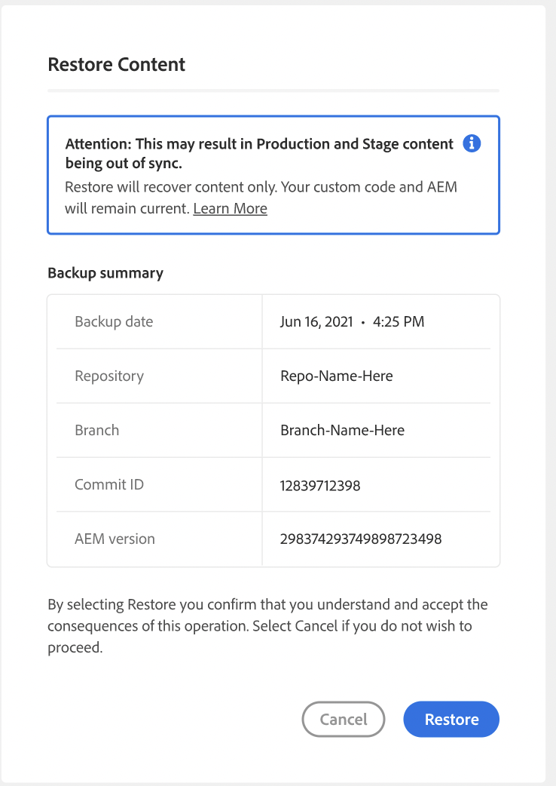
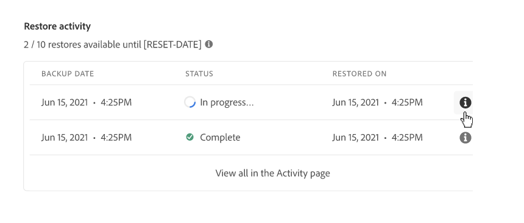

# Content Restore in AEM as a Cloud Service {#content-restore}

Learn how to restore your AEM as a Cloud Service content from backup using Cloud Manager.

## Overview {#overview}

Cloud Manager's self-service restore process copies data from Adobe system backups and restores it to its original environment. A restore is performed to return data, which has been lost, damaged, or accidentally deleted, to its original condition.

The restore process only affects content, leaving your code and version of AEM unchanged. You can initiate a restore operation of individual environments at any time.

Cloud Manager provides two types of backups from which you may restore content.

* **Point-In-Time (PIT):** This type restores from continuous system backups from the last 24 hours from the current time.
* **Last week:** This type restores from system backups in the last seven days excluding the previous 24 hours.

In both cases, the version of your custom code and the AEM version remain unchanged.

>[!TIP]
>
>It is also possible to restore backups [using the public API](https://developer.adobe.com/experience-cloud/cloud-manager/reference/api/).

>[!WARNING]
>
>* This feature should only be used when there are serious issues with either code or content.
>* Restoring a backup will result in the loss of recent data between the time of the backup and the present. Staging is also restored to the old version.
>* Before initiating a content restoration, consider other selective content restoration options.

## Selective Content Restoration Options {#selective-options}

Before restoring to a full content restoration, consider these options to restore your content more easily.

* If a package for the deleted path is available, install the package again using the [Package Manager](/help/implementing/developing/tools/package-manager.md).
* If the deleted path was a page in Sites, use the [Restore Tree function](/help/sites-cloud/authoring/sites-console/page-versions.md).
* If the deleted path was an assets folder and the original files are available, re-upload them via [the Assets console](/help/assets/add-assets.md).
* If the delete content were assets, consider [restoring previous versions of the assets](/help/assets/manage-digital-assets.md).

If none of the above options work and the contents of the deleted path are significant, perform a content restoration as detailed in the following sections.

## Create User Role {#user-role}

By default no user will have permission to execute content restorations on development, production, or staging environments. In order to delegate this permission to specific users or groups following these general steps.

1. Create a product profile with an expressive name that refers to content restoration.
1. Provide the **Program Access** permission on the required program.
1. Provide the **Content Restore** permission on the required environment or all environments of the program, depending on your use case.
1. Assign users to that profile profile.

For details on managing permissions, see [Custom Permissions](/help/implementing/cloud-manager/custom-permissions.md) documentation.

## Restoring Content {#restoring-content}

First determine the time frame of the content that you want to restore. Then to restore your environment's content from a backup perform these steps.

>[!NOTE]
>
>A user must have [appropriate permissions](#user-role) to initiate a restore operation.

1. Log into Cloud Manager at [my.cloudmanager.adobe.com](https://my.cloudmanager.adobe.com/) and select the appropriate organization.

1. Click the program for which you want to initiate a restore.

1. From the **Program Overview** page, in the **Environments** card, click the ellipsis button next to the environment for which you want to initiate a restore and select **Restore Content**.

   

   * Alternatively you can navigate directly to the **Restore Content** tab of the environment details page of a specific environment.

1. On the **Restore Content** tab of the environment details page, first select the time frame of the restore under the **Time to restore** drop-down list.

   1. If you select **Last 24 hours** the neighboring **Time** field lets you specify the exact time within the last 24 hours to restore.

      
   
   1. If you select **Last week** the neighboring **Day** field lets you select a date within the past seven days, excluding the previous 24 hours.
   
      

1. Once you select a date or specify a time, the **Backups available** section below shows a list of available backups that can be restored

   

1. Find the backup you want to restore by using the information icon to view information regarding the version of the code and AEM release included in that backup and consider the implications of a restore when [choosing the backup](#choosing-the-right-backup).

   

   * The time stamp displayed for the restore options are all based on the user's computer's time zone.

1. Click the **Restore** icon at the right end of the row representing the backup you want to restore to start the restore process.

1. Review the details on the **Restore Content** dialog before confirming your request by clicking on **Restore**.

   

The backup process is initiated and you can view its status in the **[Restore Activity](#restore-activity)** list. The time required for a restore operation to complete depends on the size and profile of the content being restored.

When the restore successfully completes the environment will:

* Run the same code and AEM release as at the time of initiating the restore operation.
* Have the same content that was available at the timestamp of the chosen snapshot, with the indexes rebuilt to match the current code.

## Choosing the Right Backup {#choosing-backup}

Cloud Manager's self-service restore process only restores content to AEM. For this reason, you must carefully consider code changes that were made between your desired restore point and the current time by reviewing the commit history between the current commit ID and the one being restored to.

There are several scenarios.

* The custom code on the environment and the restore are on the same repository and same branch.
* The custom code on the environment and the restore are on the same repository but a different branch with a common commit.
* The custom code on the environment and the restore are on different repositories.
  * In this case, a commit ID will not be displayed.
  * It is strongly recommended that you clone both repositories and use a diff tool to compare the branches.

Also, keep in mind that a restore might cause your production and staging environments to fall out of sync. You are responsible for the consequences of restoring content.

## Restore Activity {#restore-activity}

The **Restore Activity** list shows the status of the ten most recent restore requests including any active restore operations.

By clicking on the information icon for a backup, you can download logs for that backup and inspect the code details including the differences between the snapshot and data at the moment the restore was initiated.

## Offsite Backup {#offsite-backup}

Regular backups cover the risk of accidental deletions or technical failures within AEM Cloud Services, but additional risks can arise from the failure of a region. In addition to availability, the greatest risk in such region outages is a loss of data.

AEM as a Cloud Service mitigates this risk for all AEM production environments by continuously copying all AEM content to a remote region and making it available for recovery for a period of three months. This capability is referred to as offsite backup.

The restoration of AEM Cloud Services for staging and production environments from offsite backup is carried out by AEM Service Reliability Engineering in the event of data region outages.

## Limitations {#limitations}

Usage of the self-service restore mechanism is subject to the following limitations.

* Restore operations are limited to seven days, meaning it is not possible to restore a snapshot older than seven days.
* A maximum of ten successful restores are allowed across all environments in a program per calendar month.
* After environment creation, it takes six hours before the first backup snapshot is created. Until this snapshot is created, no restore can be performed on the environment.
* A restore operation will not initiate if there is a full stack or web tier config pipeline currently running for the environment.
* A restore cannot be initiated if another restore is already running on the same environment.
* In rare cases, because of the 24 hour/seven day limit on backups, the selected backup may become unavailable due to a delay between when it was selected and when the restore is initiated.
* Data from deleted environments is permanently lost and cannot be recovered.
