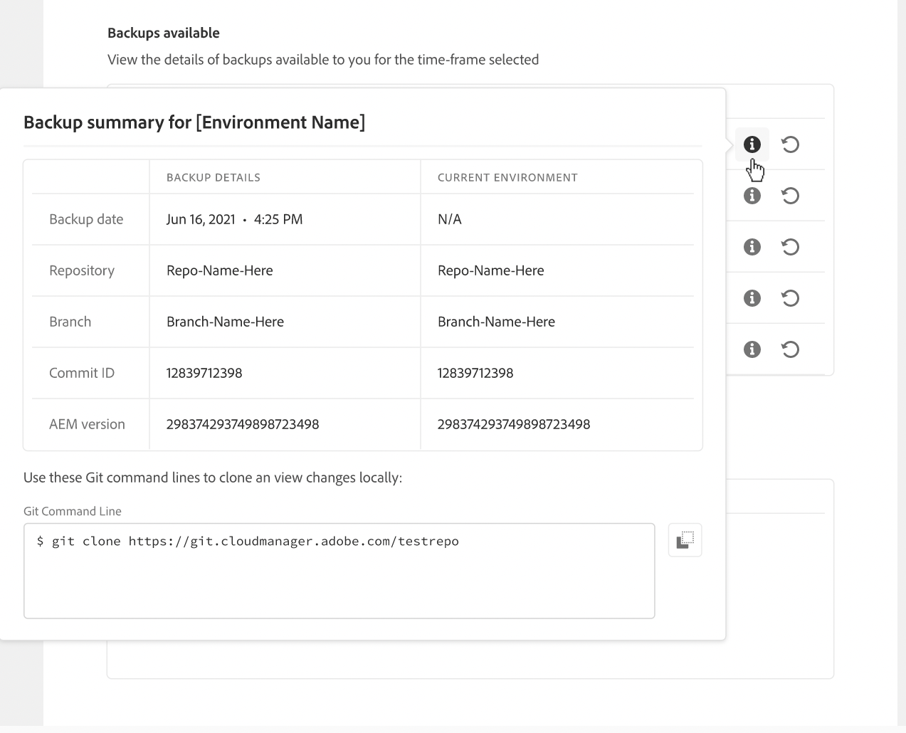
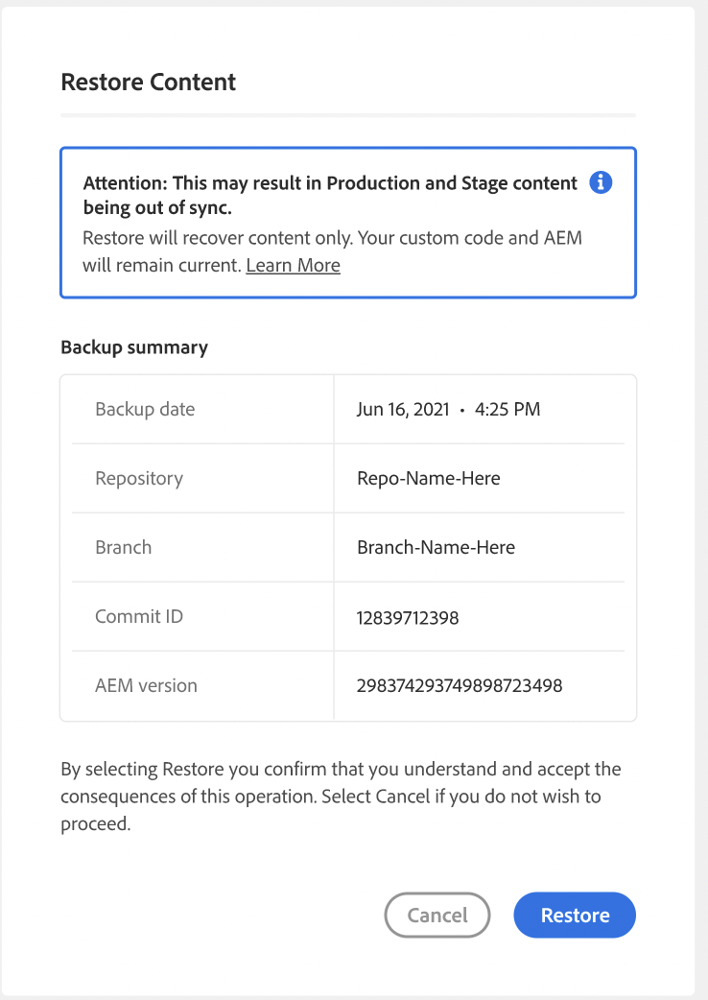
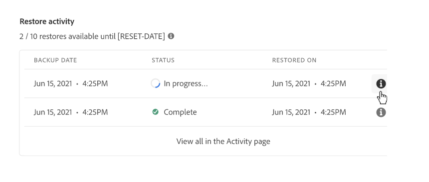

# Content restore in AEM as a Cloud Service {#content-restore}

You can restore your AEM as a Cloud Service content from backup using Cloud Manager.

## Overview {#overview}

Cloud Manager's self-service restore process copies data from Adobe system backups and restores it to its original environment. A restore is performed to return data, which has been lost, damaged, or accidentally deleted, to its original condition.

The restore process only affects content, leaving your code and version of AEM unchanged. You can initiate a restore operation of individual environments at any time.

Cloud Manager provides two types of backups from which you may restore content.

* **Point-In-Time (PIT):** This option restores continuous backups captured within the past 24 hours.
* **Last week:** This type restores from system backups in the last seven days excluding the previous 24 hours.

In both cases, the version of your custom code and the AEM version remain unchanged.

>[!TIP]
>
>It is also possible to restore backups [using the public API](https://developer.adobe.com/experience-cloud/cloud-manager/reference/api/).

>[!WARNING]
>
>* This feature should only be used when there are serious issues with either code or content.
>* Restoring a backup deletes any data added after that backup. Staging also reverts to its prior version.
>* Before initiating a content restoration, consider other selective content restoration options.

## Selective content restoration options {#selective-options}

Before restoring to a full content restoration, consider these options to restore your content more easily.

* If a package for the deleted path is available, install the package again using the [Package Manager](/help/implementing/developing/tools/package-manager.md).
* If the deleted path was a page in Sites, use the [Restore Tree function](/help/sites-cloud/authoring/sites-console/page-versions.md).
* If the deleted path was an assets folder and the original files are available, re-upload them via [the Assets console](/help/assets/add-assets.md).
* If the delete content were assets, consider [restoring previous versions of the assets](/help/assets/manage-digital-assets.md).

If none of the above options work and the contents of the deleted path are significant, perform a content restoration as detailed in the following sections.

## Create user role {#user-role}

By default no user has permission to execute content restorations in development, production, or staging environments. To delegate this permission to specific users or groups, use the following general steps.

1. Create a product profile with an expressive name that refers to content restoration.
1. Provide the **Program Access** permission on the required program.
1. Provide the **Environment Restore Create** permission on the required environment or all environments of the program, depending on your use case.
1. Assign users to that profile.

For details on managing permissions, see [Custom Permissions](/help/implementing/cloud-manager/custom-permissions.md).

## Restore the content of an environment {#restoring-content}

>[!NOTE]
>
>A user must have [appropriate permissions](#user-role) to initiate a restore operation.

**To restore the content of an environment:**

1. Log into Cloud Manager at [my.cloudmanager.adobe.com](https://my.cloudmanager.adobe.com/) and select the appropriate organization.

1. Click the program for which you want to initiate a restore.

1. List all environments for the program by doing one of the following:

   * From the left side menu, under **Services**, click  **Environments**.

      

   * From the left side menu, under **Program**, click **Overview**, then from the **Environments** card, click  **Show All**.

     

      >[!NOTE]
      >
      >The **Environments** card lists three environments only. Click **Show All** in the card to see *all* environments of the program.

1. In the Environments table, to the right of an environment whose content you want to restore, click , then click **Restore Content**.

   

1. On the **Restore Content** tab of the environment's page, in the **Time to restore** drop-down list, select the time frame of the restore.

   

   * If you chose **Last 24 hours**, in the adjacent **Time** field, specify the exact time within the last 24 hours to restore. 
   * If you chose **Last week**, in the adjacent **Day** field, select a date within the past seven days, excluding the previous 24 hours.
   
1. Once you select a date or specify a time, the **Backups available** section below shows a list of available backups that can be restored

1. Click  next to a backup to see its code version and AEM release, then weigh the restore impact before selecting a backup (see [Choose the right backup](#choosing-backup)).

   

   The time stamp displayed for the restore options is based on the computer's time zone of the user.

1. At the right end of the row representing the backup you want to restore, click  to start the restore process.

1. Review the details in the **Restore Content** dialog box, then click **Restore**.

   

The backup process is initiated. You can view its status in the **[Restore Activity](#restore-activity)** list. The time required for a restore operation to complete depends on the size and profile of the content being restored.

When the restore completes successfully, the environment does the following:

* Runs the same code and AEM release as at the time of initiating the restore operation.
* It has the same content that was available at the timestamp of the chosen snapshot, with the indexes rebuilt to match the current code.

## Choose the right backup {#choosing-backup}

Cloud Manager's self-service restore process only restores content to AEM. For this reason, you must carefully consider code changes that were made between your desired restore point and the current time. Review the commit history between the current commit ID and the one being restored to.

There are several scenarios.

* The environment custom code and the restore are on the same repository and the same branch.
* The environment custom code and the restore share one repository, use a separate branch, and originate from a common commit.
* The environment custom code and the restore are in different repositories.
  * In this case, a commit ID is not displayed.
  * Adobe highly recommends that you clone both repositories and use a diff tool to compare the branches.

Also, keep in mind that a restore might cause your production and staging environments to fall out of sync. You are responsible for the consequences of restoring content.

## Restore activity {#restore-activity}

The **Restore Activity** list shows the status of the ten most recent restore requests including any active restore operations.

By clicking  for a backup, you can download logs for that backup and inspect the code details including the differences between the snapshot and data at the moment the restore was initiated.

## Offsite backup {#offsite-backup}

Regular backups cover the risk of accidental deletions or technical failures within AEM Cloud Services, but additional risks can arise from the failure of a region. In addition to availability, the greatest risk in such region outages is a loss of data.

AEM as a Cloud Service mitigates this risk for all AEM production environments. That is, it continuously copies all AEM content to a remote region. This process makes the content available for recovery for three months. This capability is known as an offsite backup.

AEM Service Reliability Engineering restores staging and production AEM Cloud Service environments from off-site backups during data-region outages.

## Limitations {#limitations}

Usage of the self-service restore mechanism is subject to the following limitations.

* Restore operations are limited to seven days, meaning it is not possible to restore a snapshot older than seven days.
* A maximum of ten successful restores are allowed across all environments in a program per calendar month.
* After environment creation, it takes six hours before the first backup snapshot is created. Until this snapshot is created, no restore can be performed on the environment.
* A restore operation is not initiated if there is a full stack or web tier config pipeline currently running for the environment.
* A restore cannot be initiated if another restore is already running on the same environment.
* In rare cases, because of the 24 hour/seven day limit on backups, the selected backup may become unavailable due to a delay between when it was selected and when the restore is initiated.
* Data from deleted environments is permanently lost and cannot be recovered.
